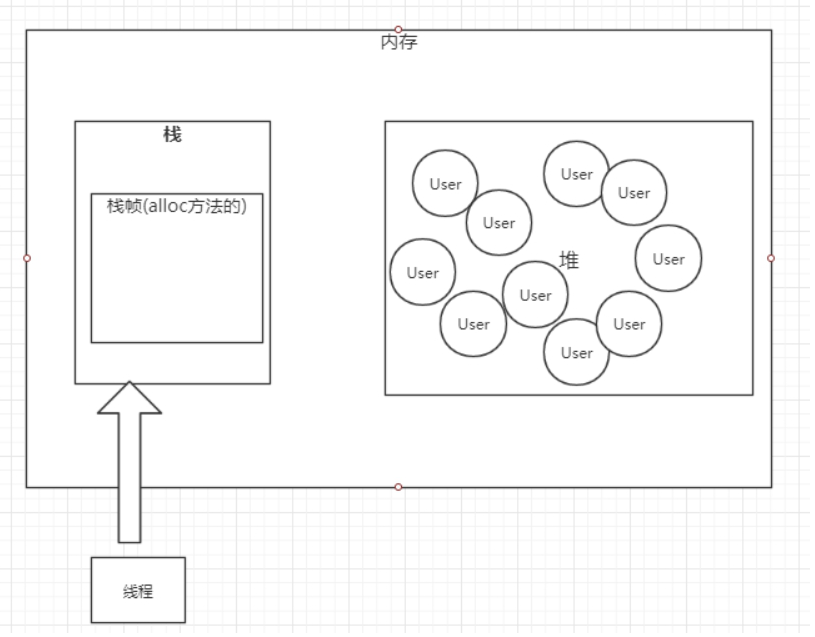

# 虚拟机中的对象

## 对象的分配  

虚拟机遇到一条 `new` 指令时，首先检查是否被类加载器加载，如果没有，那必须先执行相应的类加载过程。  
类加载就是把 `class` 加载到 `JVM` 运行时数据区的过程。  

### 1.检查加载 

首先检查这个指令的参数是否能在常量池中定位到一个类的符号引用 ( **符号引用** ：符号引用以一组符号来描述所引用的目标)，并且检查类是否已被加载、解析和初始化过。  

### 2.分配内存 

接下来虚拟机将为新生对象分配内存。为对象分配空间的任务等同于把一块确定大小的内存从 `Java` 堆里面划分出来。  

#### 指针碰撞   

如果 `Java` 堆中内存是绝对规整的，所有用过的内存都放在一边，空闲的放在另一边，中间放着一个指针作为分界点的指示器，那所分配内存就仅仅是把指针向空闲空间那边挪动一段与对象大小相等的距离，指针分配方式成为 **指针碰撞**。  

#### 空闲列表  

如果 `Java` 堆中的内存并不是规整的，已使用的内存和空闲的内存互相交错，那就没办法进行简单的指针碰撞，虚拟机就必须维护一个列表，记录那些内存是可用的，在分配的时候从列表中找到一块足够大的空间划分给对象实例，并更新列表上的记录，这种分配方式称为 **空闲列表**。  

  

>  选择哪种分配方式由 `Java` 堆是否规整决定，而 `Java` 堆是否规整由所采用的垃圾收集器是否带有压缩整理功能决定。  
1. 如果是 `Serial`、`ParNew` 等带有压缩整理的垃圾回收器的话，系统采用的是指针碰撞，既简单又高效。
2. 如果是 `CMS` 这种不带压缩整理的垃圾回收器的话，理论上只能采用较复杂的空闲列表。  

#### 并发安全  

除了如何划分可用空间之外，还有另外一个要考虑的是对象创建在虚拟机中是非常频繁的行为，即使仅仅修改一个指针所指向的位置，在并发情况下也不是线程安全的，可能出现正在给对象A 分配内存，指针还没来得及修改，对象 B 又同时使用了原来的指针分配内存的情况。  

##### CAS机制  

解决这个问题的一种方式是 对分配内存空间的动作进行同步处理 ( 即 虚拟机采用 `CAS` 配上失败重试的方式保证更新操作的原子性 )。  

##### <a id="分配缓冲">分配缓冲</a>  

另一种方式是：把内存分配的动作按照线程划分在不同的空间进行，即每个线程在 `Java` 堆中预先分配一小块私有内存，也就是 本地线程分配缓冲 ( Thread Local Allocation Buffer,TLAB )。  

`JVM` 在线程初始化时，同时也会申请一块指定大小的内存，只给当前线程使用，这样每个线程都单独拥有一个 `buffer`，如果需要分配内存，就在自己的 `buffer` 上分配，这样就不存在竞争的情况，可以大大提高分配效率，当 `Buffer`容量不够的时候，再重新从 `Eden` 区域申请一块继续使用。  

TLAB 的目的是：在为新对象分配内存空间时，让每个 `Java` 应用线程能使用自己专属的分配指针来分配空间，减少同步开销。  

`TLAB` 只是让每个线程有私有的分配指针，但底下存对象的内存空间还是给所有线程访问的，只是其他线程无法在这个区域分配而已，当一个 `TLAB` 用满 ( 分配指针 `top` 撞上分配极限 `end` 了)，就新申请一 TLAB。  

**参数：**  
`-XX:+UseTLAB`  运行在年轻代空间中使用**线程本地分配块(TLAB)**。 默认情况下启用此选项。 要禁用 `TLAB` 请指定 ： `-XX:-UseTLAB`  

https://docs.oracle.com/javase/8/docs/technotes/tools/unix/java.html  

### 3.内存空间初始化  

(注意不是构造方法)内存分配完成后，虚拟机需要将分配到的内存空间都初始化为 **零值** (如 `int` 值为 `0`， `boolean` 值为 `false`等)。这一步操作保证了对象的实例字段在 `Java` 代码中可以不赋初始值就可以直接使用，程序能访问到这些字段的数据类型所对应的 零值。  

### 4.设置  

接下来，虚拟机要对对象进行必要的设置，例如这个对象是哪个类的实例、如何才能找到类的元素信息 ( `Java classes` 在`Java Hotspot VM` 内部表示为类元数据)、对象的哈希码，对象的 GC分代年龄等信息，这些信息都存放在对象的对象头中。  

### 对象初始化

在上面工作都完成之后，从虚拟机的视角来看，一个新的对象已经产生了，但从 Java程序的视角来看，对象创建才刚刚开始，所有的字段都还为零值。 所以，一般来说，执行 `new` 指令之后会接着把对象按照 程序猿的意愿进行初始化 ( 执行构造方法 )，这样一个可用的对象才算完全产生出来。  

## 对象的内存布局  

在 `Hotspot` 虚拟机中，对象在内存中的布局可用分为三块区域： **对象头(header)、实例数据( Instance Data)、和对齐填充( Padding )**。  
- **对象头：** 对象头的信息包括两部分：
    1. 第一部分用于存储对象自身的运行时数据，如 哈希码( hashcode)、GC分代年龄、锁状态标志、线程持有的锁、偏向线程ID、偏向时间戳等。  
    2.  对象头的另一部分是类型指针，即对象指向它的类元数据的指针，虚拟机通过这个指针来确定这个对象是哪个类的实例。如果对象是一个 `Java`数组、那么在对象头中还有一块用于记录数组长度的数据。  
- **实例数据：**  实例数据部分是对象真正存储的有效信息，也就是程序代码中所定义的各种类型的字段内容。这部分的存储顺序会受到**虚拟机分配策略参数(`FieldsAllocationStyle`)和字段在 Java 源码中定义顺序的影响**。  
- **对齐填充：** 
第三部分的对齐填充并不是必然存在的，也没有特别的含义，它仅仅起着占位符的作用。由于 `Hotspot VM ` 的内存自动管理系统要求 **对象的大小必须是 8 字节的整数倍**。 当对象其他数据部分没有对齐时，就需要对齐填充来补全。  

## 对象的访问定位  

建立对象是为了使用对象，我们的 `Java` 对象需要通过栈上的 `reference` 数据来操作堆上的具体对象。 目前主流访问方式有 **使用句柄和直接指针两种**。  

### 句柄 
如果使用句柄访问的话，那么`Java` 堆中将会划分出一块内存来作为句柄池，`reference` 中存储的就是对象的句柄地址，而句柄中包含了**对象的实例数据与类型数据各自的具体地址信息**。  

### 直接指针

如果使用直接指针访问，`reference` 中存储的就是对象地址。  

这两种对象访问方式各有优势：  

- 使用句柄来访问最大的好处是 `reference` 存储的是稳定的句柄地址，在对象被移动 ( 垃圾收集时对象移动是非常普遍的行为 ) 时只会改变句柄中的实例数据指针，而 `reference` 本身不需要修改。  
- 使用直接指针访问的方式最大的好处就是速得更快，它节省了一次指针定位的时间开销，由于对象的访问在`Java` 中十分频繁，因此这类开销积少成多后也是一项非常可观的执行成本。  

**对 `sun Hotspot` 而言，它使用的是直接指针访问方式进行对象访问的。**  

### 判断对象的存活

在堆里存放着几乎所有的对象实例，垃圾回收期在对对象进行回收前，要做的就是确定这些对象中那些还是存活着，那些已经死去( 死去代表这不可能被任何途径使用的对象)。  

#### 引用计数法  

在对象中添加一个引用计数器，每当有一个地方引用它，计数器就 加1，当引用失效时，计数器 减1；  

`python` 使用的引用计数法， 但主流虚拟机没有使用，因为存在对象互相引用的情况，这个时候需要引入额外的机制处理，这样做影响效率。  

可以看到，只保留互相引用的对象还是被回收了，说明 `JVM` 采用的不是引用计数法 

#### 可达性分析

可达性分析是用来判断对象是否存活的。  

这个算法的基本思路就是通过一系列称为 “`GC Roots`” 的对象作为起始点，从这些节点开始向下搜索，搜索所走过的路径称为**引用链 ( reference chain)**。 当一个对象到 `GC Roots` 没有任何引用链时，则证明此对象是不可用的。  

**作为 GC Roots的对象包括以下几种：**  
- 虚拟机栈 (栈帧中的本地变量表)中引用的对象
- 方法区中类静态属性引用的对象
- 方法区中常量引用的对象
- 本地方法栈中 `JNI(即 native 方法)` 引用的对象
- `JVM` 的内部引用 (`class` 对象，异常对象`NullPointException`、`OutofMemoryError`，系统类加载器)。
- 所有被同步锁 ( synchronize 关键字) 持有的对象
- `JVM` 内部的 `JMXBean`、`JVMTI` 中注册的回调、本地代码缓存等。
- `JVM` 实现中的 **临时性** 对象，跨代引用的对象 (在使用分代模型回收只回收部分代时)

以上的回收都是对象。  

**类的回收条件：**  

 **注意 `Class` 要被回收 条件比较苛刻，必须同时满足以下条件 (仅仅是可以，不代表必然，因为还有一些参数可以控制)**   

1. 该类所有的实例都已经被回收，也就是堆中不存在
2. 加载该类的 `classLoader` 已经被回收
3. 该类对应的 `java.lang.Class` 没有在任何地方被引用，无法在任何地方通过反射访问该类的方法
4. 参数控制：
   

#### Finalize 方法  

即使通过可达性分析判断不可达的对象，也不是 “非死不可”，真正要宣告一个对象死亡，需要经过两次标记过程，一次是没有找到该对象与 GC Roots 的引用链，它将被第一次标记。随后进行一次筛选，如果对象覆盖了 `finalize`， 我们可以在 `finalize` 中去拯救。  

可以看到，对象可以被拯救一次( `finalize()` 执行第一次，但是不会执行第二次)。  

注释掉 `Thread.sleep()` 后：

可以看到，对象并没有被拯救，原因是 `finalize()` 执行缓慢，还没完成拯救，垃圾回收器就已经回收掉了。  
**但因为  `finalize()` 太不可靠，一般不使用。**   

## 各种引用  

### 强引用  

一般  `Object obj = new Object()` 就属于强引用。  
在任何情况下，只要强引用关联 (与根可达) 还在，垃圾回收器就永远不会回收掉被引用的对象，当内存空间不足时，`Java`虚拟机宁愿抛出 `OutOfMemoryError` 错误，使程序异常终止，也不会回收。  

如果强引用对象不使用时，需要弱化从而使GC能够回收，如 `obj = null;`  

### 软引用 (SoftReference)  

用软引用关联的对象，内存空间不足( 即将发生内存溢出 `OuyOfMemory`)的时候，这些对象就会被回收，如果这次回收之后还是没有足够的空间，才会抛出内存溢出

VM参数 `-Xms10m  -Xmx10m -XX:+PrintGC`

 

可以看到， GC 了之后对象并没有被回收，直到内存溢出了才被回收。  

**使用：** 处理用户提供的图片。 如果将所有图片读入内存，这样虽然可以很快打开图片，但内存空间使用巨大，一些使用较少的图片浪费内存空间，需要手动从内存中移除。如果每次打开图片都从磁盘文件中读到内存再显示，虽然内存占用较少，但一些经常使用的图片每次打开都要访问磁盘，代价巨大。这个时候就可以用软引用构建缓存。  

### 弱引用 ( WeakReference )  

用弱引用关联的对象，只能生存到下一次垃圾回收之前，GC 发生时**不管当前内存足够与否**， 都会将其回收  

 

**注意：** 软引用(`SoftReference`) 和 弱引用(`WeakReference`),可以用在内存资源紧张的情况下，以及创建不是很重要的数据缓存。当系统内存不足的时候，缓存中的 内容是可以被释放的。  
实际应用(`WeakHashMap`、`ThreadLocal`)  

### 虚引用 ( PhantomReference )  

虚引用随时都会被回收掉，如果一个对象仅持有虚引用，那么它就和没有任何引用一样，在任何时候都可能被垃圾回收器回收。  

应用：垃圾回收的时候收到一个通知，就是为了监控垃圾回收器是否正常工作。没啥用。  

## 垃圾回收  

### 对象的分配策略  

#### 逃逸分析

**逃逸分析原理：** 分析对象动态作用域，当一个对象在方法中定义以后，它可能被外部方法所引用，比如：调用参数传递到其他方法中，这种称之为方法逃逸，甚至还有可能被外部线程访问到，例如：赋值给其他线程中访问的变量，这个称之为线程逃逸。  

从不逃逸到方法逃逸到线程逃逸，称之为对象由低到高的不同逃逸程度。  

##### 没有逃逸  

即方法中的对象没有发生逃逸。  

如果确定一个对象不会逃逸出线程之外，那么让对象在栈上分配内存可以提高 `JVM` 的效率。 

##### 逃逸  

如果逃逸分析出来的代码可以在栈上分配的话，那么该对象的生命周期就跟随线程，不需要垃圾回收，如果是频繁的调用此方法则可以得到很大的性能提升。  

- 采用了逃逸分析，满足逃逸的对象在栈上分配  

- 没有开启逃逸分析，对象都在堆上分配，会频繁触发垃圾回收 (垃圾回收会影响系统性能 )，导致代码运行慢。  

##### 代码验证  

- **开启逃逸分析：**  

- **关闭逃逸分析：**  

  

可以看到关闭了逃逸分析， `JVM` 在频繁的进行垃圾回收(GC)，正是这一块的操作导致性能有较大差别。  

#### 对象优先在 Eden 区分配

虚拟机参数：  
 `-Xms20m`  
 `-Xmx20m`  
 `-Xmn10m`  
 `-XX:+PrintGCDetails`  

 `-XX:+PrintGCDetails` ： 打印垃圾回收日志，程序退出时输出当前内存的分配情况

注意：新生代初始时就有大小。  

大多数情况下，对象在新生代 `Eden` 区中分配。当 `Eden` 区没有足够空间分配时，虚拟机将发起一次 `Minor GC`

#### 大对象直接进入老年代    

`-Xms20m`  
`-Xmx20m`  
`-Xmn10m`  
`-XX:+PrintGCDetails`  
`-XX:PretenureSizeThreshold=4m`  
`-XX:+UseSerialGC`  

`PretenureSizeThreshold` 参数只对 `Serial` 和 `ParNew` 两款收集器有效。  

最典型的大对象是那种很长的字符串以及数组。  

**目的优点：**  
1. 避免大量内存复制
2. 避免提前进行垃圾回收，明明有空间进行分配

#### 长期存活对象进入老年期  

如果对象在 `Eden` 出生并经过一次 `Minor GC` 后仍然存活，并且能够被 `Survivor` 容纳的话，将被移动到 `Survivor`  空间中，并将对象年龄设为 `1` ，对象在 `Survivor` 区域中没熬过一次 `Minor GC` ，年龄就增加 `1`，当它的年龄增加到一定程度 (并发的垃圾回收器默认15)，`CMS` 是 `6` 时，就会被晋升到老年代中。  

可以使用  `-XX:MaxTenuringThreshold` 调整。   

#### 对象年龄动态判定  

为了能更好的适应不同程序的内存状况，虚拟机并不是永远的要求对象的年龄必须达到 `MaxTenuringThreshold` 才能晋升老年代，如果在 `Survivor` 空间中的相同年龄所有对象大小总和大于 `Survivor` 空间的一半，年龄大于或等于该年龄的对象就可以直接进入老年代，无需等到 `MaxTenuringThreshold` 中要求的年龄。  

#### 空间分配担保  

在发生 `Minor GC`之前，虚拟机会检查老年代最大可用的连续空间是否大于新生代所有对象总空间，如果这个条件成立，那么 `Minor GC` 可用确保是安全的。如果不成立，则虚拟机会查看 `HandlePromotionFailure` 设置值是否允许担保失败。如果允许，那么会继续检查老年代最大可用的连续空间是否大于历次晋升到对象的平均大小，如果大于，将尝试进行一次 `Minor GC` ，尽管这次 `Minor GC` 是有风险的，如果担保失败则会进行一次 `Full GC` ； 如果小于，或者 `HandlePromotionFailure` 设置不允许冒险，那这时也要改为进行一次 `Full GC`。  

#### 本地线程分配缓冲(TLAB)
具体见章节 ： [分配缓冲](#分配缓冲)    

#### GC
- `Minor GC`：新生代GC，指发生在新生代的垃圾收集动作，所有的`Minor GC`都会触发全世界的暂停（`stop-the-world`），停止应用程序的线程，不过这个过程非常短暂。  

- `Full GC` 是清理整个堆，包括新生代和老年代  

### 垃圾回收算法  

#### 分代收集理论  
当前商业虚拟机的垃圾收集器，大多遵循 **分代收集** 的理论来进行设计，这个理论大体上是这样描述的：
1. 绝大部分对象都是 **朝生夕死**  
2. 熬过多次垃圾回收的对象就越难回收  

根据以上两个理论，朝生夕死的对象放一个区域，难回收的对象放另外一个区域，这个就构成了新生代和老年代。  

#### GC 种类  

1. 新生代回收 (`Minor GC/Young GC`)： 指只是进行新生代回收
2. 老年代回收 (`Major GC/Old GC`)：指是只进行老年代的回收。目前只有 `CMS` 垃圾回收器 会有这个单独的收集老年代的行为。(`Major` GC定义是比较混乱，有说指是老年代，有的说是做整个堆的收集，这个需要你根据别人的场景来定，没有固定的说法)
3. 整堆收集 (`Full GC`)：收集整个 `Java` 堆和方法区  

#### 复制算法(Copying)   

将可用内存按容量划分为大小相等的两块，每次只使用其中的一块。当这一块的内存用完了，就将还存活着的对象复制到另外一块上面，然后把已经使用过的内存空间一次清理掉。这样使得每次都是对整个半区进行内存回收，内存分配时也就不用考虑内存碎片等复杂情况，只要按顺序分配内存即可，实现简单，运行高效。只是这种算法的代价是将内存缩小为原来的一半。  

注意：内存移动是真实的移动(复制)，不是指针。  

复制回收算法适合于新生代，因为大部分对象朝生夕死，那么复制过去的对象比较少，效率自然就高，另外一半的一次性清理是很快的。  

#### Appel 式回收  

一种更优雅的复制回收分代策略：具体做法是分配一块较大的 `Eden` 区和两块较小的 `Survivor` 空间(可以叫做From或者To，也可以叫做 Survivor1 和 Survivor2 )。  

专门研究表明，新生代中的对象`98%`是“朝生夕死”的，所以并不需要按照`1:1`的比例来划分内存空间，而是将内存分为一块较大的`Eden`空间和两块较小的 `Survivor`空间，每次使用`Eden`和其中一块`Survivor[1]`。当回收时，将`Eden`和`Survivor`中还存活着的对象一次性地复制到另外一块`Survivor`空间上，最后清理掉`Eden`和刚才用过的`Survivor`空间。  

`Hotspot` 虚拟机默认 `Eden` 和 `Survivor` 大小比例是 `8 ：1` ，也就是每次新生代中可用内存空间为整个新生代容量的 `90% (80% + 10%)`， 只有`10%` 的内存会被浪费。当然，`98%`的对象可回收只是一般场景下的数据，我们没有办法保证每次回收都只有不多于`10%`的对象存活，当 `Survivor`空间不够用时，需要依赖其他内存（这里指老年代）进行分配担保（`Handle Promotion`）。

#### 标记-清除算法(Mark-Sweep)  

算法分为 **标记** 和 **清除** 两个阶段：首先标记出所有需要回收的对象，在标记完成后统一回收所有被标记的对象。  
回收效率不稳定，如果大部分的对象是朝生夕死，那么回收效率降低，因为需要大量标记对象和回收对象，对比复制回收效率很低。  

不足：空间问题，标记之后会产生大量不连续的内存碎片，空间碎片太多可能会导致以后在程序运行过程中需要分配较大对象时，无法找到足够的连续内存而不得不提前触发另一次垃圾收集操作。  

回收的时候如果需要回收的对象越多，需要做的标记和清除的工作越多，所以标记清除算法使适用于老年代，复制回收算法适用于新生代。  

#### 标记-整理算法(Mark-Compact)  

首先需要标记出所有需要回收的对象，在标记完成后，后续步骤不是直接对可回收对象进行清理，而是让所有存活的对象都向一端移动，然后直接清理掉端边界以外的内存。标记整理算法虽然没有内存碎片，但效率偏低。  

标记整理算法与标记清除算法的区别在与对象的移动。对象移动不单单会加重系统负担，同时需要全程暂停用户线程才能进行，同时所有引用对象的地方都需要更新。  

## JVM常见的垃圾回收器  

### 分代收集的思想  

在新生代中，每次垃圾收集时都发现有大量对象死去，只有少量存活，那就选用复制算法，只需要付出少量存活对象的复制成本就可以完成收集。  
老年代中因为对象存活率高，没有额外空间对它进行分配担保，就必须使用 **标记-清除** 或者 **标记-整理** 算法来进行回收。  

垃圾收集器：

  

**并行**：垃圾收集的多线程的同时进行。  

**并发**：垃圾收集的多线程和应用的多线程同时进行。  

**注：**   
吞吐量 = 运行用户代码时间 / ( 运行用户代码时间 + 垃圾收集时间 )   
垃圾收集时间 = 垃圾回收频率 * 单次垃圾回收时间   

### 垃圾回收器工作示意图  

#### Serial / Serial Old  

单线程，独占式，成熟，适合单 `CPU` 服务器  

`-XX:+UseSerialGC` 新生代和老年代都用串行收集器  
`-XX:+UseParNewGC` 新生代使用`ParNew`，老年代使用`Serial Old`  
`-XX:+UseParallelGC` 新生代使用`ParallerGC`，老年代使用`Serial Old`

#### ParNew   

和 `Serial` 基本没区别，唯一的区别：多线程，多`CPU`的，停顿时间比`Serial`少  

`-XX:+UseParNewGC` 新生代使用`ParNew`，老年代使用`Serial Old`  

#### Parallel Scavenge（ParallerGC）/ Parallel Old  

关注吞吐量的收集器，高吞吐量则可以高效率的利用 `CPU` 时间，尽快完成程序的运算任务，主要适合在后台运算而不需要太多交互的任务。  

所谓吞吐量，就是 `CPU` 用于运行用户代码的时间与`CPU`总消耗时间的比值，即  **吞吐量 = 运行用户代码时间 / ( 运行用户代码时间 + 垃圾收集时间 )**， 虚拟机总共运行了100分钟，其中垃圾收集花掉1分钟，那吞吐量就是99%。  

#### Concurrent Mark Sweep （CMS）  

`CMS` 是一款以获取最短回收停顿时间为目标的收集器。目前很大一部分的 `Java` 应用集中在互联网网站或者 `B/S` 系统的服务商，这类应用尤其重视服务的响应速度，希望系统停顿时间最短，以给用户带来较好的体验。`CMS` 收集器就非常符合这些应用的要求。  

从名字 (包含 `Mark Sweep`)上就可以看出，`CMS` 收集器是基于 **标记-清除** 算法实现的，它的运作过程相对于前面几种收集器更复杂一点，整个过程分为四个步骤：
1. **初始标记** -短暂，仅仅只是标记一下 `GC Roots` 能直接关联到的对象，速度很快。
2. **并发标记** -和用户的应用程序同时进行，进行 `GC Roots` 追踪的过程，标记从 `GCRoots`开始关联的所有对象开始遍历整个可达分析路径的对象。这个时间比较长，所以采用并发处理(垃圾回收器线程和用户线程同时工作)。  
3. **重新标记** - 短暂，为了修正并发标记期间因用户线程继续运作而导致标记产生变动的那一部分对象的标记记录，这个阶段的停顿时间一般比初始标记阶段烧长一些，但远比并发标记的时间短。  
4. **并发清除**  

由于整个过程中耗时最长的并发标记和并发清除过程收集器线程都可以与用户线程一起工作，所以，从整体上来说，`CMS`收集器的内存回收过程是与用户线程一起并发执行的。  

`-XX:+UseConcMarkSweepGC`，表示新生代使用 `ParNew`，老年代的用 `CMS`   
**CPU敏感：** `CMS`对处理器资源敏感，毕竟采用了并发收集，当处理核心数不足四个时，CMS对用户影响较大。  
**浮动垃圾：** 由于 `CMS`并发清理阶段用户线程还在运行这，伴随程序运行自然就还会有新的垃圾不断产生，这一部分垃圾出现在标记过程之后，`CMS` 无法在当次收集中处理掉他们，只好留到下一次 `GC` 时再清理掉。这一部分垃圾就成为 **浮动垃圾**。  

由于浮动垃圾的存在，因此需要预留出一部分内存，意味着 `CMS` 收集器不能像其他收集器那样等待老年代快满的时候再回收。  
在1.6 的版本中，老年代空间使用率阙值为92%  
如果预留的内存不够存放浮动垃圾，就会出现 `Concurrent Mode Failure`，这时虚拟机将临时启用 `Serial Old` 来代替 `CMS`。  

**会产生空间碎片：** **标记-清除**算法会导致产生不连续的空间碎片。  

最大的问题是：`CMS` 采用了标记清除算法，所以会有内存碎片，当碎片较多时，给大对象的分配带来很大的麻烦，为了解决这个问题，`CMS` 提供一个参数 `-XX:+UseCMSCompactAtFullCollection`，一般是开启的，如果分配不了大对象，就进行内存碎片的整理过程。这个地方一般会使用 `Serial Old`，因为 `Serial Old` 是一个单线程，所以如果内存空间很大、且对象较多时，`CMS` 发生这种情况会很卡。  

#### Stop The World 现象  

任何 `GC` 收集器都会进行业务线程的暂停，这个就是 `STW`，`Stop The World`，所以我们**GC调优**的目标就是尽可能的减少STW的时间和次数。  

#### G1  

`-XX:+UseG1GC`  

**内存布局：**在`G1` 之前的其他收集器进行收集的范围都是在整个新生代或者老年代，而`G1`不再是这样。使用 `G1`收集器时，`Java` 堆的内存布局就与其他收集器有很大差别，它将整个 `Java`堆划分为多个大小相等的独立区域(`Region`)，虽然还保留有新生代和老年代的概念，但新生代和老年代不再是物理隔离的了，它们都是一部分 `Region` 的集合(不需要连续)。每一个区域都可以通过参数 `-XX:G1HeapRegionSize=size ` 来设置。  

 

`Region` 中还有一块特殊区域 `Humongous` 用于存储大对象，一般只要认为一个对象超过了 `Region`容量的就是大对象，如果对象超级大，那么使用连续的 `N` 个 `Humongous` 来存储。  

**并行与并发：** `G1` 能充分利用多 CPU、多核环境下的硬件优势，使用多个 CPU (CPU或者CPU核心) 来缩短 `Stop-The-World`停顿的时间，部分其他收集器原本需要停顿 `Java` 线程执行的`GC`动作，`G1`收集器仍然可以通过并发的方式让 `Java` 程序继续执行。  

**分代收集：** 与其他收集器一样，分代概念在 `G1` 中仍然得以保留。虽然 `G1` 可以不需要其他收集器配合就能独立管理整个 `GC` 堆，但它能够采用不同的方式去处理新创建的对象和已存活了一段时间、熬过多次 `GC`的旧对象以获取更好的收集效果。  

**空间整合：**与 `CMS` 的**标记-清理**算法不同，`G1` 从整体上来看是基于 **标记-整理**算法实现的收集器，从局部(两个 `Region` 之间)上来看是基于**复制**算法实现的，但无论如何，这两种算法都意味着`G1`运作期间不会产生任何内存碎片，收集后能 提供规整的可用内存。这种特性有利于程序长时间运行，分配大对象时不会因为无法找到连续内存空间而提前触发下一次`GC`。  

**追求停顿时间：**   
`-XX:MaxGCPauseMillis`  指定目标最大停顿时间，`G1` 尝试调整新生代和老年代的比例，堆大小，晋升年龄来打到这个目标时间。  
`-XX:ParallerGCThreads` 设置 `GC` 的工作线程数量。  

一般在G1和CMS中间选择的话平衡点在`6~8G`，只有内存比较大G1才能发挥优势。  

## 常量池与String  

常量池包括运行时常量池、`class` 常量池、字符串常量池。  

严格来说是**静态常量池** 和**运行时常量池**  
静态常量池是存放字符串字面、符号引用以及类和方法的信息，而运行时常量池存放的是运行时的一些直接引用。  

运行时常量池是在类加载完成之后，将静态常量池中的符号引用值转存到运行时常量池中，类在解析之后，将符号引用替换成直接引用。  

这两个常量池在`jdk1.7` 版本之后，就移到堆内存中了，这里指的是物理空间，而逻辑上还属于方法区(方法区是逻辑分区)。  

### 字面量  

给基本类型变量赋值的方式就叫做字面量或者字面值。  

比如：`int i=120; long j=10L;`  

**符号引用：**包括类和方法的全限定名 (例如 `String` 这个类，它的全限定名就是 `Java/lang/String`)、字段的名称和描述符以及方法的名称和描述符。  

**直接引用：**具体对象的索引值。  

### String 对象是如何实现的  

`String` 类被 `final` 关键字修饰了，而且变量 `char` 数组也被 `final` 修饰了，代表了 `String` 对象不可被更改，`Java` 实现的这个特性叫做 `String` 对象的不可变性，即 `String` 对象一旦创建成功，就不能再对它进行改变。

在 `Java` 中，通常有两种创建字符串对象的方式：

- 一种是通过**字符串常量的方式创建**，如 `String str = "abc";`  
    这种方式首先会检查该对象是否在字符串常量池中，如果在，就返回该对象引用，否则新的字符串将在常量池中被创建。这种方式可以减少同一个值的字符串对象被重复创建，节约内存。   
- 另一种是**字符串变量通过 `new` 形式的创建**，如 `String str = new String("abc");`  
    这种方式，首先在编译类文件时，`"abc"`常量字符串将会放入到常量结构中，在类加载时，`"abc"`将在常量池中被创建；其次，在调用 `new` 时，`JVM`命令将会调用 `String` 的构造函数，同时引用常量池中的 `"abc"`字符串，在堆内创建一个 `String`对象，最后，`str` 引用 `String`对象。  

    如果调用 `intern()` 方法， 会去查看字符串常量池是否有等于该对象的字符串的引用，如果没有，会把首次遇到的字符串的引用添加到常量池中；如果有，就返回常量池中的字符串引用(这个版本都是基于JDK1.7及以后版本)。  
    

**代码示例：**

  

