### JVM
`JVM`全称 `Java Virtual Machine`，也就是 `Java虚拟机`，它能够识别 字节码文件( .class 文件)，并且解析它的指令，然后调用操作系统相关的函数，完成软件的操作。  
**作用 :** `JVM` 的作用其实就是 将 `.class` 文件 翻译成操作系统可识别的指令函数。  

#### JVM与操作系统的关系  

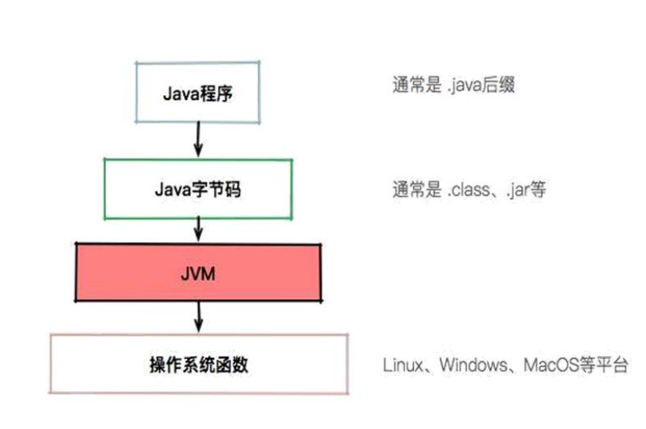

从图中可以看到，`JVM` 只负责解析 字节码文件，将字节码翻译成操作系统函数，就可以让在不同操作系统平台上运行了

#### 跨平台到跨语言  

**跨平台：**  

JVM 提供了多种平台的 `JDK`，使得 `JVM` 可以在不同平台上 让同样的代码执行出一样的效果，这就是`JVM`的跨平台性 
https://www.oracle.com/java/technologies/javase/javase-jdk8-downloads.html
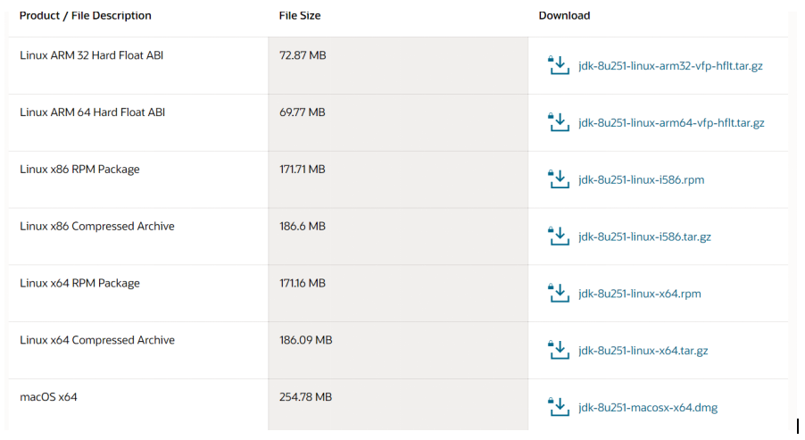

### Java SE 体系架构

**跨语言：**  

 `JVM` 只能识别 **字节码文件(.class文件)**，也就是说，只能能编译成字节码的语言(`Groovy` 、`Kotlin`、`Jruby`)，都可以在 JVM 上运行，这就是 `JVM` 的跨语言特性

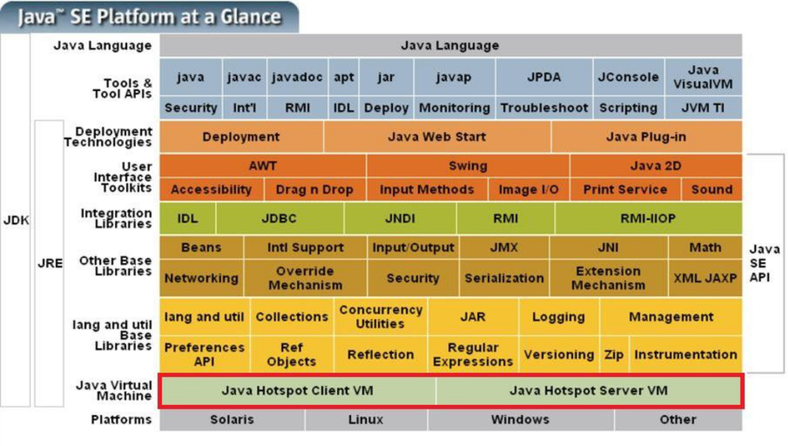 

#### JVM、JRE、JDK的关系  
https://www.oracle.com/java/technologies/javase-jdk8-doc-downloads.html  

**JVM ：**   `JVM`是把 `.class`翻译成机器可以识别的代码，但 `JVM` 不会自己生成代码， 同事 它需要很多依赖类库，这时候就需要用到 `JRE`  

**JRE ：**  `JRE` 除了包含JVM 之外，还提供了很多类库(也就是 jar 包，它提供一些即插即用的功能，比如               读取或操作文件，连接网络，使用I/O等)，这些都是 `JRE` 提供的基础类库。 `JVM` 标准加上实现的一大堆基础类库，组成了 `Java` 的运行时环境，也就是 `JRE(Java Runtime Environment)`  

**JDK :**  而 `JDK`提供了一些好用的工具，如 `javac( 编译代码)`，`java`， `jar(打包代码)`，`javap(反编译<反汇编>)`等，可以帮开发者编译，调试，打包，反编译代码等  

### JVM 整体  

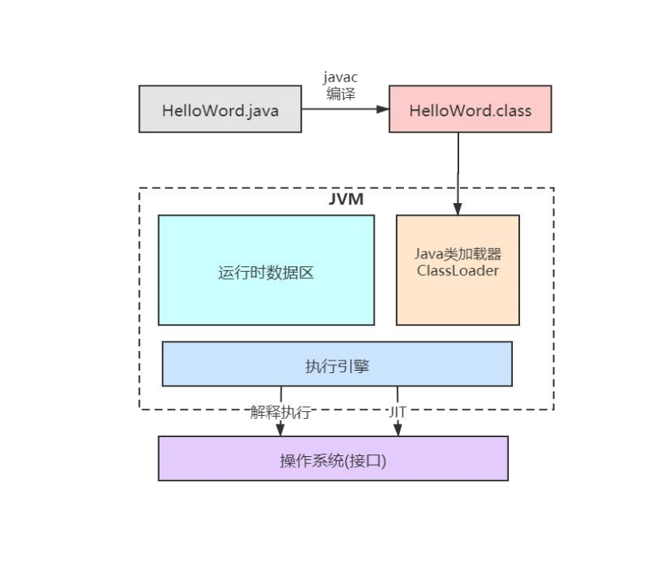 

一个`Java`程序，首先要经过 `javac` 编译成 `.class` 文件，然后 `JVM` 会将其加载到方法区，**执行引擎**会执行这些字节码。执行时，会翻译成操作系统相关的函数。`JVM` 作为 `.class` 的翻译存在，输入字节码，调用操作系统函数。  

#### 过程如下 :  

`Java` 文件 -> 编译器 -> 字节码 -> `JVM` -> 机器码 。  

#### 解释执行与JIT  

`Java` 代码最初仅仅是通过解释器解释执行的，即对字节码逐条解释执行，这种方式执行速度会相对比较慢，尤其是当某个方法或者代码块运行特别频繁的时候，这种方式的执行效率就显得很低。  

于是后来在虚拟机中引入了`JIT编译器（即时编译器）`，当虚拟机发现某个方法或者代码块运行特别频繁的时候，就会把这些代码认定为 `Hot Sopt Code (热点代码)`，为了提高热点代码的执行效率，在运行时，虚拟机会将这些代码编译成与本地平台相关的机器码，并进行各层次的优化，完成这项任务的正是 `JIT 虚拟机`  

我们所说的 `JVM`，狭义上指的就是 `HotSpot`(`JVM`有很多版本，使用最多的是 `HotSpot`)。如非特殊说明，我们都以 `HotSpot` 为准。  
`Java` 之所以成为跨平台，就是因为 `JVM` 的存在。 `Java字节码` 是沟通 `Java` 与 `JVM` 的桥梁，同时也是沟通 `JVM` 和操作系统的桥梁。   

**优势:**    
1. 当程序需要快速启动和执行时，解释器可以发挥作用，省去编译的时间立即执行  
2. 当程序运行后，随着时间推移，编译器会逐渐发挥作用，把越来越多的代码编译成本地代码，可以获取更高执行效率  

解释执行可以节约内存，而编译执行可以提升效率。  

#### 运行时数据区域  

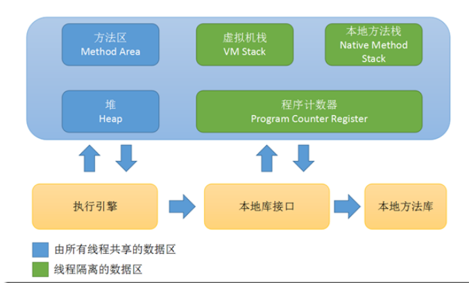  

**定义：**  `Java虚拟机` 在执行 Java 程序的过程中会把他锁管理的 **内存** 划分为若干个不同的数据区域  

**类型：**  程序技术器、虚拟机栈、本地方法栈、Java堆、方法区(运行时常量池)、直接内存  

### 线程私有的区域

#### 程序计数器

程序计数器`（Program Counter Register）` 是一块较小的内存空间，可以看做是当前线程所执行的字节码的行号指示器。  

程序计数器是一块很小的内存空间，主要用来记录各个线程执行的字节码的地址，例如，分支、循环、跳转、异常、线程恢复等都依赖于计数器  

由于 `Java` 是多线程语言，当执行的线程数量超过 `CPU` 核数时，线程之间会根据时间片轮询争夺 `CPU` 资源。如果一个线程的时间片用完了，或者是其它原因导致这个线程的 `CPU` 资源被提前抢夺，那么这个退出的线程就需要单独的一个程序计数器，来记录下一条运行的指令。保证线程切换后能恢复到正确的执行位置。  

因此，每条线程都需要有一个独立的程序计数器，各条线程之间计数器互不影响，独立存储，我们称这类内存区域为**线程私有**的内存。  

如果线程正在执行的是 `Java` 方法，这个计数器记录的是正在执行的虚拟机字节码指令的地址；  
如果正在执行的是 `native` 方法，这个计数器值则为空`(Undefined)`。  

程序计数器也是`JVM`中唯一不会`OOM(OutOfMemory)`的内存区域  

#### Java虚拟机栈  

栈是 **先进后出(FILO)** 的数据结构  

虚拟机栈在 `JVM` 运行过程中存储当前线程运行方法所需的数据，指令，返回地址  

`Java虚拟机栈` 是基于线程的，在线程的生命周期中，参与计算的数据会频繁的入栈和出栈，栈的生命周期和线程是一样的。  

栈里的每条数据就是**栈帧**，在每个 `Java` 方法被调用的时候，都会创建一个栈帧，并入栈，一但完成相应的调用，则出栈。所有的栈帧都出栈后，线程也就结束了  

每个栈帧都包含四个区域：局部变量表， 操作数栈， 动态连接，返回地址。  

栈的大小缺省为`1M`，可用参数 `-Xss` 调整大小，例如`-Xss256k`

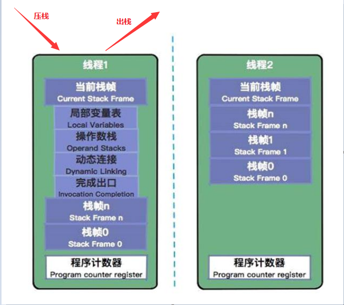 

##### 1.局部变量表  
局部变量表是存放方法参数和局部变量的区域(表)。
它是**32位**的长度，主要存放 `Java` 的八大基础数据类型，一般 `32位`可以存放下，如果是 `64位` 的就使用高低位占用两个也可以存放下，如果是局部的一些对象，比如 `Object`， 只需要存放它的引用地址即可。  
局部变量没有引用阶段，必须显示初始化。如果是非静态方法，**则在 index[0]位置上存储的是方法所属对象的实例引用**，一个引用变量占四个字节，随后存储的是参数和局部变量。字节码指令中的 `store` 指令就是将操作栈中计算完成的局部变量写会局部变量表的存储空间内。  

虚拟机栈规定了两种情况：如果线程请求的栈深度大于虚拟机所允许的深度，将抛出 `StackOverflowError` 异常；如果虚拟机栈可以动态扩展
(当前大部分 Java 虚拟机都可以动态扩展)，如果扩展时无法申请到足够的内存，就会抛出 `OutOfMemoryError` 异常  

##### 2.操作数据栈  
存放方法执行的操作数。它是一个先进后出的栈，操作数栈是用来操作数据的，操作的元素可以是任意 `Java`数据类型，所以我们知道，一个方法刚开始的时候，这个方法的操作数栈是空的，操作数栈运行方法就是 `JVM`一直运行 **入栈/出栈** 的操作。  

**i++ 和 ++i 的区别** 
1. `i++` 从局部变量表取出 `i` 并压入操作栈，然后对局部变量表中的 `i` 自增 `1`，将操作栈栈顶值取出使用，最后，使用栈顶值更新局部变量表，如此，线程从操作栈中读到的是自增之前的值。  
2. `++i` 首先对局部变量表的 `i` 自增 `1`，然后取出并压入操作栈，再将操作栈栈顶值取出使用，最后使用栈顶值更新更新局部变量表，线程从操作栈读到的是自增后的值。  

注: 之所以说 `i++` 不是原子操作，即使使用 `volatile` 关键字也不是线程安全，就是因为，可能 `i` 被从局部变量表(内存)中取出 ，压入操作栈(寄存器)，操作栈中自增，使用栈顶值更新局部变量表(寄存器更新写入内存)，其中氛围三步， `volatile` 保证可见性，保证每次从局部变量表取到的都是最新的数据，但这三步可能被另一个线程的三步打断，产生数据互相覆盖问题，从而导致 `i` 值比预期的小。  

##### 3.动态连接
`Java` 语言特性多态(需要类运行时才能确定具体的方法)  
每个栈帧中包含一个在常量池中对当前方法的引用，目的是支持方法调用过程的动态连接  

##### 4.返回地址  
方法执行时有两种退出情况：
1. 正常退出(调用程序计数器中的地址作为返回, 即正常执行到任何方法的返回字节码指令，如 RETURN、IRETURN、ARETURN 等) 
2. 异常退出(通过异常处理器表<非栈帧中的>来确定)  

无论何种退出情况，都将返回至方法被调用的位置，方法退出的过程相当于弹出当前栈帧，退出可能有三种方式：
1. 返回值压入上层调用栈帧
2. 异常信息抛给能够处理的栈帧
3. PC计数器指向方法调用后的下一条指令

#### 栈帧执行对内存区域的影响
字节码助记码解释地址：https://cloud.tencent.com/developer/article/1333540

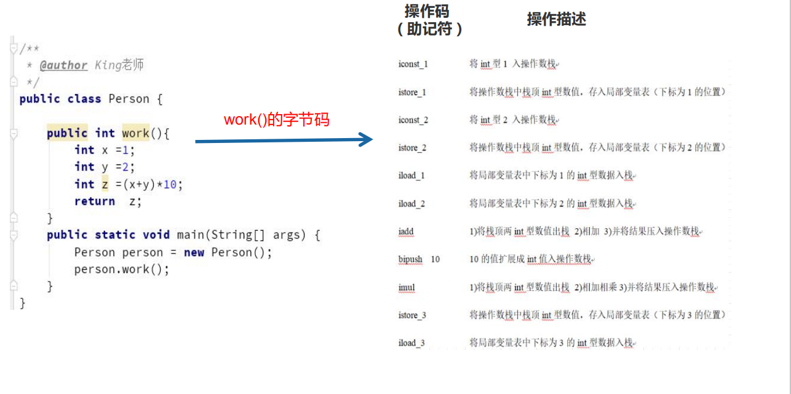
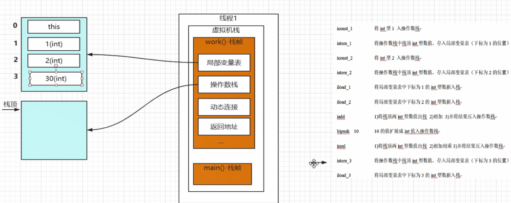

#### 本地方法栈  
本地方法栈保存的是 native 方法的信息。
本地方法栈跟 `Java` 虚拟机栈的功能类似，`Java` 虚拟机栈用于管理 `Java` 函数的调用，本地方法栈展则用于管理本地方法的调用，但本地方法并不是由 `Java` 实现的，而是由 `C语言`实现的。与虚拟机栈一样，本地方法也会抛出 `StackOverflowError` 和 `OutOfMemoryError`异常。      

本地方法栈是和虚拟机栈非常相似的一个区域，它服务的对象是 `native` 区域。虚拟机规范无强制规定，各版本虚拟机自由实现，`HotSpot` 直接把本地方法栈和虚拟机栈合二为一。  

线程开始调用本地方法时，会进入不受 `JVM` 约束的区域。本地方法可以通过 `jni (Java Native Interface)`来访问虚拟机运行时的数据区，甚至可以调用寄存器，具有和`jvm`相同的功能和权限，当大量本地方法出现是，势必会削弱 `jvm` 对系统的控制力，因为它的出错信息比较黑盒。 内存不足的情况下，本地方法栈还会抛出 `nativeheapOutOfMemory` 异常  

`JNI` 使 `Java` 深度使用操作系统的特性功能，复用非`Java`代码，但是在项目过程中，大量使用其他语言实现 `jni`，就会丧失跨平台特性。  
### 线程共享的区域  

#### Java堆  

堆是 `JVM` 上最大的内存区域，我们申请的几乎所有对象，都是在这里存储的，我们常说的垃圾回收，操作的对象就是堆。  
堆空间一般在程序启动时候就会申请，此空间唯一的作用就是存放对象实例。  

随着对象的频繁创建，堆空间占用的越来越多，就需要不定期的对不再使用的对象进行回收，这个在 `Java` 中，叫做 `GC(Garbage Collection)`。  

`Java` 对象创建分配的内存地址和 **对象的类型和在 Java 类中存在的位置** 有关：
`Java` 对象可以分为 基本数据类型和普通对象  
1. 对于普通对象来说，`JVM`会在堆上创建对象，然后在其他地方使用的是它的引用，比如把这个对象的引用保存在虚拟机栈的局部变量表中  
2. 对基本数据类型来说(byte、short、int、long、float、double、char、boolean)，有两种情况。 当你在方法体内声明了基本数据类型的对象，它会在栈上分配内存，其他情况都是在堆上分配。  

堆是垃圾回收器管理的主要区域，
- 从内存回收的角度来看，由于现在收集器都采用**分代收集算法**，所以 `Java` 堆还可以细分为：新生代和老年代；再细致一点的有 `Eden` 空间、`From Survivor` 空间、`To Survivor` 空间等  
- 从内存分配的角度看，线程共享的 `Java` 堆中可能划分出多个线程私有的分配缓冲区(Thread Local Allocation Buffer,TLAB)  

`Java` 堆可以处于物理上不连续的内存空间中，只要逻辑上是连续的即可，当前主流的虚拟机都是按照可扩展来实现的(通过 -Xmx 和 -Xms 控制)，如果在堆中没有内存完成实例分配，并且堆也无法再扩展时，将会抛出 `OutOfMemoryError`异常  

**堆大小参数：**   
-Xms：堆的最小值；  
-Xmx：堆的最大值；  
-Xmn：新生代的大小；  
-XX:NewSize；新生代最小值；  
-XX:MaxNewSize：新生代最大值；  
例如- Xmx256m  

#### 方法区  

方法区`(Method Area)` 与 `Java` 堆一样，是各个线程共享的内存区域，它用于存储已经被虚拟机加载的类相关信息，包括类信息，静态变量，常量，运行时常量池，字符串常量池。  

**在 `HotSpot` 虚拟机、`Java7` 版本中，已经将永久代的静态变量和运行时常量池转移到了堆中，其余部分则存储在 JVM 的非堆内存中，而 Java8 版本中已经将方法区中实现的永久代去掉了,并用元空间(class metadata) 代替了之前的永久代，并且元空间的存储位置是本地。**   

`Java` 虚拟机规范把方法区描述为堆的一个逻辑部分，但是它有一个别名叫做 Non-Heap(非堆)，目的应该是与Java堆区分开。  

`Java` 虚拟机规范对方法区的限制非常宽松，除了和 Java堆一样不需要连续的内存和可以选择固定大小或者可扩展外，还可以选择不实现垃圾收集。垃圾收集行为在这个区域是比较少见的，其内存回收目标主要是针对常量池的回收和对类型的卸载。当方法区无法满足内存分配需求时，将抛出 `OutOfMemoryError` 异常。  

**注：**  
很多人习惯将 **方法区**成为 **永久代**，其实两者并不等价，`HotSpot`虚拟机使用永久代来实现方法区，但在其他虚拟机中，例如：Oracle 的 JRockit、IBM 的 J9 就不存在永久代一说。 方法区是 JVM 规范中的一部分，可以说，在 `HotSpot` 中，设计人员使用永久代来实现了 `JVM` 规范的方法区。  

`Java8` 为什么使用元空间代替永久代，这样做的好处是什么？  
1. 字符串存在永久代中，容易出现性能问题和内存溢出
2. 类及方法的信息等比较难确定其大小，因此对于永久代的大小指定比较困难，太小容易出现永久代溢出，太大则容易导致老年代溢出
3. 永久代会为 `GC` 带来不必要的复杂度，并且回收效率偏低
4. 将 `HotSpot` 与 `JRockit` 二合一 

**元空间大小参数：**  
jdk1.7及以前（初始和最大值）：-XX:PermSize；-XX:MaxPermSize；  
jdk1.8以后（初始和最大值）：-XX:MetaspaceSize； -XX:MaxMetaspaceSize  
jdk1.8以后大小就只受本机总内存的限制（如果不设置参数的话）  

JVM参数参考：https://docs.oracle.com/javase/8/docs/technotes/tools/unix/java.html

#### 运行时常量池  

运行时常量池`(Runtime Constant Pool)` 是方法区的一部分。`Class` 文件中除了有类的版本、字段、方法、接口等描述信息外，还有一项信息是常量池（`Constant Pool Table`），用于存放编译期生成的各种字面量和符号引用，这部分内容将在类加载后进入方法区的运行时常量池中存放。

`Java` 在执行某个类的时候，必须先加载类。在加载类(加载、验证、准备、解析、初始化) 的时候，`JVM` 会先加载 `class` 文件，而在 `class` 文件中除了有类的版本、字段、方法和接口等描述信息外，还有一项信息是常量池(Constant Pool Table),用于存放编译器生成的各种**字面量**和**符号引用**， 这部分内容将在类加载后进入方法区的运行时常量池中存放。  

**字面量**包括字符串(String a = "b")、基本类型的常量(final 修饰的变量)、**符号引用**则包括类和方法的全限定名(例如 String 这个类，它的全限定名是 `Java/lang/String`)、字段的名称和描述符以及方法的名称和描述符。  

而当类加载到内存中后，`JVM`就会将 `class` 文件常量池中的内容存放到运行时的常量池中；在解析阶段，`JVM`会把符号引用替换为直接引用(对象的索引值)。 

例如：类的一个字符串常量在 `class` 文件中时，存放在 `class` 文件常量池中；在 `jvm` 加载完类之后，`JVM`会将这个字符串常量放到**运行时常量池**中，并在解析阶段，指定该字符串对象的索引值。运行时常量池是全局共享的，多个类公用一个运行时常量池，`class`文件中常量池多个相同的字符串在运行时常量池只会保存一份。  

假如两个线程都试图访问方法区中的同一个类信息，而这个类还没有装入 `jvm`那么此时就只允许一个线程去加载它，另一个线程必须等待。

### 直接内存
直接内存`(Direct Memory)`并不是虚拟机运行时数据区的一部分，也不是 Java虚拟机规范中定义的内存区域。  

在 JDK 1.4 中新加入了 `NIO`，引入了一种基于通道`（Channel）`与缓冲区`（Buffer）`的` I/O` 方式，它可以使用 `native` 函数库直接分配堆外内存，然后通过一个存储在`Java堆`中的 `DirectByteBuffer` 作为这块内存的引用进行操作。这样能在一些场景中显著提高性能，因为避免了在 `Java堆` 和 `native堆` 中来回复制数据。  

直接内存不受 `Java堆` 的限制，但受本机总内存的限制。在配置虚拟机参数时，会根据实际内存设置 -Xmx 等参数信息，但经常忽略直接内存，使得各个内存区域总和大于物理内存限制（包括物理的和操作系统级的限制），从而导致动态扩展时出现 `OutOfMemoryError` 异常。  

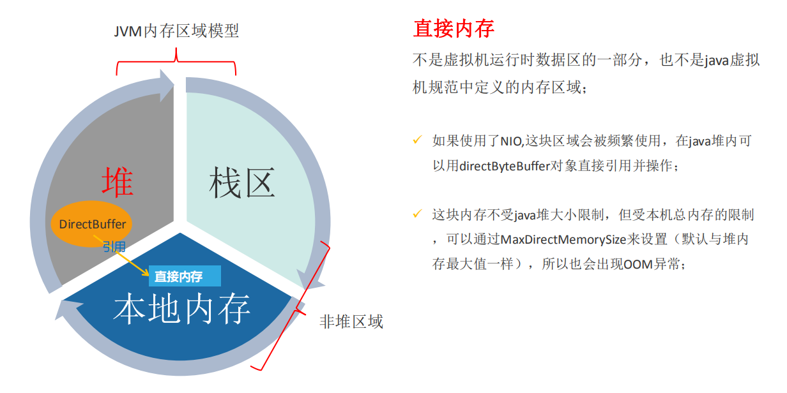

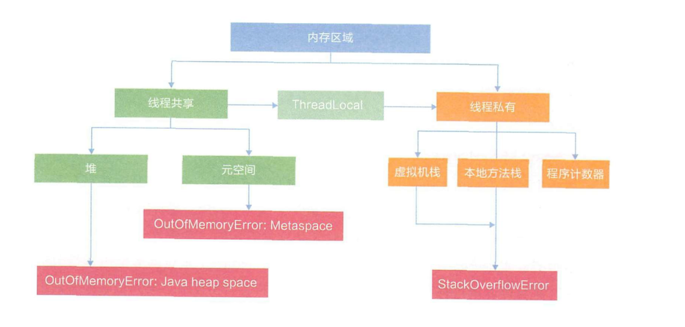

### 从底层深入理解运行时数据区  

开启 `HSDB` 工具  
`Jdk1.8` 启动 `JHSDB` 的时候必须将 `sawindbg.dll` 复制到对应目录的 `jre` 下  

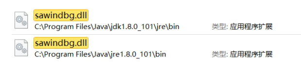  

在 `jdk - lib`目录下执行 ` java -cp .\sa-jdi.jar sun.jvm.hotspot.HSDB`  

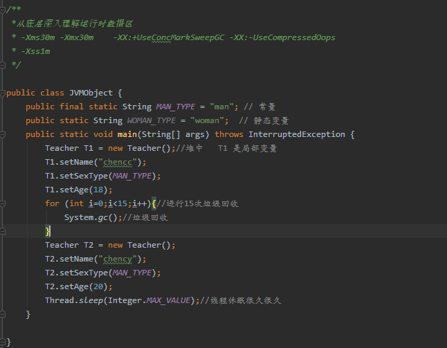

当我们通过 Java 运行以上代码时，JVM 的整个处理过程如下：  

1. `JVM` 向操作系统申请内存， `JVM` 第一部结束通过配置参数或者默认参数向操作系统申请内存空间  
2. `JVM` 获得内存空间后，会根据配置参数分配堆，栈以及方法区的内存大小。  
3. 完成上一个步骤后，`jvm` 会先执行构造器，编译器会在 `java` 文件编译成 `class` 文件时，收集
所有初始化的代码，包括静态变量赋值语句、静态代码块、静态方法、静态变量和常量放入方法区。  
4. 执行方法。启动 `main` 线程，执行 `main` 方法，开始执行第一行代码。此时堆中会创建一个 `Teacher` 对象，对象引用就放在栈中。
 执行其他方法时，具体操作看： **栈帧执行对内存区域的影响**  

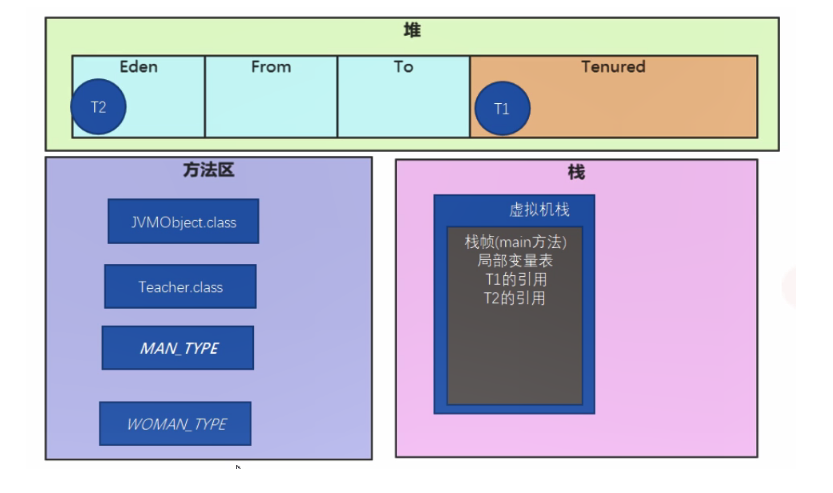

### 深入辨析堆和栈  
- **功能**   
    - 栈 ： 以栈帧的方式存储调用过程，并存储方法调用过程中基本数据类型的变量 ( int、short、long、byte、float、double、boolean、char等 )，以及对象的引用变量，其内存分配在栈上，变量出了作用域就会自动释放  
    - 堆：而堆内存用来存储 `Java` 中的对象。 无论是成员变量，局部变量还是类变量，他们指向的对象都存储在堆内存中。
    
- **线程独享还是共享**
    - 栈内存归属单个线程，每个线程都有一个栈内存，其存储的变量只能在其所属线程中可见，即栈内存可以理解为线程的私有内存
    - 堆内存中的对象对所有线程可见。堆内存中的对象可以被所有线程访问。
    
- **空间大小**  
    - 栈的内存要远小于堆内存，栈的深度是有限制的，可能发生 `StackOverFlowError` 异常
    

### 内存溢出  

#### 栈溢出  

设置参数：-`Xss1m`   
具体默认值需要查看官网：https://docs.oracle.com/javase/8/docs/technotes/tools/unix/java.html#BABHDABI

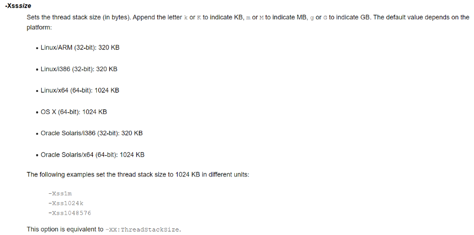

`HotSpot` 虚拟机中栈的版本大小是固定的，不支持拓展

`java.lang.StackOverflowError` 一般的方法调用是很难出现的，如果出现了，可能是无限递归  

虚拟机带给我们的启示：方法的执行因为要打包成栈帧，所以天生要比实现同样功能的循环慢，所以树的遍历算法中：递归和非递归( 循环来实现 )都有存在的意义。 递归代码简介，非递归代码复杂但是速度快。  

`OutOfMemoryError` 不断建立线程，`JVM` 申请栈内存，机器没有足够的内存( 一般演示不出来，演示出来机器就死了)。  

#### 堆溢出  

内存溢出：申请内存空间，超出最大内存空间。  

如果是内存溢出，则通过调大 `-Xms` ，`-Xmx` 参数  

如果是内存泄漏，就说明内存中的对象都是必须存活的，那么就应该检查 `jvm` 的堆参数设置，与机器的内存对比，看看是否还有可以调整的空间，再从代码上检查是否存在某些对象声明周期过长、持有状态时间过长，存储结构设计不合理的情况，尽量减少程序运行时的内存消耗。  

#### 方法区溢出  

- 运行时常量池溢出
- 方法区中保存的 Class对象没有被及时回收，或者 Class 信息占用的内存超过了我们的配置

**注意 `Class` 要被回收，条件比较苛刻（仅仅是可以，不代表必然，因为还有一些参数可以进行控制）**  
1. 该类所有的实例都已经被回收，也就是堆中不存在该类的任何实例
2. 加载该类的 `classloader` 已经被回收
3. 该类对应的 `java.lang.Class` 对象没有在任何地方被引用，无法在任何地方通过反射访问该类的方法

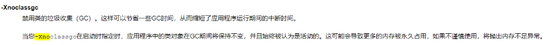

#### 本机直接内存溢出 

直接内存的容量可以用 `MaxDirectMemorySize` 来设置 ( 默认与堆内存最大值一样)， 所以也会出现 `oom` 异常  
由直接内存导致的内存溢出，一个比较明显的特征是在 `HeapDump` 文件中不会看见有什么明显的异常情况，如果发生了 `OOM` ，同时 `Dump` 文件很小，可以考虑重点排查下直接内存方面的原因  

### 虚拟机优化技术 

#### 编译优化技术-方法内联

方法内联的优化行为，就是把目标方法的代码原封不动的“复制”到调用的代码中，避免真实的方法调用而已。  

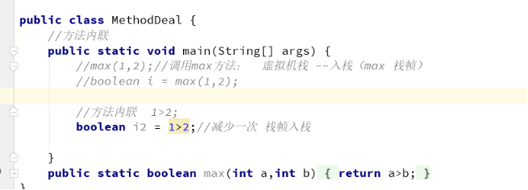

#### 栈的优化技术-栈帧直接数据的共享

在一般的模型中，两个不同栈帧的内存区域是互相独立的，但是大部分的 `jvm` 在实现中会进行一些优化，使得两个栈帧出现一部分重叠（主要体现在方法中有参数传递的情况），让下面栈帧的操作数据和上面栈帧的部分局部变量重叠，这样做不但节约了一部分空间，更重要的是在方法进行调用的时候，就可以公用一部分数据，无需进行额外的参数复制传递。  

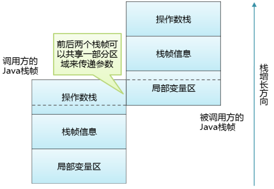