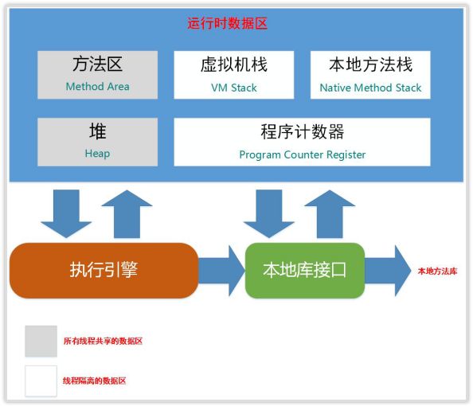
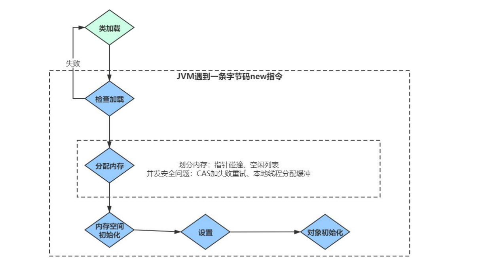

####  JVM 内存结构  
一般从两个维度出发：线程私有和线程共享。  

`Java` 虚拟机栈是基于线程的，在线程的生命周期中，参与计算的数据会频繁的入栈和出栈，栈的生命周期和线程是一样。  

- 栈里的每条数据就是栈帧。在每个`Java`方法被调用的时候，都会创建一个栈帧，并入栈。 一但完成相应的调用，则出栈。所有栈帧都出栈后，线程也就结束了。  
每个栈帧，都包含四个区域：  
1. 局部变量表
2. 操作数栈
3. 动态连接
4. 返回地址  

- 本地方法栈是和虚拟机栈非常相似的一个区域，它服务的对象是 `native` 方法。  
- 程序计数器是一块较小的内存空间，它的作用可以看作是当前线程所执行的字节码的行号指示器。  
- 堆是 `jvm` 上最大的内存区域，我们申请的几乎所有对象，都是在堆上存储的。 垃圾回收操作的对象就是堆。  
- 方法区， 这个区域存储的内容包括：类的信息、常量池、方法数据、方法代码。   

#### 什么情况下内存栈溢出？  

`java.lang.StackOverflowError` 可能是无线递归导致的  
`OutOfMemoryError` ： 不断建立线程， `JVM` 申请栈内存机器没有足够的内存。  

#### 通过 new 创建 一个对象的流程  

详情见  [学习笔记-JVM-对象和垃圾回收机制](https://juejin.im/post/5efd35526fb9a07eb8692d50#heading-1)  **对象的分配** 章节

#### Java 对象会不会分配在栈中  

可以，如果对象不满足逃逸分析，那么虚拟机在特定情况下会走栈上分配。  

#### 如果判断一个对象是否被回收，有哪些算法，实际虚拟机使用得最多的是什么

引用计数法和可达性分析两种，大多数虚拟机用的是可达性分析。  

详情见 [学习笔记-JVM-对象和垃圾回收机制](https://juejin.im/post/5efd35526fb9a07eb8692d50#heading-16 )  **判断对象的存活** 章节  

#### GC收集算法有哪些？他们的特点是什么？  

复制、标记清除、标记整理。  

复制速度快，但浪费空间，不会产生内存碎片。  
标记清除空间利用率高，但有内存碎片。  
标记整理算法没有内存碎片，但是要移动对象，性能较低。  

详情见 [学习笔记-JVM-对象和垃圾回收机制](https://juejin.im/post/5efd35526fb9a07eb8692d50#heading-38)  **垃圾回收算法** 章节  

#### JVM中一次完整的GC流程是怎样的？对象如何晋级到老年代？  

对象优先在新生代区中分配，如果没有足够空间，则 `Minor GC`；  
大对象(需要大量连续内存)直接进入老年代；长期存活的对象进入老年代；  
如果对象在新生代中出生并经历过一次 `Minor GC` 后仍然存活，年龄 **+1** ，若年龄超过一定限制（15），则被晋升到老年态。  

详情见 [学习笔记-JVM-对象和垃圾回收机制](https://juejin.im/post/5efd35526fb9a07eb8692d50#heading-26)  **对象的分配策略** 章节

#### Java中的几种引用关系，它们的区别？  
详情见 [学习笔记-JVM-对象和垃圾回收机制](https://juejin.im/post/5efd35526fb9a07eb8692d50#heading-20 )  **各种引用** 章节  

#### final、finally、finalize的区别？  
##### final：
在 `Java` 中，`final` 可以用来修饰类，方法和变量(成员变量或局部变量)  

当用 `final` 修饰类时，标明该类不能被其他类所继承。当我没需要一个类永远不能被继承是，就可以用 `final` 修饰，但要注意：  

final 类中所有的成员方法都会隐式的定义为 final方法。  

使用 `final` 方法的原因有两个：  
1. 把方法锁定，以防止继承类对其进行更改。
2. 效率，早期的 `Java`版本中，会将 `final` 转为内嵌调用。但若方法过于庞大，可能在性能上不会有多大提升。因此在最近版本中，不需要 `final` 进行这些优化了。  

final 成员变量表示常量，只能被赋值一次，赋值后其值不再改变。  

##### finally：
**`finally` 作为异常处理的一部分**，它只能用在`try catch`语句中，并且附带一个语句块，表示这段语句最终一定会被执行(不管有没有抛出异常)，经常被用在需要释放资源的情况下。  

##### Object 中的 finalize() 方法 

即使通过可达性分析判断不可达的对象，也不是**非死不可**。 真正宣告一个对象死亡，需要经过两次标记过程，一次是没有找到与 `GCRoots` 的引用链，它将被第一次标记。随后进行一次筛选(如果对象覆盖了 finalize())，我们可以在 `finalize()` 中去拯救。  

#### String s = new String(“abc”);创建了几个对象？  

**2个**  
1. 在一开始字符串 `abc` 会在加载类时，在常量池中创建一个字符串对象。  
2. 调用 `new` 时，会在堆内存中创建一个 `String` 对象，`String` 对象中的 `char` 数组会引用常量池中的字符串。  

详情见 [学习笔记-JVM-对象和垃圾回收机制](https://juejin.im/post/5efd35526fb9a07eb8692d50#heading-56)  **String 对象是如何实现的** 章节  