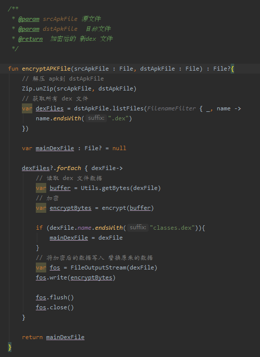

### 学习笔记-Java-IO复习-文件加密（dex）

本文目的为复习IO方面知识，以dex文件加密解密为例：

**整体框架**   

加壳：

脱壳 ：  

思路就是将 **源dex** 文件进行加密，将加密后的**源dex** 和 **壳dex** 重新打包生成新的apk，然后在 apk 打开的时候 使用**壳dex** 解密**源dex**文件并加载。  

整个流程分三部分：  

1. 处理原始`apk` ,加密**源dex**
2. 处理 `aar`  获得**壳dex**
3. 将 **源dex** 和 **壳dex** 重新打包签名  

####  处理原始`apk` ,加密源dex  
 解压**apk**文件，对所有的dex文件进行加密重新写入，然后重命名

#### 处理aar获得壳dex
这里使用 **aar** 来做壳dex，aar里包含了 `Application`  
根据APP的启动流程，我们需要在 `Application.attachBaseContext()` 方法里解密 **源dex** 并加载
主要工作是 解压`aar` 使用 `windows 命令行` 将 `jar` 转化为 `dex` 文件，然后将`dex` 放入解压后的apk文件夹内

####  打包签名  
前面使用的同样是`windows 命令行`

 

#### 壳dex解密处理  

解压 `apk` 文件，然后对加密的dex文件进行解密
  

如果文件存在，说明已经解密过了，直接加载即可 ( `ClassLoader` 这部分还不太会，会了补笔记)
