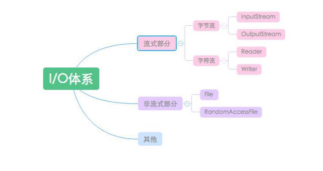
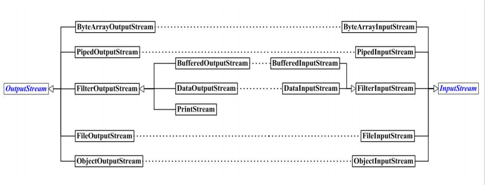
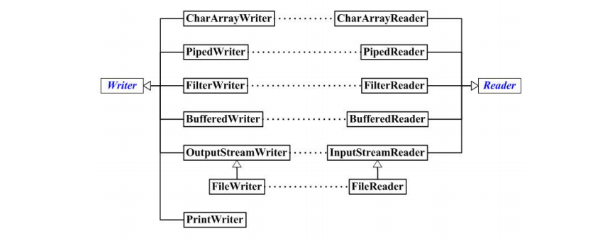
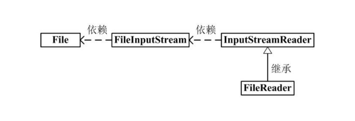
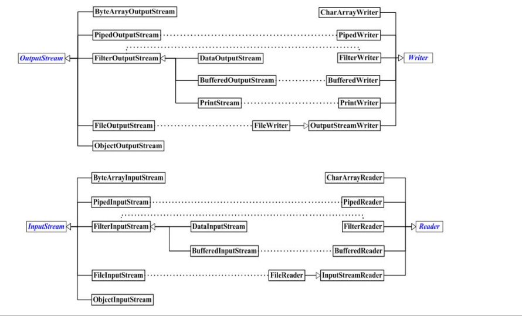

### IO体系


### 字节流

**类结构**
  

```Java
OutputStream -> FileOutputStream / FilterOutputStream -> DataOutputStream -> bufferedOutputStream
```

**使用**  
```Java
DataOutputStream out = new DataOutputStream( 
                    new BufferedOutputStream( 
                    new FileOutputStream( 
                    new File(file)));
```

从上面的代码块可以看到类的关系：为了向文件中写入数据，首先需要创建一个 `FileOutputStream`，为了提高读写效率，所以将它发送给具备缓存功能的 `BufferedOutputStream`，而为了实现与机器类型无关的Java基本类型的输出，所以我们将缓存流传递给了 `DataOutputStream`。从上面的关系，我们可以看到，
其根本目的都是为 `outputSteam` 添加额外的功能。而这种额外功能的添加就是采用了**装饰模式**来构建的代码。  

### 字符流  




```Java
Writer -> FilterWriter -> BufferedWriter -> OutputStreamWriter -> FileWriter -> 其他
```

字符有一个 `readline()` ，`readLine()`方法在进行读取一行时，只有遇到回车`(\r)`或者换行符 `(\n)` 才会返回读取结果，这就是“读取一行的意思”，重要的是 `readLine()` 返回的读取内容中并不包含换行符或者回车符；

并且，当 `realLine()` 读取到的内容为空时，并不会返回 `null`，而是会一直阻塞，只有当读取的输入流发生错误或者被关闭时，`readLine()`方法才会返回 `null`。  

**注意：**
因为英文是一个字节，中文最少是两个字节，所以用 `stream` 读取的话，中文就会出现乱码，如果你用 `Writer`，就不会有乱码了  

#### BufferedWriter 和 bufferedOutputStream  
`Buffer` 是一个缓冲区，
如果你直接用 `stream` 或者`writer`，需要访问多少数据就向磁盘中
读多少个数据 ，`buffered` 就是将本地添加了一个
**缓存的数组**， 会先读取整个缓存空间相应大小的数据，
这样就是从磁盘读取了一块比较大的数据，然后缓存起来，从而减少了对磁盘的访问的次数以达到提升性能的目的。

#### OutputStreamWriter/InputStreamReader  
输入字符转换流、是输入字节流转向输入字符流的桥梁、用于将输入字节流转换成输入字符流、通过指定的或者默认
的编码将从底层读取的字节转换成字符返回到程序中。  
本质也是使用其内部的一个类
来完成所有工作：`StreamDecoder`、使用默认或者指定的编码将字节转换成字符；  
`OutputStreamWriter/InputStreamReader` 只是对 `StreamDecoder` 进行了封装、内部所有方法核心都是调用 `StreamDecoder` 来完成的，使得我们可以直接使用读取方法、而不用关心内部实现  

```Java

OutputStreamWriter、InputStreamReader分别为InputStream、OutputStream的低级输入输出流提供将字 节转换成字符的桥梁、他们只是外边的一个门面、真正的核心：

```
**OutputStreamWriter中的StreamEncoder：**  
- 使用指定的或者默认的编码集将字符转码为字节 
- 调用 `StreamEncoder`自身实现的写入方法将转码后的字节写入到底层字节输出流中。

**InputStreamReader中的StreamDecoder：**  
- 1、使用指定的或者默认的编码集将字节解码为字符 
- 调用 `StreamDecoder`自身实现的读取方法将解码后的字符读取到程序中。


#### 字符流用法  
`Java` 字节流可以转换为字符流，转换关系为  







**转换：**  

`InputStreamReader`和`OutputStreamWriter`，这两个为类是字节流和字符流之间相互转换的类  

**InputSreamReader用于将一个字节流中的字节解码成字符：**  
**构造方法：**  
```Java
//功能：用默认字符集创建一个InputStreamReader对象
InputStreamReader(InputStream in);

//功能：接收已指定字符集名的字符串，并用该字符创建对象
InputStreamReader(InputStream in,String CharsetName);
```

**OutputStream用于将写入的字符编码成字节后写入一个字节流：**  
**构造方法：**  
```Java
//功能：用默认字符集创建一个OutputStreamWriter对象
OutputStreamWriter(OutputStream out);

//功能：接收已指定字符集名的字符串，并用该字符创建对象
OutputStreamWriter(OutputStream out,String CharSetName)
```

为了避免频繁的转换字节流和字符流，对以上两个类做了封装：  
`BufferedWriter` 封装了 `OutputStreamWriter` 类  

`BufferedReader` 封装了 `InputStreamReader` 类  

```Java
BufferedWriter out=new BufferedWriter(new OutputStreamWriter(System.out)); 
BufferedReader in= new BufferedReader(new InputStreamReader(System.in);
```
利用下面的语句，可以从控制台读取一行字符串：
```Java
BufferedReader in=new BufferedReader(new InputStreamReader(System.in)); 
String line=in.readLine();
```


### RandomAccessFile  

`RandomAccessFile`是 `java Io`体系中功能最丰富的文件内容访问类。即可以读取文件内容，也可以向文件中写入内容。但是和其他输入/输入流不同的是，程序可以直接跳到文件的任意位置来读写数据。  

**使用场景：** 访问文件部分内容、多线程分段下载等。  

**构造方法：** 
```Java
RandomAccessFile raf = newRandomAccessFile(File file, String mode); 
```
其中参数 `mode` 的值可选 `"r"：可读`，`"w" ：可写`，`"rw"：可读性`；  

**成员方法 :**  
`seek(int index);` 可以将指针移动到某个位置开始读写;  

`setLength(long len);` 给写入文件预留空间；  

#### RandomAccessFile特定和优势  
- **既可以读也可以写**  
    `RandomAccessFile` 不属于`InputStream` 和 `OutputStream` 类系的它是一个完全独立的类，所有方法(绝大多数都只属于它自己)都是自己从头开始规定的,这里面包含读写两种操作
- **可以指定位置读写**  
    `RandomAccessFile`能在文件里面前后移动，可以自由访问文件的任意位置， 在文件里移动用的`seek( )`,所以它的行为与其它的 **I/O** 类 有些根本性的不同。
总而言之，它是一个直接继承 `Object`的，独立的类。只有 `RandomAccessFile`才有 `seek`搜寻方法，而这个方法也只适用于文件。  

### NIO——FileChannel  
`Channel` 是对 `I/0` 操作的封装  

`FileChannel` 配合 `ByteBuffer`，将读写的数据缓存到内存中，然后以 批量/缓存的方式 `read/write`，省去了非批量操作时的重复中间操作，操作大文件时可以显著提高效率（和Stream以byte数组方式有什么区别？经过测试，效率上几 乎无区别）。  