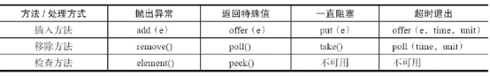
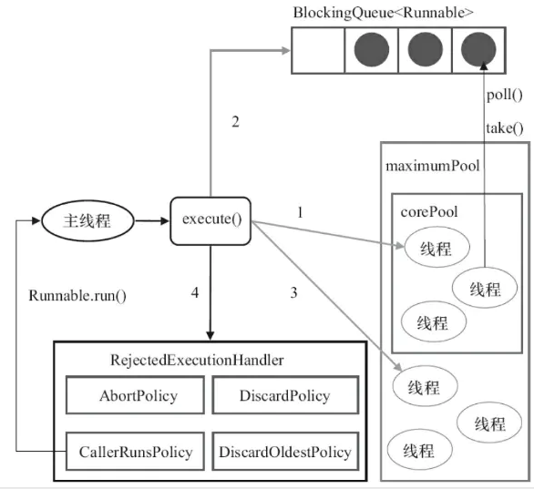

## 队列

队列是一种特殊的线性表，特殊之处在于它只允许在表的前端`（front）`进行删除操作，而在表的后端`（rear）`进行插入操作，和栈一样，队列是一种操作受限制的线性表。进行插入操作的端称为队尾，进行删除操作的端称为队头。在队列中插入一个队列元素称为入队，从队列中删除一个队列元素称为出队。
 因为队列只允许在一端插入，在另一端删除，所以只有最早进入队列的元素才能最先从队列中删除，故队列又称为先进先出`（FIFO—first in first out）`线性表。

### 阻塞队列

1. 支持阻塞的插入方法：意思是当队列满时，队列会阻塞插入元素的线程，直到队列不满。
2. 支持阻塞的移除方法：意思是在队列为空时，获取元素的线程会等待队列变为非空。

阻塞队列常用于生产者和消费者的场景。
 在并发编程中使用`生产者和消费者模式`能够解决绝大多数并发问题。该模式通过平衡生产线程和消费线程的工作能力来提高程序整体处理数据的速度。

在多线程开发中，如果生产者处理速度很快，而消费者处理速度很慢，那么生产者就必须等待消费者处理完，才能继续生产数据。同样的道理，如果消费者的处理能力大于生产者，那么消费者就必须等待生产者。

生产者和消费者模式是通过一个容器来解决生产者和消费者的强耦合问题。生产者和消费者彼此之间不直接通信，而是通过阻塞队列来进行通信，所以生产者生产完数据之后不用等待消费者处理，直接扔给阻塞队列，消费者不找生产者要数据，而是直接从阻塞队列里取，阻塞队列就相当于一个缓冲区，平衡了生产者和消费者的处理能力。




- 抛出异常：当队列满时，如果往队列里插入元素，会抛出 `IllegalStateException（"Queuefull"）` 异常。当队列为空时，从队列获取元素会抛出 `NoSuchElementException` 异常。

- 返回特殊值：当往队列插入元素时，会返回元素是否插入成功，成功返回 `true`，如果是移除方法，则是从队列取出一个元素，如果没有则返回`null`

- 一直阻塞：当阻塞队列满时，如果生产者线程往队列里 `put` 元素，队列会一直阻塞生产者线程，直到队列可用或者响应中断退出。当队列为空时，如果消费者线程从队列里 `take` 元素，队列会阻塞消费者线程，直到队列不为空。

- 超时退出：当阻塞队列满时，如果生产者线程往队列里插入元素，队列会阻塞生产者线程一段时间，如果超过指定的时间，生产者线程就会退出。 

### 常用阻塞队列

- `ArrayBlockingQueue` 一个由数组结构组成的有界阻塞队列
- `LinkedBlockingQueue` 一个由链表结构组成的有界阻塞队列
- `PriorityBlockingQueue` 一个支持优先级的无界阻塞队列
- `DelayQueue`  一个使用优先级队列实现的无界阻塞队列
- `SynchronousQueue`  一个不存储元素的阻塞队列
- `LinkedTransferQueue` 一个由链表结构组成的无界阻塞队列
- `LinkedBlockingDeque`  一个由链表结构组成的双向阻塞队列

以上的阻塞队列都实现了BlockingQueue接口，也都是线程安全的。

**有界无界？**
 有界队列就是长度有限，满了以后就会产生阻塞，无界队列就是里面能一直放东西，不会因为队列的长度限制被阻塞，当然空间的限制来源于系统资源的限制，如果不及时处理，导致队列越来越大，超出一定限制会使内存超限，会 `OOM`

无界队列也会阻塞： 因为阻塞不仅是放入元素会阻塞， 消费者拿取元素时，如果队列没有元素也会阻塞

**ArrayBlockingQueue**
 是用数组形成的有界阻塞队列。 按照`先进先出原则(FIFO)` 原则对元素进行排序，默认情况下不保证线程公平的访问队列。 公平的访问队列是指阻塞的线程可以按照阻塞的先后顺序放问队列，即先阻塞的先访问队列，后阻塞的后访问队列，非公平性是对先等待的线程是非公平的，当队列可用时，阻塞的线程都可以争夺访问队列的资格，有可能先阻塞的线程最后才访问队列。初始化时有参数可以设置。

**LinkedBlockingQueue**
 是一个用链表实现的有界阻塞队列。此队列的默认和最大长度为Integer.MAX_VALUE。此队列按照先进先出的原则对元素进行排序。

**Array实现和Linked实现的区别**

1. 队列中锁的实现不同
    `ArrayBlockingQueue` 实现的队列中锁是没有分离的，即生产和消费用的是同一把锁。
    `LinkedBlockingQueue` 实现的队列中锁是分离的，即生产用的是`putLock`，消费是`takeLock`
2. 在生产或消费时操作不同
    `ArrayBlockingQueue` 实现的队列在生产或消费的时候，是直接将枚举对象插入或移除的 `LinkedBlockingQueue` 实现的队列在生产或消费的时候，需要把枚举对象转换为 `Node` 进行插入或移除，会影响性能
3. 队列大小初始方式不同
    `ArrayBlockingQueue`  实现的队列中必须指定队列的大小
    `LinkedBlockingQueue`  实现的队列中可以不指定队列的大小，默认大小是  `Integer.MAX_VALUE`

**PriorityBlockingQueue**
 `PriorityBlockingQueue` 是一个支持优先级的无界阻塞队列，默认情况下元素采取自然顺序升序排列，也可以自定义实现`compareTo()` 自定义元素排列规则，或者初始化 `PriorityBlockingQueue` 时，指定构造参数 `Comparator` 对元素进行排序，需要注意的是不能保证同优先级元素的顺序。

**DelayQueue**
 是一个支持延时获取元素的无界阻塞队列，队列使用 `PriorityQueue` 来实现。队列中的元素必须实现`Delayed`接口，在创建元素时可以指定多久才能从队列中获取当前元素。只有在延迟期满时才能从队列中提取元素。

`DelayQueue`非常有用，可以将`DelayQueue`运用在以下应用场景。
 缓存系统的设计：可以用`DelayQueue`保存缓存元素的有效期，使用一个线程循环查询`DelayQueue`，一旦能从`DelayQueue`中获取元素时，表示缓存有效期到了。

**SynchronousQueue**
 一个不存储元素的阻塞队列，每一个`put`操作必须等待一个`take`操作，否则不能 添加元素，队列本身并不存储任何元素，非常适合传递性场景。`SynchronousQueue`的吞吐量高于`LinkedBlockingQueue`和`ArrayBlockingQueue`。

**LinkedTransferQueue**
 多了`tryTransfer`和`transfer`方法

1. `transfer`  如果当前有消费者正在等待接收元素，(消费者使用`take()`方法或带时间限制的`poll()`方法时), `transfer`方法可以把生产者传入的元素立刻`transfer`（传输）给消费者。如果没有消费者在等待接收元素，`transfer`方法会将元素存放在队列的tail节点，并等到该元素被消费者消费了才返回。
2. `tryTransfer`   `tryTransfer`方法是用来试探生产者传入的元素是否能直接传给消费者。 如果没有消费者等待接收元素，则返回`false`。 无论消费者是否接收， 方法立即返回。`transfer` 是必须消费者消费了才返回。

**LinkedBlockingDeque**
 `LinkedBlockingDeque`  是一个由链表结构组成的双向阻塞队列，所谓双向队列指的是可以从队列的两端插入和移出元素。双向队列因为多了一个操作队列的入口，在多线程同时入队时，也就减少了一半的竞争。
 多`了addFirst`、`addLast`、`offerFirst`、`offerLast`、`peekFirst`和`peekLast`等方法。
 以`First`单词结尾的方法，表示插入`(add)`、获取`(peek`) 或移除`(remove)` 双端队列的第一个元素。
 插入方法 `add` 等同于 `addLast` ，移除方法 `remove` 等效于 `removeFirst` , 但是`take`方法却等同于`takeFirst`
 在初始化`LinkedBlockingDeque`时可以设置容量防止其过度膨胀。另外，双向阻塞队列可以运用在 **工作窃取** 模式中

**工作窃取模式** 当执行新的任务时，他可以拆分成更小的任务执行，并将小的任务加到线程中，然后再送一个随机的线程队列偷一个放到自己的队列中。

## 线程池




**线程池的优点：**


1. 降低资源消耗。 通过重复利用已创建的线程降低线程创建和销毁造成的消耗。
2. 提高响应速度。当任务到达时，任务可以不需要等到线程创建就能立即执行。线程池技术正是关注如何缩短或调整 **线程创建时间** 和 **线程销毁时间** 的技术，从而提高服务器程序性能的。它把他们分别安排在服务器程序的启动和结束的时间段或者一些空闲的时间段，这样在服务器程序处理客户请求时，不会有这个开销了
3. 提高线程的可管理性。线程是稀缺资源，如果无限制地创建，不仅会消耗系统资源，还会降低系统的稳定性，使用线程池可以进行统一分配、调优和监控。

**ThreadPoolExecutor 结构，类关系**
 `Executor`是一个接口，它是`Executor`框架的基础，它将任务的提交与任务的执行分离开来。
 `ExecutorService`接口继承了`Executor`，在其上做了一些`shutdown()`、`submit()`的扩展，可以说是真正的线程池接口。 `AbstractExecutorService` 抽象类实现了 `ExecutorService` 接口中的大部分方法。
 `ThreadPoolExecutor` 是线程池的核心实现类，用来执行被提交的任务。
 `ScheduledExecutorService` 接口继承了 `ExecutorService` 接口，提供了带"周期执行"功能`ExecutorService`。
 `ScheduledThreadPoolExecutor` 可以在给定的延迟后运行命令，或者定期执行命令。`ScheduledThreadPoolExecutor` 比 `Timer` 更灵活，功能更强大。

**线程池的创建各个参数含义**

```java

public ThreadPoolExecutor(int corePoolSize, int maximumPoolSize, long keepAliveTime, 								TimeUnit unit, 
                          	BlockingQueue<Runnable> workQueue, 														ThreadFactory threadFactory, 
                          	RejectedExecutionHandler handler)

复制代码
```

`corePoolSize` 线程池核心线程数，当提交一个任务时，线程池创建一个新线程执行任务，直到当前线程数等于`corePoolSize`； 如果当前线程数为`corePoolSize`，继续提交的任务被保存到阻塞队列中，等待被执行；如果执行了线程池的 `prestartAllCoreThreads()` 方法，线程池会提前创建并启动所有核心线程。
 `maximumPoolSize` 线程池最大线程数，线程池中允许的最大线程数。如果当前阻塞队列满了，且继续提交任务，则创建新的线程执行任务，前提是当前线程数小于`maximumPoolSize`
 `keepAliveTime` 线程空闲时的存活时间，即当线程没有任务执行时，继续存活的时间。默认情况下，该参数只在线程数大于`corePoolSize`时才有用
 `TimeUnit` `keepAliveTime` 的时间单位
 `workQueue` `workQueue` 必须是 `BlockingQueue` 阻塞队列，当前线程池线程数超过 `corePoolSize` 的时候，线程会进入阻塞队列进行阻塞等待，通过 `workQueue`，线程池实现了阻塞功能。

一般来说，我们应该尽量使用有界队列，使用无界队列作为工作队列会对线程池带来如下影响：

1. 当线程池中的线程数达到 `corePoolSize` 后，新任务将在无界队列中等待，因此线程池中的线程数不会超过 `corePoolSize`
2. 由于1，使用无界队列时 `maximumPoolSize` 将是一个无效参数
3. 由于1和2，使用无界队列时 `keepAliveTime` 将是一个无效参数。
4. 使用无界队列可能会耗尽系统资源，有界队列则有助于防止资源耗尽，同时即使使用有界队列，也要尽量控制队列的大小在一个合适的范围。

```
threadFactory`  创建线程的工厂，通过自定义的线程工厂可以给每个新建的线程设置一个具有识别度的线程名，当然还可以更加自由的对线程做更多的设置，比如设置所有的线程为守护线程。
 `Executors` 静态工厂里默认的`threadFactory` ，线程的命名规则是 `"pool-数字-thread-数字"
```

`RejectedExecutionHandler`  线程池的饱和策略，当阻塞队列满了，且没有空闲的工作线程，如果继续提交任务，必须采取一种策略处理该任务，线程池提供了4种策略：

1. `AbortPolicy` 直接抛出异常，默认策略
2. `CallerRunsPolicy` 在调用者所在线程执行任务
3. `DiscardOldestPolicy`  丢弃阻塞队列中靠最前的任务，并执行当前任务
4. `DiscardPolicy`  直接丢弃任务 当然也可以根据应用场景实现RejectedExecutionHandler接口，自定义饱和策略，如记录日志或持久化存储不能处理的任务。

**线程池的工作机制**

1. 如果当前运行的线程少于`corePoolSize`，则创建新线程来执行任务（注意，执行这一步骤需要获取全局锁）
2. 如果运行的线程等于或多于`corePoolSize`，则将任务加入`BlockingQueue`
3. 如果无法将任务加入`BlockingQueue（队列已满）`，则创建新的线程来处理任务。
4. 如果创建新线程将使当前运行的线程超出`maximumPoolSize`，任务将被拒绝，并调用`RejectedExecutionHandler.rejectedExecution()`方法。

**提交任务**
 `execute()`方法用于提交不需要返回值的任务，所以无法判断任务是否被线程池执行成功
 `submit()`方法用于提交需要返回值的任务。线程池会返回一个 `future` 类型的对象，通过这个`future`对象可以判断任务是否执行成功，并且可以通过`future`的`get()`方法来获取返回值，`get()`方法会阻塞当前线程直到任务完成，而使用`get（long timeout，TimeUnit unit）`方法则会阻塞当前线程一段时间后立即返回，这时候有可能任务没有执行完

**关闭线程池**
 可以通过调用线程池的 `shutdown` 或 `shutdownNow` 方法来关闭线程池。它们的原理是遍历线程池中的工作线程，然后逐个调用线程的 `interrupt` 方法来中断线程，所以无法响应中断的任务可能永远无法终止。
 `shutdownNow` 首先将线程池的状态设置成 `STOP`，然后尝试停止所有的正在执行或暂停任务的线程，并返回等待执行任务的列表，而 `shutdown` 只是将线程池的状态设置成 `SHUTDOWN` 状态，然后中断所有没有正在执行任务的线程。
 只要调用了这两个任何一个方法，`isShutdown` 就会返回 `true`， 当所有的任务都关闭后，才表示线程池关闭成功， 这时候调用 `isTerminaed` 会返回 `true`，通常调用 `shutdown` 方法来关闭线程池，如果任务不一定要执行完，则可以调用 `shutdownNow` 方法

**合理地配置线程池**
 要想合理地配置线程池，就必须首先分析任务特性
 要想合理地配置线程池，就必须首先分析任务特性，可以从以下几个角度来分析：

- 任务的性质：CPU密集型任务、IO密集型任务和混合型任务
- 任务的优先级：高、中和低。
- 任务的执行时间：长、中和短
- 任务的依赖性：是否依赖其他系统资源，如数据库连接

性质不同的任务可以用不同规模的线程池分开处理。

1. 按任务性质
    CPU密集型任务应配置尽可能小的线程，如配置`Ncpu+1`个线程的线程池。。
    由于IO密集型任务线程并不是一直在执行任务，则应配置尽可能多的线程，如`2*Ncpu`。
    混合型的任务，如果可以拆分，将其拆分成一个`CPU密集型任务`和一个`IO密集型任务`，只要这两个任务执行的时间相差不是太大，那么分解后执行的吞吐量将高于串行执行的吞吐量。如果这两个任务执行时间相差太大，则没必要进行分解。可以通过`Runtime.getRuntime().availableProcessors()`方法获得当前设备的 `CPU` 个数。
2. 按优先级
    优先级不同的任务可以使用优先级队列PriorityBlockingQueue来处理。它可以让优先级高的任务先执行
3. 按时间
    执行时间不同的任务可以交给不同规模的线程池来处理，或者可以使用优先级队列，让执行时间短的任务先执行。

建议使用有界队列。有界队列能增加系统的稳定性和预警能力，可以根据需要设大一点儿，比如几千。
 如果当时我们设置成无界队列，那么线程池的队列就会越来越多，有可能会撑满内存，导致整个系统不可用，而不只是后台任务出现问题。


作者：哦哦哦哦哦链接：https://juejin.im/post/5ed6150ee51d45786a6ba7b1来源：掘金著作权归作者所有。商业转载请联系作者获得授权，非商业转载请注明出处。