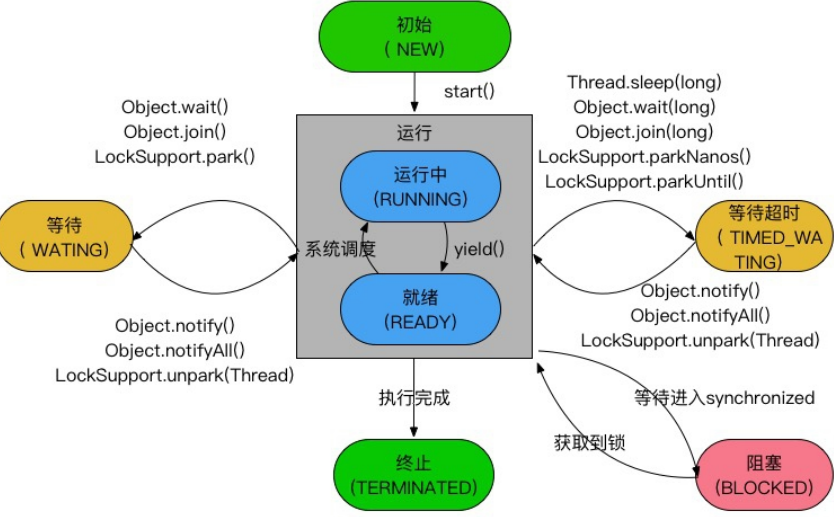
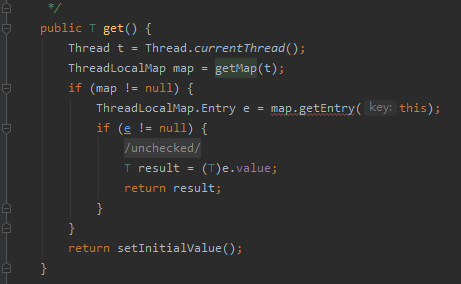
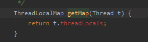
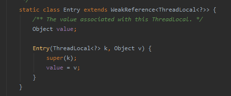
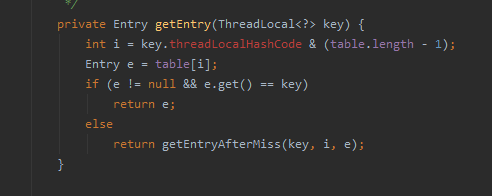
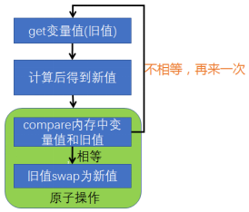

**Java有两种启动新线程的方式**：
`Thread` 类 和 `Runnable` 接口。  
注： `Callable` 开启线程需要借助 `FutureTask`, `FutureTask` 实现了`RunnableFuture` 接口, `RunnableFuture` 继承自 `Runnable`, 所以 `Callable` 本质上还是 `Runnable` 方式.  
**多线程的执行顺序**
可以用`join`方法实现。
**线程的状态&生命周期**  
Java线程状态有6中：  
1. 初始(NEW)：新创建了一个线程对象，但还没有调用start()方法
2. 运行(RUNNABLE)：Java线程中将就绪（ready）和运行中（running）两种状态笼统的称为"运行"
                线程对象被创建后，其他线程调用了该对象的 `start()` 方法, 该状态的线程位于可运行线程池中,等待被线程调度选中, 获取CPU使用权,此时为`就绪状态(ready)`, 就绪线程获得CPU的时间片后变为`运行中状态(running)`.  
3. 阻塞(BLOCKED) : 表示线程被锁阻塞
4. 等待(WATING) : 进入该状态的线程需要等待其他线程通知或者中断或者完成
5. 等待超时(TIMED_WATING) : 该状态的线程可以在指定时间后自行返回
6. 终止(TERMINATED) : 线程已经执行完毕

**死锁**  

是指两个或两个以上的进程在执行过程中，由于竞争资源或者由于彼此通信而造成的一种阻塞的现象，若无外力作用，它们都将无法推进下去。此时称系统处于死锁状态或系统产生了死锁。  

**定义**  
死锁发生的四个必要条件:  
1. 资源互斥条件：指进程对所分配到的资源进行排它性使用，即在一段时间内某资源只由一个进程占用。如果此时还有其它进程请求资源，则请求者只能等待，直至占有资源的进程用毕释放。
2. 请求和保持条件：指进程已经保持至少一个资源，但又提出了新的资源请求，而该资源已被其它进程占有，此时请求进程阻塞，但又对自己已获得的其它资源保持不放。
3. 不剥夺条件：指进程已获得的资源，在未使用完之前，不能被剥夺，只能在使用完时由自己释放。
4. 环路等待条件：指在发生死锁时，必然存在一个进程——资源的环形链，即进程集合`{P0，P1，P2，···，Pn}`中的`P0`正在等待一个`P1`占用的资源；`P1`正在等待`P2`占用的资源，……，Pn正在等待已被`P0`占用的资源。

死锁发生的条件总结:
1. 多个操作者`( M > = 2 ) ` 争夺多个 资源 `( N < = 2 )`, 并且资源数小于等于操作者数量 `(N < = M)`.
2. 争夺资源的顺序不同
3. 争夺者拿到资源不释放  

**避免死锁的方式**  
只要打破四个必要条件之一就能有效预防死锁的发生。  
1. 打破互斥条件：改造独占性资源为虚拟资源。
2. 打破不可抢占条件：当一进程占有一独占性资源后又申请一独占性资源而无法满足，则退出原占有的资源。
3. 打破占有且申请条件：采用资源预先分配策略，即进程运行前申请全部资源，满足则运行，不然就等待，这样就不会占有且申请.
4. 打破循环等待条件：实现资源有序分配策略，对所有设备实现分类编号，所有进程只能采用按序号递增的形式申请资源。

避免死锁常见的算法有有序资源分配法、银行家算法
**常用解决方法** 
1. 内部通过顺序比较，确定拿锁的顺序
2. 采用尝试拿锁的机制  

**活锁**

两个线程在尝试拿锁的机制中，发生多个线程之间互相谦让，不断发生同一个线程总是拿到同一把锁，在尝试拿另一把锁时因为拿不到，而将本来已经持有的锁释放的过程
解决办法：线程随机休眠，错开拿锁时间  

**线程饥饿**
低优先级的线程，总是拿不到执行时间
解决方法：
1. 保证资源充足
2. 公平分配资源
3. 避免持有锁的线程长时间执行  

### ThreadLocal
`threadlocal`而是一个线程内部的存储类，可以在指定线程内存储数据，数据存储以后，只有指定线程可以得到存储数据.
和 `synchonized` 一样 `threadlocal` 也是用来解决多线程并发访问问题的，不同的是， `synchonized`  是利用锁的机制, 使变量或者代码块在同一时间仅能被一个线程访问. 而 `ThreadLocal` 为每个线程都提供了变量的副本,每个线程在同一时刻访问到的其实不是同一变量,  这样就隔离了多个线程对数据的数据共享.  

**ThreadLocal的使用**
`ThreadLocal` 有四个方法,
1.  `void set(T value)  `  
    设置当前线程的线程局部变量的值
2.  `public T get()`   
    返回当前线程所对应的线程局部变量
3. `public void remove()`   
    删除当前线程局部变量的值, 目的是为了减少内存的占用. 当线程结束后，对应线程的局部变量将自动被垃圾回收, 所以调用该方法清除局部变量不是必须的操作, 但它可以加快内存回收的速度.
4.  `protected T initialValue()`  
    返回该线程局部变量的初始值，该方法是一个`protected`的方法，显然是为了让子类覆盖而设计的。这个方法是一个延迟调用方法，在线程第1次调用`get()`或`set(Object)`时才执行，并且仅执行1次。`ThreadLocal`中的为空实现, 直接返回的 `null`  

在 `get()` 方法里, 会先获取前线程，然后调用`getMap`方法获取对应的`ThreadLocalMap`，`ThreadLocalMap`是`ThreadLocal`的静态内部类,`ThreadLocalMap`  内部是由一个  `Entry[]` 数组来保存数据, `Entry` 为 `ThreadLocalMap` 的静态内部类, 

  
类似于 `key - value`  结构,  `ThreadLocal` 为 `key`, `value` 为要保存的变量.

`getEntry` 为获取 `threadlocal` 对应的变量, set 为更新对应 `threadlocal` 的值.
`ThreadLocal.get()` 方法里就是获取到当前 线程的 `ThreadLocalMap`, 然后通过 `threadLocal` 获取到对应的 `entry`的值返回.

### 原子操作  
原子操作是指不会被线程调度机制打断, 也不能被分割的操作, 这种操作一旦开始，就一直运行到结束.
Java使用锁和自旋CAS实现原子操作.
### CAS( Compare and Swap )

`CAS`操作过程都包含三个运算符：一个内存地址`V`，一个期望的值`A`和一个新值`B`，操作的时候如果这个地址上存放的值等于这个期望的值`A`，则将地址上的值赋为新值`B`，否则不做任何操作。  
`CAS`的基本思路就是，如果这个地址上的值和期望的值相等，则给其赋予新值，否则不做任何事，但是要返回原值是多少。循环`CAS`就是在一个循环里不断的做`cas`操作，直到成功为止  

**CAS实现原子操作的三大问题** 
1. **ABA 问题**
    `CAS`需要在操作值的时候，检查值有没有发生变化，如果没有发生变化则更新，但是如果一个值原来是`A`，变成了`B`，又变成了`A`，那么使用`CAS`进行检查时会发现它的值没有发生变化，但是实际上却变化了。  
    解决思路:  
    `ABA问题` 的解决思路就是使用版本号. 在变量前面追加上版本号，每次变量更新的时候把版本号加1，那么A→B→A就会变成1A→2B→3A.
2. **循环时间长开销大**  
    自旋`CAS`如果长时间不成功，会给`CPU`带来非常大的执行开销  
3. **只能保证一个共享变量的原子操作**  
   当对一个共享变量执行操作时，我们可以使用循环`CAS`的方式来保证原子操作，但是对多个共享变量操作时，循环`CAS`就无法保证操作的原子性，这个时候就可以用锁.  
    取巧的办法，就是把多个共享变量合并成一个共享变量来操作。比如，有两个共享变量`i＝2` ,`j = a`,合并一下 `ij = 2a`, 然后用`CAS`来操作`ij`。`JDK`提供了 `AtomicReference` 类来保证引用对象之间的原子性，就可以把多个变量放在一个对象里来进行`CAS`操作  

**Java JDK 原子操作类使用**  
- 更新基本类型类：`AtomicBoolean`，`AtomicInteger`，`AtomicLong`  
- 更新数组类：`AtomicIntegerArray`，`AtomicLongArray`，`AtomicReferenceArray`
- 更新引用类型：`AtomicReference`，`AtomicMarkableReference`，`AtomicStampedReference`

**AtomicInteger**   
- int addAndGet(int delta) ：原子方式将输入的数值与实例中的值（AtomicInteger里的value）相加，并返回结果  
- boolean compareAndSet(int expect,int update) : 如果输入的数值等于预期值，则以原子方式将该值设置为输入的值。
- int getAndIncrement() ：以原子方式将当前值加1，这里返回的是自增前的值
- int getAndSet(int newValue) : 以原子方式设置为newValue的值，并返回旧值。  

**AtomicIntegerArray**

- int addAndGet(int i,int delta) : 以原子方式将输入值与数组中索引`i`的元素相加. 并返回结果
- boolean compareAndSet(int i,int expect,int update)：如果当前值等于预期值，则以原子方式将数组位置i的元素设置成`update`值  
需要注意的是，数组`value`通过构造方法传递进去，然后`AtomicIntegerArray`会将当前数组复制一份，所以当`AtomicIntegerArray`对内部的数组元素进行修改时，不会影响传入的数组.  

**更新引用类型**  
原子更新基本类型的`AtomicInteger`,只能更新一个变量,如果要原子更新多个变量,就需要使用这个原子更新引用类型提供的类.Atomic包提供了以下3个类.

- AtomicReference  原子更新引用类型
- AtomicStampedReference  原子更新带有版本戳的引用类型, 记录了每次更新的版本戳，解决了 `ABA` 问题
- AtomicMarkableReference  原子更新带有标记位的引用类型 可以原子更新一个布尔类型的标记位和引用类型。构造方法是`AtomicMarkableReference(V initialRef，boolean initialMark)`.  

区别 `AtomicStampedReference` 关心的是改动了几次, `AtomicMarkableReference` 关心的是是否有改动过.  

### 相关方法
`sleep`、`wait`、`yield`的区别：  

  `yield()`方法：使当前线程让出`CPU`占有权，但让出的时间是不可设定的。也不会释放锁资源。所有执行`yield()`的线程有可能在进入到就绪状态后，被 `OS(操作系统)` 再次选中马上又被执行。

`yield()` 、`sleep()`被调用后，都不会释放当前线程所持有的锁。  

 调用`wait()`方法后，会释放当前线程持有的锁，而且当前被唤醒后，会重新去竞争锁，锁竞争到后才会执行 `wait`方法后面的代码。 

`wait`通常被用于线程间交互，`sleep`通常被用于暂停执行，`yield()`方法使当前线程让出CPU占有权。  

`wait` 的线程可以使用`notify/notifyAll()`进行唤醒。  

### 守护线程  
`Daemon`（守护）线程是一种支持型线程，因为它主要被用作程序中后台调度以及支持性工作。这意味着，当一个**Java虚拟机**中不存在非`Daemon`线程的时候，Java虚拟机将会退出。可以通过调用`Thread.setDaemon(true)`将线程设置为`Daemon`线程。我们一般用不上，比如**垃圾回收线程**就是Daemon线程。  

#### 退出线程  
`run()` 方法执行完毕或者 抛出未处理的异常导致线程提前结束。  
暂停、恢复和停止操作对应在线程 Thread 的 API 就是 `suspend()`、`resume()` 和`stop()`。但是这些API是过期的，也就是不建议使用的。因为会导致程序可能工作在不确定状态下。  
安全的中止则是其他线程通过调用某个线程A的 `interrupt()` 方法对其进行中断操作，被中断的线程则是通过线程通过方法 `isInterrupted()`来进行判断是否被中断，也可以调用静态方法`Thread.interrupted()`来进行判断当前线程是否被中断，不过`Thread.interrupted()`会同时将中断标识位改写为`false`。
