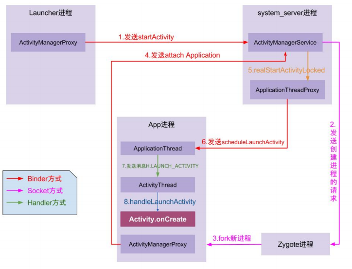

- **Andorid 为什么设计出 bundle 而不是直接用 map结构**  
1. `Bundle` 内部是由 `ArrayMap` 实现的，`ArrayMap` 内部实现是两个数组，一个 `int` 数组存储对象数据对应下标，一个对象数组保存 `key` 和`value`， 内部使用 **二分法** 对`key`进行排序， 所以，在添加，删除，查找数据的时候，都会使用**二分法**查找，只适合于小数据量操作，如果数据量比较大的情况下，那么它的性能将退化。而 `HashMap` 内部是 **数组 + 链表** 结构，在数据量较少的时候，`HashMap`的 `Entry Array` 比`ArrayMap` 占用更多的内存，而使用`Bundle`的场景大多数为小数据量，用 `ArrayMap` 保存数据，在操作速度和内存占用上都具有优势，因此使用Bundle来传递数据，可以保
证更快的速度和更少的内存占用。  
2. 另外一个原因，则是在`Android`中如果使用`Intent`来携带数据的话，需要数据是基本类型或者是可
序列化类型，`HashMap`使用`Serializable`进行序列化，而`Bundle`则是使用`Parcelable`进行序列化，而在 `Android` 平台中，更推荐使用`Parcelable`实现序列化，虽然写法复杂，但是开销更小，所以为
了更加快速的进行数据的序列化和反序列化，系统封装了`Bundle`类，方便我们进行数据的传输。  

- **Android中Intent/Bundle的通信原理及大小限制**  
`Intent` 中的 `Bundle` 是使用 `Binder` 机制进行数据传送的，能使用的 `binder` 的缓冲区是有大小限制的(大约是2M, 机型不同大小可能不同)，一个进程默认有`16`个 binder 线程，所以一个线程能占用的缓冲区
就更小了(大约一个线程可以占用 128 KB),  传递数据过大会发生 `The Binder
transaction failed because it was too large` 这类 `TransactionTooLargeException` 异常。  

- **为何Intent不能直接在组件间传递对象而要通过序列化机制？**  

  `Intent` 在启动其他组件时，会离开当前应用程序进程，进入 `ActivityManagerService` 进程 (`intent.prepareToLeaveProcess()`)，这也意味着， `intent` 所携带的数据要能够在不同进程间传输。 `Android` 是基于 `linux` 系统的，不同进程之间 `Java` 对象无法传输，所以要对对象进行序列化，从而实现对象在 **应用程序进程** 和 `ActivityManagerService进程` 之间传输。  
  而`Parcel`或者`Serializable`都可以将对象序列化，其中，`Serializable`使用方便，但性能不如`Parcel`
  容器，后者也是Android系统专门推出的用于进程间通信等的接口

  