##  学习笔记-RxJava复习

### RxJava 操作符  

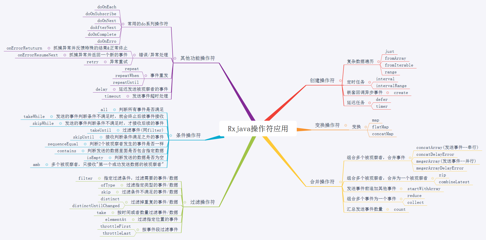

### RxJava  原理流程 

以如下代码为例：
```Java
            Observable.create(object :ObservableOnSubscribe<String> {
                override fun subscribe(emitter: ObservableEmitter<String>) {
                 Log.e(TAG, "onComplete:  ${Thread.currentThread()}" )
                    emitter.onNext("create =======")
                }
            })
                .flatMap(object : Function<String, Observable<String>>{
                    override fun apply(t: String): Observable<String> {
                        return Observable.just("flatMap ===== ")
                    }
                } )
                .subscribeOn(Schedulers.io())
                .observeOn(AndroidSchedulers.mainThread())
                .subscribe(object : Observer<String> {
                    override fun onComplete() {
                        Log.e(TAG, "onComplete:  " )
                    }

                    override fun onSubscribe(d: Disposable) {
                        Log.e(TAG, "onSubscribe:  " )
                    }

                    override fun onNext(t: String) {
                        Log.e(TAG, "onNext:  ${t.toString()}  " )
                    }

                    override fun onError(e: Throwable) {
                        Log.e(TAG, "onError:  ${e.message}" )
                    }


                })
```

**流程简述**  
每一个 `RxJava` 事件流 总是以 `Create` 创建开始，以 `subscribe` 订阅结束，`Create` 和 `subscribe` 直接由若干个操作符 或者 线程调度操作符(`subscribeOn` 、 `observeOn`) 组成。  

### 具体流程：   
#### create创建方法
`Observable.create()` 需要传入 `ObservableOnSubscribe` 接口对象  并返回一个 `ObservableCreate` 对象， `RxJavaPlugins.onAssembly` 默认为空实现。
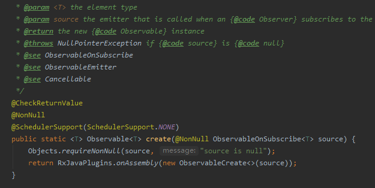

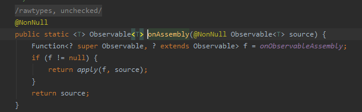  

#### RxJava操作符  
`RxJava操作符` 是在 `create()` 创建之后， `subscribe()` 订阅之前调用， 以 `flatMap()` 为例:  
`flatMap()` 需要传入一个 `Function` 对象，返回一个 `ObservableFlatMap` 对象，并将自身`Source`传入进去，相当于给当前方法的调用对象(即 `Create()` 方法返回的 `ObservableCreate`)封装一层再次返回。   

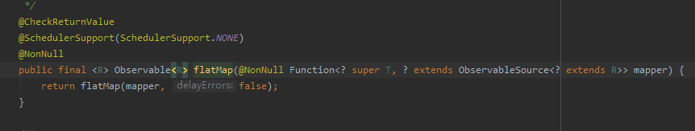

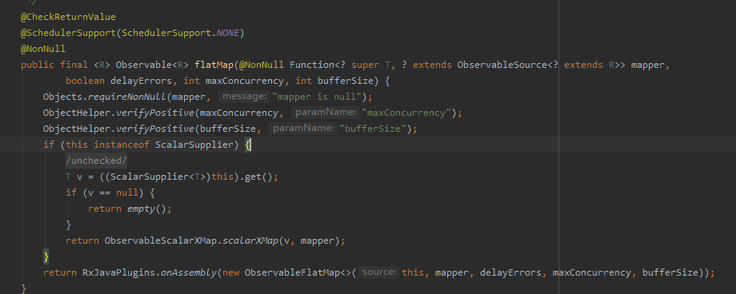  

#### subscribeOn 和 subscribe  
`subscribeOn` 和 `subscribe` 操作符是用来做线程调度的，后面在看，这里只关注返回  
这两个方法返回的都是 `ObservableObserveOn` 对象，和 `flatMap()` 一样，都是对调用对象做了一层封装并返回。
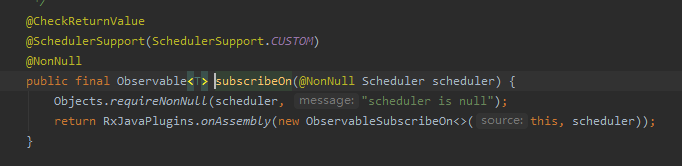

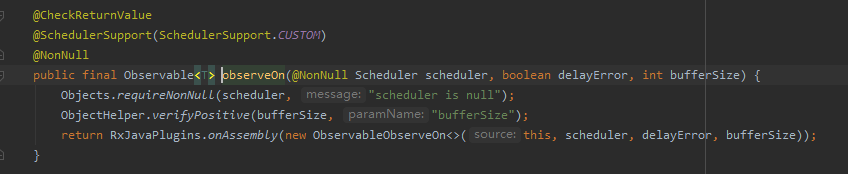  

#### subscribe  
`subscribe` 订阅方法是 `RxJava` 事件流的结尾，需要传入一个 观察者(`Observer` 对象)，源码可以看到，`subscribe()`最终调用了当前对象的 `subscribeActual()`方法( 也就是上个操作符，这里是`observeOn`操作符返回的 `Observable` 对象)，并且将 自定义观察者(`observer`)传入了进去  

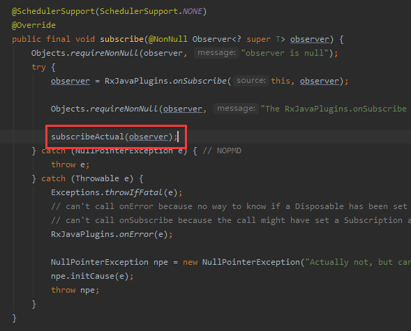\

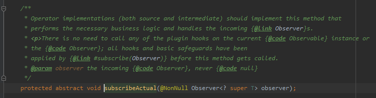

回到上个操作符返回的 `Observable` 对象 `subscribeActual()`，可以看到调用了 `source.subscribe()`方法并将 观察者 `observer` 包装了一层继续传递 

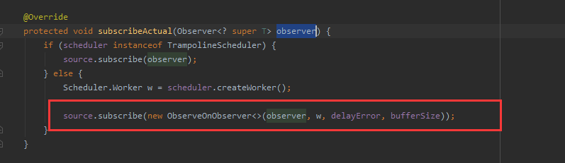

而 `source` 其实就是 再上个 操作符返回给我们的 `Observable`对象

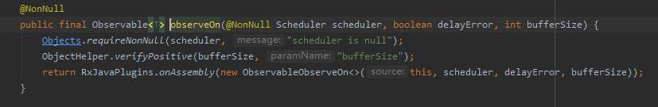

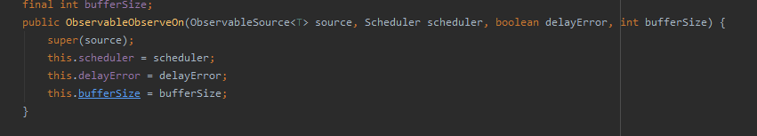

查看源码可以看到，所以的操作符都是同样的流程，也就是说，每个操作符都会多 `observer` 包装一层，同时将它传给上一层的操作符，直到最开始的 `create()` 方法返回的`ObservableCreate`，
可以看到，这时候调用了我们传入的 `observer` 的 `onSubscribe()`方法，此时订阅成功，事件开始。
然后调用了 我们自定义 `source` 的 `subscribe()` 也就是下图部分

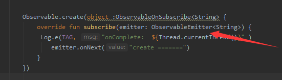

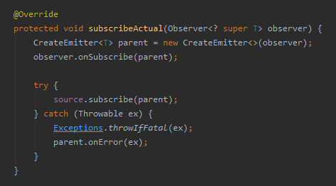


#### RxJava 事件流的全流程  

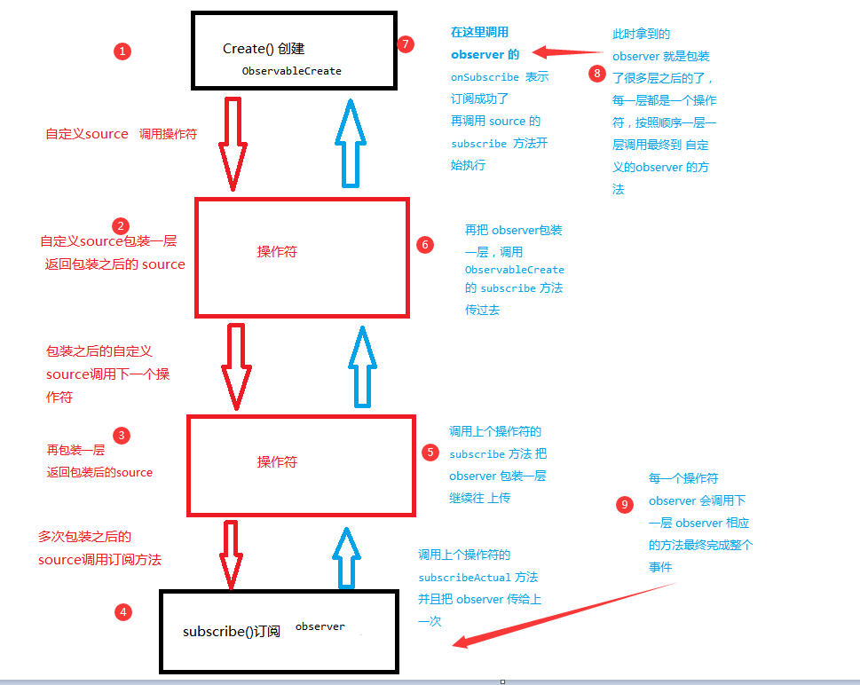  


#### subscribeOn  
给上面的代码分配线程  即  

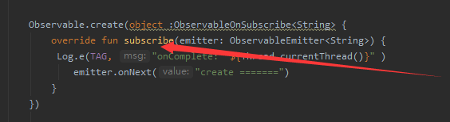


`Schedulers.io()` 源码  
查看源码可以看到，`Schedulers.io()`方法最终内部是维护了一个线程池，并开启了一个工作线程

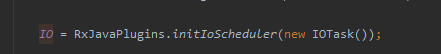

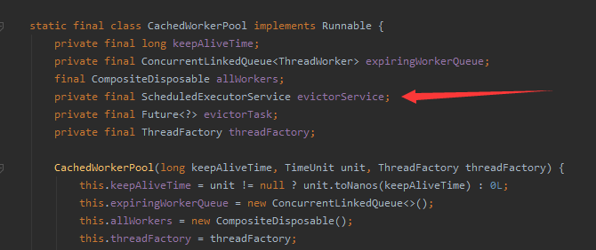

而 `subscribeOn` 方法，内部则是将下级的操作符传递回来的 `observer` 对象封装一层，然后创建了一个`runnable` 丢入线程池进行管理，上部分的代码运行在了 `runnable` 也就是我们传进来的线程里面了。

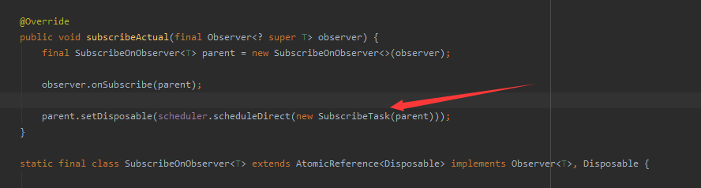

因此，下图这种情况下，最终上面代码调用的线程是最上面的 `Schedulers.io()` 线程

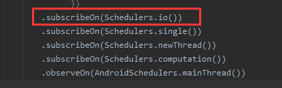  

#### observeOn  
`observeOn` 是给下面的代码分配线程 
以 `.observeOn(AndroidSchedulers.mainThread())` 为例  
`AndroidSchedulers.mainThread()` 和 上面 `Schedulers.io()` 一样，不再看了  

可以看到，`observeOn` 将 `observer` 丢到打包丢到 `runnable` 中，然后通过 `worker.schedule(this)` 将当前任务丢给 `worker` 处理

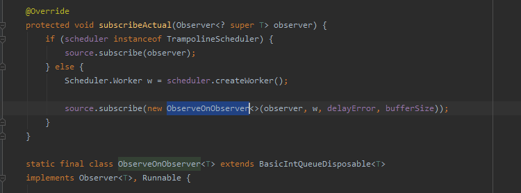

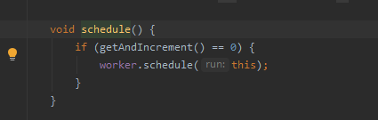

最后会通过 一个 `Android` 的`主线程 handler` 往下传递上层的数据，达到切换线程的效果。

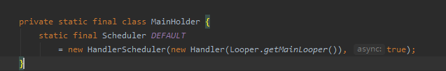

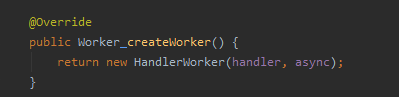


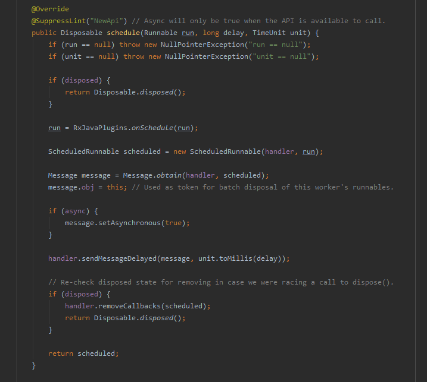

因此，下图这种情况下，最终下面代码调用的线程是最下面的 `AndroidSchedulers.mainThread()` 线程

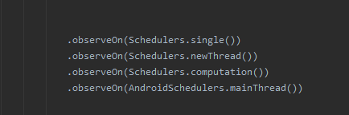