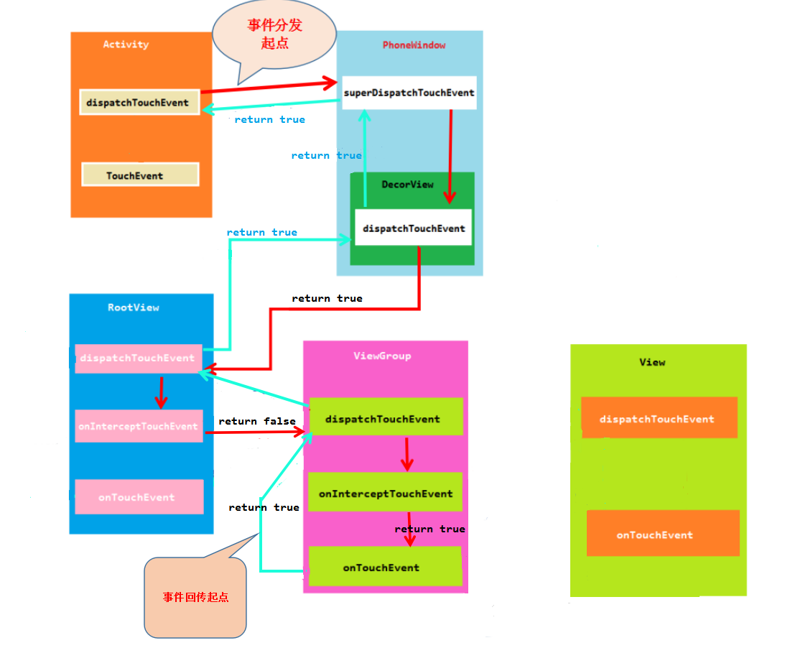
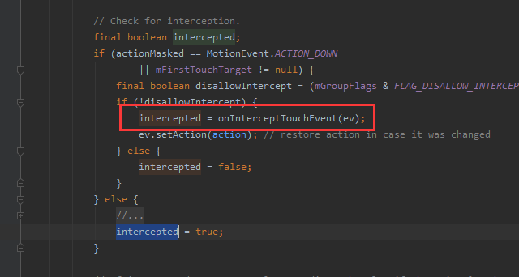
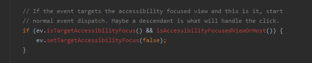
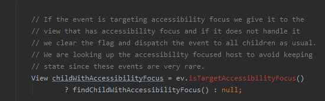

# 学习笔记-View事件分发

## View 体系结构和事件  
### View 结构  


### View 事件


## 事件分发流程

### 事件分发流程( View 消费了事件)


### 事件分发流程( ViewGroup 消费了事件)



注意：
1.  事件返回时， 子View的 dispatchTouchEvent 给了父View 的 dispatchTouchEvent 一个 false 返回值，父View 调用自身的 onTouchEvent，反之，如果返回了 true， 父View 则调用子View 的dispatchTouchEvent。  


2. ViewGroup 是根据 onInterceptTouchEvent 的返回值来确定到底是调用子 View 的dispatchTouchEvent 还是自身的 onTouchEvent 的( 调用自身ontouchEvent 是通过 super.dispatchTouchEvent 来完成的)  



### 事件分发极简流畅


### 事件分发进阶流程  


### View dispatchTouchEvent  

1. 为什么View会有dispatchTouchEvent？  

答: 我们知道 View 可以注册很多监听器，例如：单击事件(onClick)、长按事件(onLongClick)，触摸事件(onTouch), 并且View 自身也有onTouchEvent 方法，那么问题来了，那么多与事件相关的方法应该由谁来管理？ 毋庸置疑就是 dispatchTouchEvent，所以 View 也会有事件分发。  
2. 与View 事件相关的各个方法的调用顺序是怎样的？  
- **单击事件( onClickListener)** ：需要两个事件( ACTION_DOWN 和 ACTION_UP)才能触发，如果先分配给 onClick 判断，等他判断完，用户手指已经离开屏幕，定然造成 View 无法响应别的事件， 所以应该最后调用。  
- **长按事件( onLongClickListener)** ： 同理，也是需要长时间等待才能出结果，但因为不需要 ACTION_UP，所以应该排在 onClickListener 前面。( onLongClickListener > onClickListener)  
- **触摸事件( onTouchListener)** ： 如果用户注册了触摸事件，说明用户要自己处理触摸事件了。 所以在最前面。  
- **View自身处理( onTouchEvent)** ： 提供了一种默认的处理方式，如果用户已经处理好了，也就不需要了，所以应该排在( onTouchListener) 之后，( onTouchListener > onTouchEvent)  


### View 和 ViewGroup 的onTouchEvent  

```Kotlin
		
        /**
         *  事件处理的伪代码
         */
        fun dispatchTouchEvent(event: MotionEvent): Boolean {
            ......
            var result = false               // 函数返回值，主要告诉调用者是否消费了事件
            if (onFilterTouchEventForSecurity(event)) {

                val li: ListenerInfo = mListenerInfo

                /**
                 * 如果设置了 onTouchListener 并且 当前 view 可以点击 就调用监听器的 onTouch 方法
                 * 如果 onTouch 方法返回为true 就设置 result 为 true
                 */
                if (li != null && li.mOnTouchListener != null
                    && (mViewFlags & ENABLED_MASK) == ENABLED
                && li.mOnTouchListener.onTouch(this, event)) {
                    result = true
                }

                /**
                 * 如果 result 为false  则调用自身的 onTouchEvent 方法
                 *  如果 onTouchEvent 返回值为true 则 result 赋值为 true
                 */
                if (!result && onTouchEvent(event)) {
                     result = true;
                 }

            }
            ......
            return result
        }
        
        
        /**
         *  简化伪代码  onTouchListener
         */
        fun dispatchTouchEvent(event : MotionEvent) : Boolean{

            if(mOnTouchListener.onTouch(this, event)){          // 如果我们自己设置的监听器 返回为true 则返回为true
                return true
            } else if(onTouchEvent(event)){            // 如果自身的 onTouchEvent 处理了事件 也返回为true
                return true
            }

            return false                        // 否则就返回为false
        }
        
       /**
         *  onTouchEvent 伪代码   onLongClickListener  和 onClickListener 处理
         */
       fun onTouchEvent(event : MotionEvent) : Boolean {
            ......
            val action = event.action

            /**
             *  检查各种 clickable
             */

             val clickable = ((viewFlags & CLICKABLE) == CLICKABLE
                                           || (viewFlags & LONG_CLICKABLE) == LONG_CLICKABLE)
                                           || (viewFlags & CONTEXT_CLICKABLE) == CONTEXT_CLICKABLE;
            if(clickable) {

                when(action){
                    MotionEvent.ACTION_UP -> {
                        ...
                        removeLongPressCallback();  // 移除长按事件
                        ......
                        performClickInternal(); // 检查单机事件  实际上是 performClickInternal() ->  performClick() 内部进行检查
                        ...
                    }
                    MotionEvent.ACTION_DOWN -> {
                        ...
                        checkForLongClick(...)      // 检测长按
                        ...
                    }
                    ...
                }
               return true                // 表示事件被消费
            }
            ......
            return false
        }

```

### ViewGroup 的 onInterceptTouchEvent 

```Java

    public boolean onInterceptTouchEvent(MotionEvent ev) {
        if (ev.isFromSource(InputDevice.SOURCE_MOUSE)
                && ev.getAction() == MotionEvent.ACTION_DOWN
                && ev.isButtonPressed(MotionEvent.BUTTON_PRIMARY)
                && isOnScrollbarThumb(ev.getX(), ev.getY())) {
            return true;
        }
        return false;
    }

```

### ViewGroup 的dispatchTouchEvent成员变量  
TouchTraget 和 mFirstTouchTarget。  
mFirstTouchTarget 这个变量是给手势设置的，跨越事件保留的


1. mFirstTouchTarget 是TouchTarget, 是一个链表。  
2. mFirstTouchTarget 记录的是该View第一个接收该手势的子View
3. mFirstTouchTarget 的next 的 TouchTarget 记录的是这个手势的其他手指或鼠标所在的子View  
4. mFirstTouchTarget 是一个viewGroup 是否有孩子处理该事件的一个标志，为null 标明没有孩子处理它，否则标明 action_down 已经分发给它的孩子了
5. mFirstTouchTarget 是 ViewGroup 的成员变量，标志着每一个 ViewGroup 都有一个这样的变量，如果一个手势被一个View 处理，那么它的父亲和祖父们的 mFirstTouchTarget 都不为空  

### dispatchTouchEvent 的局部变量  

**newTouchTarget** 和  **alreadyDispatchedToNewTouchTarget**  


与 action_down, action_pointer_down, action_hove_move一样，这里不先进行分发，因为mFirstTouchTarget不允许加载重复的View，  
所以我们现在只需要将这个手指的id加入到这个view 的 pointerIdBits。  

  
对于这次事件，找到了新子View 接收处理， 设置 newTouchTarget ，同时设置 alreadyDispatchedToNewTouchTarget 为true， 后面就不需要再进行分发了。  


没有找到view愿意接收和处理事件，将这个手指分配给 mFirstTouchTarget最近的View

### 辅助功能 View 的分发逻辑  
  

1. 如果现在分发的事件，就是分发给我这个辅助功能获取焦点的view 的，那么我们立即进行正常的分发，同时清除这个 MotionEvent事件的 FLAG_TARGET_ACCESSIBILITY_FOCUS 标志。  


2. 如果这个事件被该ViewGroup拦截，或者已经有子View 正在处理这个手势，我们清除这个事件的FLAG_TARGET_ACCESSIBILITY_FOCUS标志，进行正常的分发。  

### 辅助功能View 的分发逻辑  

  
  

3. 如果这个事件带有FLAG_TARGET_ACCESSIBILITY_FOCUS 标志，说明它是来自辅助功能的，那么我们优先分发给辅助功能View，如果它不处理，那么我们就会清除这个标志，照常分发给其他所有孩子。  

4. 有FLAG_TARGET_ACCESSIBILITY_FOCUS 标志的事件能通过这个条件的View一定是要能接受pointerIdBits 的， 并且落在这个view范围之内，否则就清除 FLAG_TARGET_ACCESSIBILITY_FOCUS，继续流程...

5. 分发完成后，没有人愿意接收这个辅助功能事件，所以我们直接清除 FLAG_TARGET_ACCESSIBILITY_FOCUS 标志。  

## 滑动冲突解决方法  

### 外部拦截  

  

### 内部拦截

  

### 嵌套滑动  

