## 学习笔记-Android虚拟机与类加载机制

## JVM与Dalvik  

`Android` 应用程序运行在 `Dalvik/ART` 虚拟机，并且每一个应用程序对应有一个单独的 `Dalvik` 虚拟机实例。  
`Dalvik` 虚拟机实则也算是一个 `Java` 虚拟机，只不过它执行的是 `dex`文件，而不是 `class` 文件。  

`Dalvik` 虚拟机与 `Java` 虚拟机有差不多的特性，差别在于两者执行的指令集是不一样的，前者的指令集是基于寄存器的，而后者的指令集是基于堆栈的。  


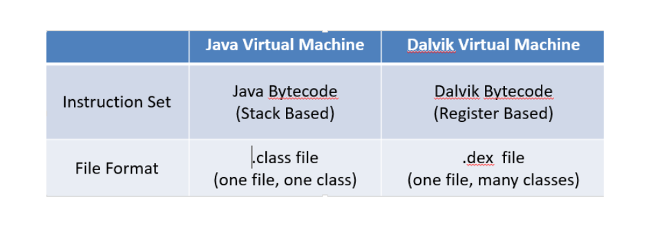  

### 基于栈的虚拟机  

对于基于栈的虚拟机来说，每一个运行的线程，都有一个独立的栈。栈中记录了方法调用的历史，每有一次方法调用，栈中便会多一个栈帧。最顶部的栈帧称作当前栈帧，其代表着当前执行的方法，基于栈的虚拟机通过操作数栈进行所有操作。  


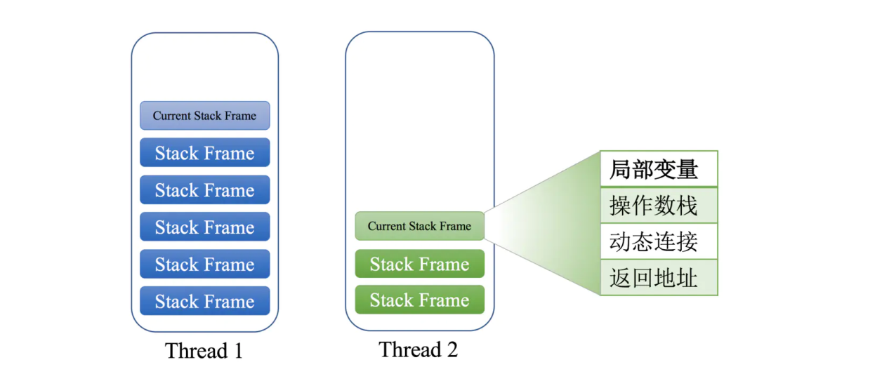  

#### 字节码指令 


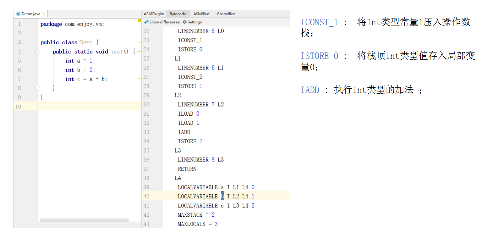

**执行过程：**
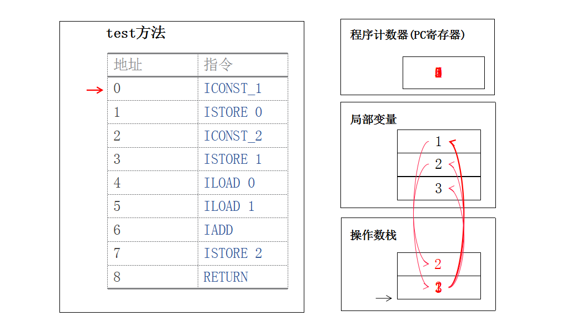

字节码指令详情：https://cloud.tencent.com/developer/article/1333540  

### 寄存器  

寄存器是 `CPU`的组成部分。寄存器是有限存贮容量的告诉存贮部件，它们可以用来暂存指令、数据和位址。  


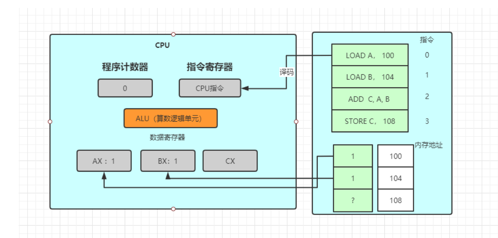  

### 基于寄存器的虚拟机  

基于寄存器的虚拟机中没有操作数栈，但有很多虚拟寄存器。其实和操作数栈相同，这些寄存器也存放在运行时栈中，本质上就是一个数组。与 `JVM` 相比，在 `Dalvik VM` 中每个线程都有自己的 `PC`和调用栈，方法调用的活动记录以帧为单位保存在调用栈上。  

与 `JVM` 相比，可以发现 `Dalvik` 虚拟机的指令数明显减少了，数据移动次数也明显减少了。  

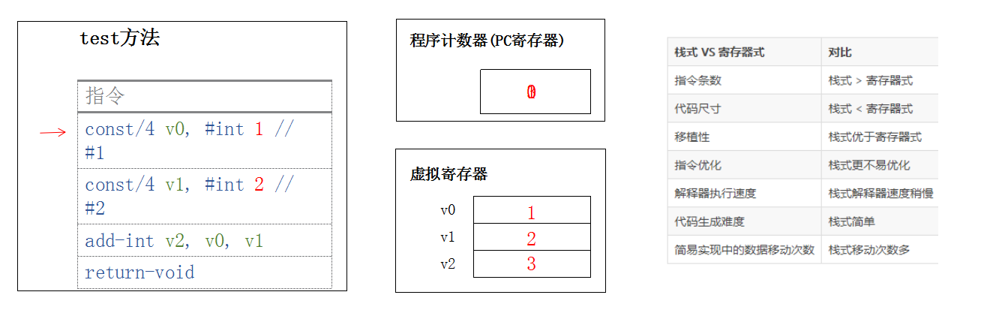  

### ART 与 Dalvik  

`Dalvik VM` 也是实现了 `JVM` 规范的一个虚拟机，默认使用 `CMS`垃圾回收器，但是与 `JVM` 运行 `Class`字节码文件不同，`DVM` 执行 `dex (Dalvik Executable Format)`，专为 `Dalvik` 设计的一种压缩格式。`dex`文件是很多 `.class`文件处理压缩后的产物，最终可以在 `Android`运行时环境执行。   

`Dalvik` 虚拟机执行的是 `dex` 字节码，从 `Android2.2` 版本开始，支持 <font color=red>JIT即时编译 (Just in Time)</font>，在程序运行的过程中进行选择热点代码(经常执行的代码)进行编译或者优化。  

而 `ART(Android RunTime)` 是在`Android 4.4`中引入的一个开发者选项，也是 `Android 5.0` 以及更高版本的默认`Android`运行时。`ART` 虚拟机执行的是本地机器码。`Android` 的运行时从 `Dalvik`虚拟机替换成 `ART`虚拟机，并不要求开发者将自己的应用直接编译成目标机器码，`APK` 仍然是一个包含 `dex` 字节码的文件。  

`ART` 和 `Dalvik` 都是运行 `dex`字节码的兼容运行时，因此针对 `dalvik`开发的应用也能在 `ART` 环境中运作。  


### dexopt与dex2oat  


`Dalvik`下应用在安装的过程，会执行一次优化，将`dex` 字节码优化生成 `odex`文件。 而`ART`下将应用的 `dex`字节码翻译成本地机器码的最恰当 `AOT` 时机也就发生在应用安装的时候。`ART` 引入了 <font color=red> AOT (预先编译机制 Ahead Of Time) </font>，在安装时，`ART`使用设备自带的 `dex2oat`工具来编译应用，`dex`中的字节码将被编译成本地机器码。  

- **dexopt**  
    在 **Dalvik** 中虚拟机在加载一个`dex` 文件时，对 `dex` 文件进行验证和优化的操作，其对 `dex` 文件的优化结果变成了 `odex((Optimized dex)`文件，这个文件和 `dex` 文件很像，只是使用了一些优化操作码。  
- **dex2oat**  
    **ART预先编译机制**，在安装时对`dex`文件执行 `AOT` 提前编译操作，编译为 `OAT`( 实际上是 ELF 文件)可执行文件(机器码)。  


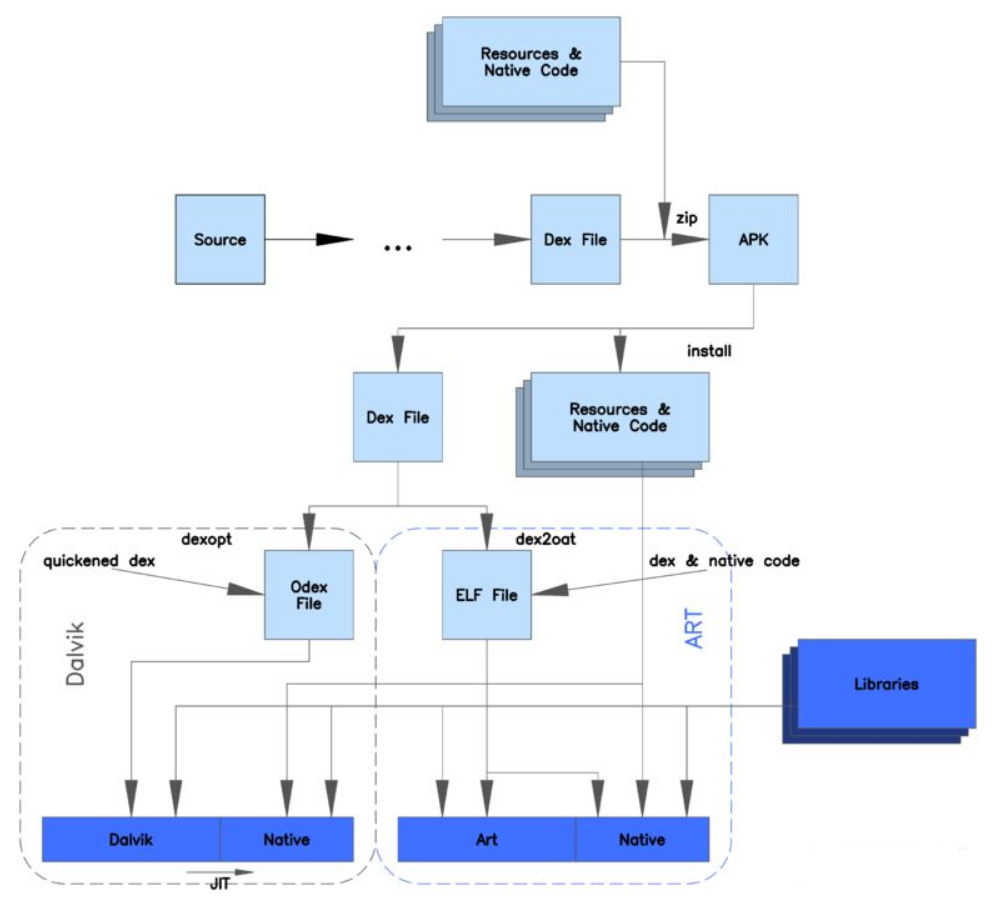

### Android N 的运作方式  

`ART` 使用预先编译`(AOT)`， 并且从`Android N`混合使用 `AOT` 编译，解释和`JIT`。   

1. 最初进行安装时不进行任何 `AOT`编译(安装快了)，运行过程中解释执行，对经常执行的方法 `JIT`，经过 `JIT`编译的方法将会记录到 `Profile` 配置文件中。  
2. 当设备闲置和充电时，编译守护进程会运行，根据 `Profile` 文件对常用代码进行 `AOT` 编译。待下次运行时直接使用。  


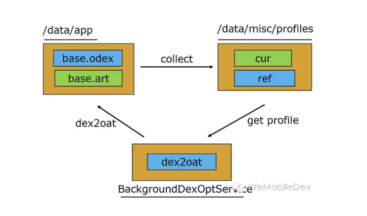

## ClassLoader  

任何一个 `Java`程序都是由一个或多个 `class`文件组成，在程序运行时，需要将`class`文件加载到 `JVM` 中才可以使用，负责加载这些 `class` 文件的就是 `Java`的类加载机制。 `ClassLoader` 的作用简单来说就是加载 `class` 文件，提供给程序运行时使用。每个 `class` 对象的内部都有一个 `classLoader`对象来标识自己是由哪个 `Classloader` 加载的。  


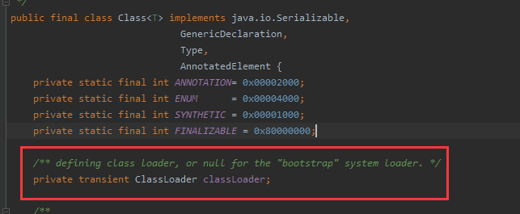
**ClassLoader 结构：**  

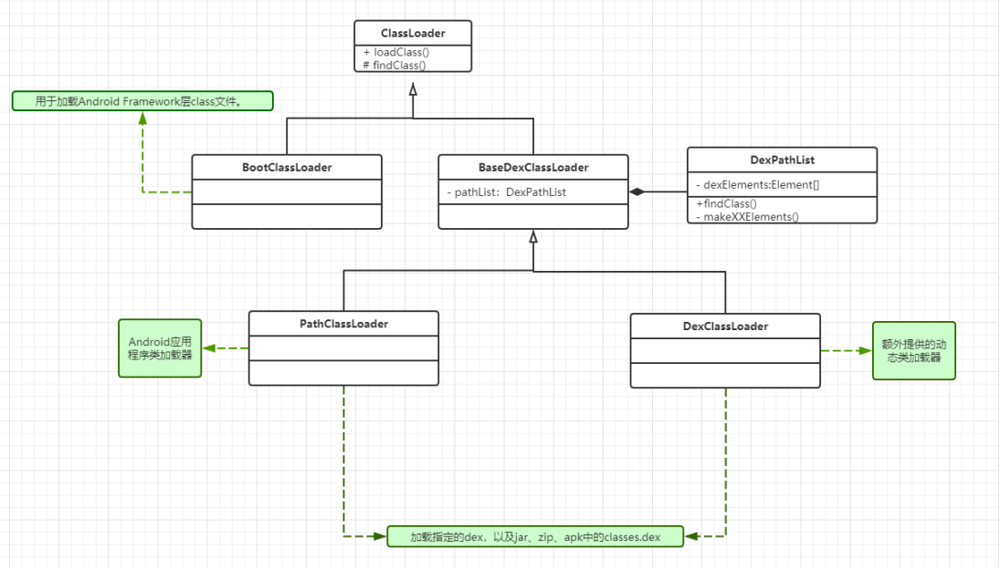  


`ClassLoader` 是一个抽象类，它的具体实现类主要有：  
- **BootClassLoader**  
    用于加载 `Android Framework` 层 `class` 文件  
- **PathClassLoader**  
    用于 `Android` 应用程序类加载器。 可以加载指定的 `dex`，以及 `jar`、`zip`、`apk` 中的 `classes.dex`
- **DexClassLoader**  
    用于加载指定的 `dex`，以及 `jar`、`zip`、`apk` 中的 `classes.dex`  

注：在`dalvik` 虚拟机上，`PathClassLoader`只能加载已安装`apk` 的 `dex`，但是我们现在一般不用关心 `Dalvik`  


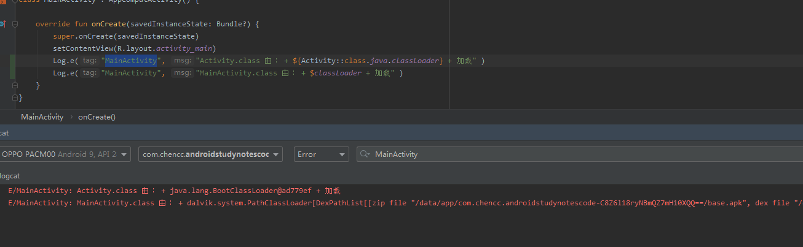

`PathClassLoader` 与 `DexClassLoader` 的共同父类是 `BaseDexClassLoader`  
```Java

public class DexClassLoader extends BaseDexClassLoader { 
    public DexClassLoader(String dexPath, String optimizedDirectory, String librarySearchPath, ClassLoader parent) {    
        super(dexPath, new File(optimizedDirectory), librarySearchPath, parent); 
    }
}


public class PathClassLoader extends BaseDexClassLoader {   
    public PathClassLoader(String dexPath, ClassLoader parent) {   
        super(dexPath, null, null, parent);  
    }  
    public PathClassLoader(String dexPath, String librarySearchPath, ClassLoader parent){   
        super(dexPath, null, librarySearchPath, parent);   
    }   
    
}

```

可以看到两者唯一的区别在于：创建 `DexClassLoader` 需要传递一个 `optimizedDirectory` 参数，并且会将其创建为 `File` 对象传递给 `super`，而 `PathClassLoader` 则直接给到 `null`。因此两者都可以加载**指定的dex**、以及 **jar**、**zip**、**apk中的classes.dex**。  
```Java
PathClassLoader pathClassLoader = new PathClassLoader("/sdcard/xx.dex", getClassLoader());   

File dexOutputDir = context.getCodeCacheDir();   
DexClassLoader dexClassLoader = new DexClassLoader("/sdcard/xx.dex",dexOutputDir.getAbsolutePath(), null,getClassLoader());

```

其实 `optimizedDirectory` 参数就是 `dexopt`的产出目录`(odex)`。 那 `PathClassLoader` 创建时，这个目录为 `null`就意味着不进行 `dexopt` 吗？ 并不是， `optimizedDirectory` 为 `null` 时的默认路径为 ：`/data/dalvik-cache`。  

**注：**  在`API 26`源码中，将 `DexClassLoader` 的 `optimizedDirectory` 标记为了 `deprecated` 弃用，实现也变为了：

```Java
public DexClassLoader(String dexPath, String optimizedDirectory, String librarySearchPath, ClassLoader parent) {   
    super(dexPath, null, librarySearchPath, parent);   
}
```
**......和 PathClassLoader 一摸一样了！**  

### 双亲委托机制  

查看源码可以看到创建 `ClassLoader` 需要接收一个 `ClassLoader parent` 参数。 这个 `parent`的目的就在于实现类加载的双亲委托。即：  
某个类加载器在接收到类加载的请求时，首先将加载任务委托给父类加载器，依次递归，如果父类加载器可以完成类加载任务，就成功返回；只有父类加载器无法完成加载任务时，才自己加载。

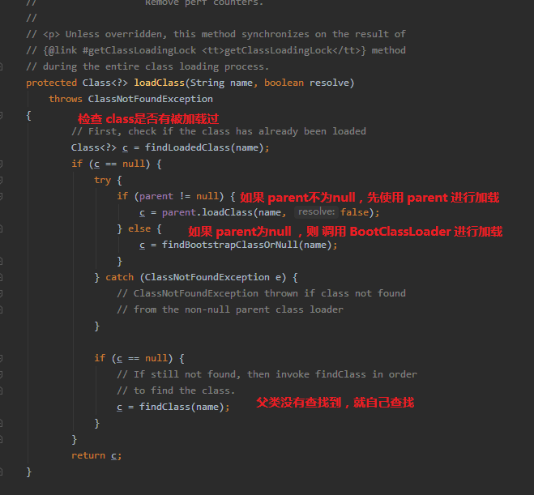


> 因此，我们自己创建的 `ClassLoader`: `new PathClassLoader("/sdcard/xx.dex", getClassLoader());` 并不仅仅只能加载 `dex` 中的 `class`。  

值得注意的是：`c = findBootstrapClassOrNull(name);`  按照方法名理解，应当是 `parent` 为 `null` 的时候，也能够加载 `BootClassLoader` 加载的类。  

`new PathClassLoader("/sdcard/xx.dex", null)` 能否加载  `Activity.class` **？？？**   

但实际上，`Android` 中的实现为 ：

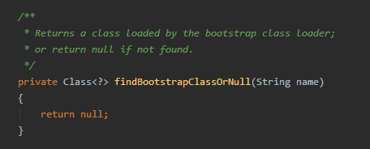  


### findClass  

可以看到在所以 `ClassLoader` 都无法加载 `class` 时，则会调用自己的 `findClass` 方法。 `findClass` 在 `ClassLoader` 中的定义为：  


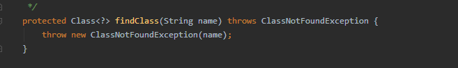  

任何 `ClassLoader` 的子类都可以重写 `loadClass` 和 `findClass` 方法。  
一般如果你不想使用 **双亲委托**，则重写 `loadClass` 修改其实现。  
而重写 `findClass`则表示在双亲委托下，父 `ClassLoader` 都找不到类的情况下，定义自己如何去查找一个 `Class`。  

而 我们的 `PathClassLoader` 会自己负责加载 `MainActivity`这种程序中自己编写的类，利用双亲委托父 `ClassLoader`加载 `framework`中的 `Activity`。 说明 `PathClassLoader`并没有重写 `loadClass`，因此，我们可以看看 `PathClassLoader` 中的 `findClass` 如何实现的：  


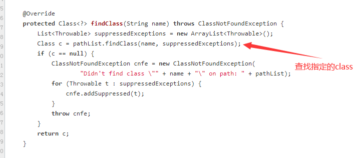    

实现非常简单，从 `pathList` 中查找 `Class`。 继续查看 `DexPathList`


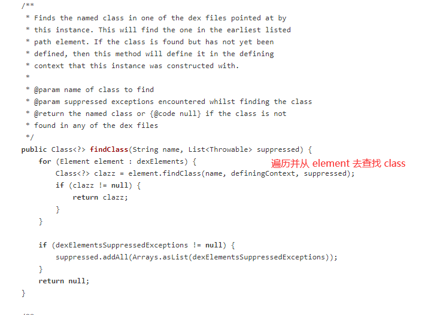

```Java
public DexPathList(ClassLoader definingContext, String dexPath,
            String librarySearchPath, File optimizedDirectory, boolean isTrusted){
             
            //......
            //  splitDexPath(..)  实现为返回 List<File>.add(dexPath)
            //  optimizedDirectory 指定输出dex优化后的odex文件，可以为null
            //  makeDexElements(..)  会去 List<File>.add(dexPath) 中使用DexFile加载dex文件，包装成 Element对象，最后返回     // //  Element数组
            //
             // save dexPath for BaseDexClassLoader
            this.dexElements = makeDexElements(splitDexPath(dexPath), optimizedDirectory,
                                           suppressedExceptions, definingContext, isTrusted);

            //......    
}
```


### 类加载  

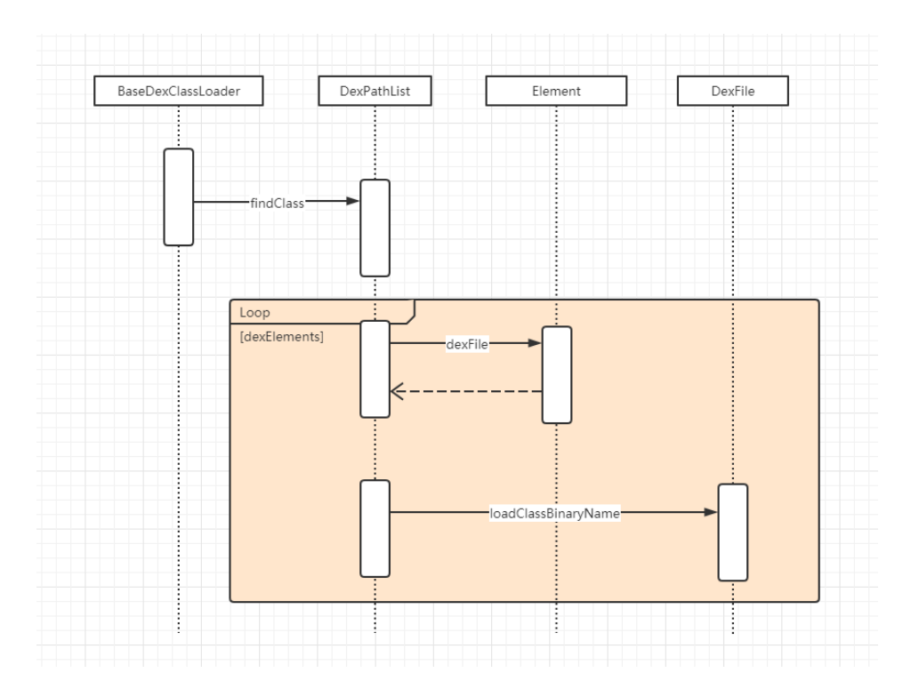


## 热修复  

`PathClassLoader` 中存在一个 `Element`数组， `Element` 中存在一 `dexFile`的成员表示 `dex` 文件，即： `APK` 中有 `X`个 `dex`， `Element` 中就有 `X`个元素。  


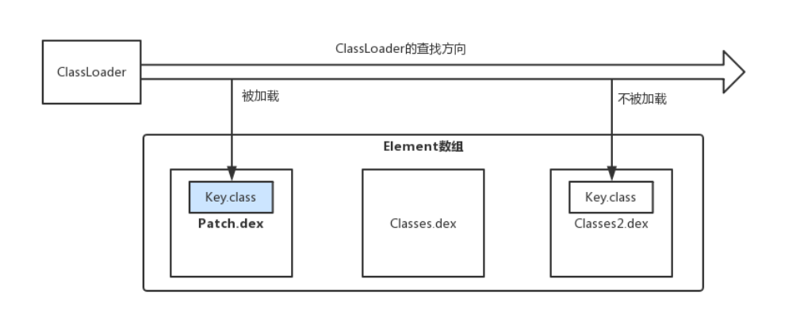  

在 `PathClassLoader` 中的数组为：`[Patch.dex,  classes.dex , classes2.dex]`。如果存在 `Key.class` 位于 `patch.dex`与 `classes2.dex` 中都存在一份，当进行类查找时，循环获得 `dexElements` 中的 `dexFile`，查找到了 `Key.class` 则立即返回，不会再管后续的 `Element` 中的 `DexFile` 是否能加载到 `Key.class` 了。  

因此，一种热修复的实现跨越将出现 `bug` 的 `Class`单独制作一份  `fix.dex` 补丁包文件，然后在程序启动时，从服务器下载 `fix.dex` 保存到某个路径，再通过 `fix.dex` 的文件路径，用其创建 `Element` 对象，然后将这个 `Element` 对象插入到我们程序的类加载器 `PathClassLoader` 的 `pathList` 中的 `dexElements` 数组头部，这样在加载出现 `Bug` 的
`class` 时会优先加载 `fix.dex` 中的修复类，从而解决 `Bug`。  