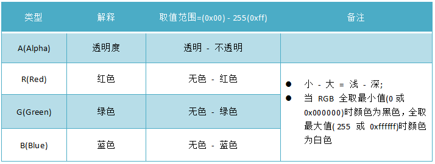

## 自定义**View**的基本方法

自定义 View 最基本的三个方法是：`onMeasure()`,`onLayout()`,`onDraw()`; View在Activity中显示出来，要经历**测量**、**布局**和**绘制**三个步骤，分别对应三个动作：`measure()`、 `layout()` 和 `draw()`。
- 测量：`onMeasure()` 决定 View 的大小。
- 布局：`onLayout()` 决定 View 在 ViewGroup 中的位置。
- 绘制：`onDraw()` 决定绘制这个 View 

### 自定义控件分类
- 自定义View：只需要重写 `onMeasure()` 和 `onDraw()` 
- 自定义ViewGroup： 只需要重写 `onMeasure()` 和 `onLayout()`

## 自定义View基础  
### View的分类  
| 类别                                                      | 解释                                                         | 特点                                                         |
| --------------------------------------------------------- | ------------------------------------------------------------ | ------------------------------------------------------------ |
| 单一视图 &nbsp;&nbsp;&nbsp;&nbsp;&nbsp;&nbsp;&nbsp;&nbsp; | 即一个View，如 TextView                                      | 不包含子View  &nbsp;&nbsp;&nbsp;&nbsp;&nbsp;&nbsp;&nbsp;&nbsp;&nbsp;&nbsp;&nbsp;&nbsp; |
| 视图组                                                    | 即多个View 组成的ViewGroup，如 LinearLayout &nbsp;&nbsp;&nbsp;&nbsp;&nbsp;&nbsp;&nbsp;&nbsp;&nbsp;&nbsp;&nbsp | 包含子View                                                   |

### View类简介
- View类是 Android 中各种组件的基类，如 View 是 ViewGroup 的基类
- View 表现为在屏幕上显示的各种视图

Android 中的UI 组件都是由 View、ViewGroup 组成

- View 的构造函数：共有四个
```Java
// 如果View是在Java代码里面new的，则调用第一个构造函数 
public View(Context context) { 

}

// 如果 View 是在 .xml 里声明的则调用第二个构造函数
// .xml里定义的属性是从 AttributeSet 里传进来的
public View(Context context, @Nullable AttributeSet attrs) {
       
}

// 不会自动调用，一般是在第二个构造函数主动调用
//  view 有style属性时 
//  defStyleAttr  比如： <item name="android:textViewStyle">@style/CustomTextStyle</item> 
public View(Context context, @Nullable AttributeSet attrs, int defStyleAttr) {
    
}

/**
 *  API 21之后才使用
 *  不会自动调用
 *	一般是在第二个构造函数里主动调用	
 *   View有style属性时
 *  defStyleRes  比如：<item name="android:textColor">@android:color/white</item> 
 */
public View(Context context, @Nullable AttributeSet attrs, int defStyleAttr, int defStyleRes){
 
}
```


### AttributeSet与自定义属性  

系统自带的View可以在 xml 中配置属性，对于自定义 View 同样可以在 xml 中配置属性，为了使自定义 View 的属性可以在 xml 中配置，需要以下四个步骤：
1. 通过 `<declare-styleable>` 为自定义View 添加属性
2. 在 xml 中为相应的属性声明值
3. 在运行时 ( 一般为构造函数 )获取值
4. 将获取到的属性值应用到 View

### View 视图结构
1. `PhoneWindow` 是 Android 系统中最基本的窗口系统，继承自 Windows类，负责管理界面显示以及事件相应。它是 Activity 与 View 系统交互的接口。  
2. `DecorView` 是 PhoneWindow 中的起始节点 View，作为整个视图容器来使用。用于设置窗口属性。它本质上是一个 `Framelayout`。  
3. `ViewRoot` 在 Activity 启动时创建，负责管理、布局、渲染窗口UI等


对于多 View 的视图，结构是树形结构：最顶层的是 ViewGroup，ViewGroup下可能有多个 ViewGroup或 View， 如下图：  


一定要记住，无论是 measure过程，layout过程还是 draw过程，永远都是从 View 树的根节点开始测量或计算( 即从树的顶端开始 )，一层一层，一个分支一个分支的进行( 树形递归 )，最终计算整个 View 树中 各个 View， 最终确定整个 View 树的相关属性。  

### Android 坐标系 

Android 坐标系定义为：
- 屏幕左上角为坐标原点
- 向右为 x轴 增大方向
- 向下为 y轴 增大方向

 


### View 位置( 坐标 )描述  

View的位置由四个顶点觉决定的，4个顶点的位置描述分别由四个值决定：

注意：View 的位置是相对父控件而言的。  

- Top ：子 View 上边界到父View 上边界的距离
- Left ：子 View 左边界到父View 左边界的距离
- Bottom ：子 View 下边界到父View 上边界的距离
- Right ：子 View 右边界到父View 左边界的距离

### 位置获取方式

View 的位置通过 `view.getXXX()` 函数来进行获取：
```Java
// 获取 Top 位置
// 获取子 View 左上角到父View 顶部的距离
public final int getTop() {
     return mTop;
}

// 其余如下
getLeft()   // 获取子 View 左上角到父View 左侧的距离
getBottom()  // 获取子 View 右下角到父View 顶部的距离
getRight()  // 获取子 View 右下角到父 View 左侧的距离

```

与 `MotionEvent` 中 `get()` 和 `getRaw()` 的区别： 

```Java
//  get() 触摸点相对于其所在组件坐标系的坐标
event.getX();
event.getY();

// getRaw() 触摸点相对于屏幕默认坐标系的坐标
event.getRawX();
event.getRawY();

```


### Android 中颜色相关的内容


Android 支持的颜色模式：  


介绍颜色定义：




## View 树的绘制流程

### View 树的绘制流程是谁负责的？

View 树的绘制流程是通过 `ViewRoot` 去负责绘制的。 `ViewRoot` 这个类的命名有点坑，翻译过来是 View 的根节点，但其实 `ViewRoot` 不是 `View` 的根节点，它连 View 节点都算不上，它的主要作用是 View树 的管理者，负责将 `DecorView` 和 `PhoneWindown` 组合起来，而 View树的根节点严格意义上来说只有 `DecorView`； 每个 `DecorView` 都有一个 `ViewRoot` 与之关联，这种关联关系是由 `WindowManager` 去进行管理的；

### View 的添加


### View 的绘制流程


#### measure  


#### layout


#### draw


#### LayoutParams

`LayoutParams` 翻译过来是布局参数，子 View 通过 Layoutparams 告诉父容器 ViewGroup 应该如何放置自己。从这个定义中也可以看出来 LayoutParams 与 ViewGroup 是息息相关的，因此脱离 ViewGroup 谈 LayoutParams 是没有意义的。  

每个 ViewGroup 的子类都有自己对应的 LayoutParams 类，典型的 LinearLayout.LayoutParams 和 FrameLayout.LayoutParams 等，可以看出来 LayoutParams 都是对应 ViewGroup 子类的内部类。  

#### MarginLayoutParams

`MarginLayoutParams` 是和外间距有关的。 和 LayoutParams 相比，MarginLayoutParams 只是增加了对上下左右外间距的支持。 实际上大部分的 LayoutParams 的实现类都是继承自 MarginLayoutParams ，因为基本上所有父容器都支持子 View 设置外间距的。  

- 属性优先级问题：MarginLayoutParams 主要增加了上下左右四种外间距。 在构造方法中，先是获得了 margin 属性； 如果该值不合法，就获取 horizontalMargin ； 如果该值不合法，再获取 leftMargin 和 rightMargin 属性 ( verticalMargin、topMargin 和 bottomMargin 同理)，我们可以据此总结出这几个属性的优先级：  
> margin > horizontalMargin 和 verticalMargin > leftMargin 和 rightMargin 、topMargin 和  bottomMargin

- 属性覆盖问题：优先级更高的属性会覆盖掉优先级较低的属性。 此外，还要注意一下这几种属性的注释  
> Call {@link ViewGroup#setLayoutParams(LayoutParams)} after reassigning a new value

### LayoutParams 与 View 如何建立联系
- 在 XML 中定义 View
- 在 Java 代码中直接生成 View 对应的实例对象

### addView 
```Java
/**
 * 重载方法1，添加一个子 View
 * 如果这个子 View 还没有 LayoutParams ， 就为 子View 设置当前 ViewGroup 默认的 LayoutParams
 *
 */
public void addView(View child) {
    addView(child, -1);
}


/**
 * 重载方法2，在指定位置添加一个子 View
 * 如果这个子 View 还没有 LayoutParams ， 就为 子View 设置当前 ViewGroup 默认的 LayoutParams
 *@param index  View 将在ViewGroup 中被添加的位置( -1 代表被添加到末尾)
 */
public void addView(View child, int index) {
    if (child == null) {
        throw new IllegalArgumentException("Cannot add a null child view to a ViewGroup");
    }
    LayoutParams params = child.getLayoutParams();
    if (params == null) {
       params = generateDefaultLayoutParams();  // 生成当前ViewGroup默认的LayoutParams
       if (params == null) {
           throw new IllegalArgumentException("generateDefaultLayoutParams() cannot return null");
       }
    }
    addView(child, index, params);
}


/**
 * 重载方法3，添加一个子 View
 * 使用当前 ViewGroup 默认的 LayoutParams，并传入参数作为 LayoutParams 的宽和高
 *
 */
public void addView(View child, int width, int height) {
    final LayoutParams params = generateDefaultLayoutParams();    // 生成当前ViewGroup默认的LayoutParams
    params.width = width;
    params.height = height;
    addView(child, -1, params);
}

/**
 * 重载方法4
 * 添加一个 子View 并使用传入的 LayoutParams
 */
public void addView(View child, LayoutParams params) {
    addView(child, -1, params);
}


/**
 * 重载方法5
 * 在指定位置添加一个 子View 并使用传入的 LayoutParams
 */
public void addView(View child, int index, LayoutParams params) {
    if (child == null) {
       throw new IllegalArgumentException("Cannot add a null child view to a ViewGroup");
    }

   // addViewInner() will call child.requestLayout() when setting the new LayoutParams
   // therefore, we call requestLayout() on ourselves before, so that the child's request
   // will be blocked at our level
   requestLayout();
   invalidate(true);
   addViewInner(child, index, params, false);
}


private void addViewInner(View child, int index, LayoutParams params, boolean preventRequestLayout) { 
	..... 
	if (mTransition != null) {
    	mTransition.addChild(this, child);
    }
    if (!checkLayoutParams(params)) {		//  检查传入的 LayoutParams 是否合法
    	params = generateLayoutParams(params);		// 如果不合法，将进行转化操作
    }
	
    if (preventRequestLayout) {		// 是否需要阻止重新执行布局流程 
    	child.mLayoutParams = params;	// 这不会引起子View 重新布局 （onMeasure->onLayout- >onDraw）
    } else {
    	child.setLayoutParams(params);	// 这会引起子View 重新布局 （onMeasure->onLayout- >onDraw）
    }
    
    if (index < 0) {
    	index = mChildrenCount;
    }
    
    addInArray(child, index);

    // tell our children
    if (preventRequestLayout) {
    	child.assignParent(this);
    } else {
    	child.mParent = this;
    }
    ......
}

```


### 自定义 LayoutParams

1. 创建自定义属性

```Java
<resources>
	<declare-styleable name="xxxViewGroup_Layout"> 
    	<!-- 自定义的属性 --> 
    	<attr name="layout_simple_attr" format="integer"/> 
    	<!-- 使用系统预置的属性 --> 
    	<attr name="android:layout_gravity"/> 
    </declare-styleable> 
</resources>

```

2. 继承 MarginLayoutParams
```Kotlin
/**
 * 自定义 LayoutParams
 */
class MarginLayoutParamsTest : ViewGroup.MarginLayoutParams{
    var simpleAttr : Int = 0
    var gravity : Int = 0

    constructor(c: Context?, attrs: AttributeSet?) : super(c, attrs){
        // 解析布局属性
        val typedArray = c?.obtainStyledAttributes(attrs, R.styleable.SimpleViewGroup_Layout)
        simpleAttr = typedArray?.getInteger(R.styleable.SimpleViewGroup_Layout_layout_simple_attr, 0) ?: 0
        gravity = typedArray?.getInteger(R.styleable.SimpleViewGroup_Layout_android_layout_gravity, -1) ?: 0
        typedArray?.recycle()
    }
    constructor(width: Int, height: Int) : super(width, height)
    constructor(source: ViewGroup.MarginLayoutParams?) : super(source)
    constructor(source: ViewGroup.LayoutParams?) : super(source)
    
}

```

3. 重写 ViewGroup 中与 LayoutParams 相关的方法
```kotlin

    /**
     *  检查 LayoutParams 是否合法
     */
    override fun checkLayoutParams(p: LayoutParams?): Boolean {
        return p is MarginLayoutParamsTest
    }

    /**
     * 生成默认的 LayoutParams
     */
    override fun generateDefaultLayoutParams(): LayoutParams {
        return MarginLayoutParamsTest(LayoutParams.MATCH_PARENT, LayoutParams.WRAP_CONTENT)
    }

    /**
     * 对传入的 layoutParams 进行转化
     */
    override fun generateLayoutParams(p: LayoutParams?): LayoutParams {
        return MarginLayoutParamsTest(p)
    }
    /**
     * 对传入的 layoutParams 进行转化
     */
    override fun generateLayoutParams(attrs: AttributeSet?): LayoutParams {
        return  MarginLayoutParamsTest(context, attrs)
    }

```

## MeasureSpec 
MeasureSpec是View中的内部类，基本都是二进制运算。由于int是32位的，用高两位表示mode，低30位表示size，MODE_SHIFT = 30的作用是移位
### 定义


测量规格，封装了父容器对 View 的布局上的限制，内部提供了宽高的信息(SpecMode, SpecSize)， `SpecSize` 是指在某种 SpecMode 下的参考尺寸，其中 SpecMode 有如下三种：
- **UNSPECIFIED** ： 父控件不对子View没有任何限制。你要多大就给多大。这种情况一般用于系统内部，表示一种测量状态。( 这个模式主要用于系统内部多次Measure的情形，并不是真的你想要多大就有多大)
- **EXACTLY** ： 父控件知道子View 所需的确切大小，如 100dp。  
- **AT_MOST** ： 子View 的大小不能大于父控件给你指定的 size，但具体大小需要子View自己决定

### MeasureSpecs的意义
通过将 SpecMode 和 SpecSize 打包成一个 int 值，可以避免过多的对象内存分配，为了方便操作，提供了打包/解包方法。  

### MeasureSpec 值的确定


子View的 MeasureSpec 是根据子View 的布局参数( LayoutParams) 和父容器的 MeasureSpec 值计算来的，具体的计算逻辑封装在 getChildMeasureSpec() 里：

```Java

    /**
     * 目标是将父控件的测量规格 和 child view 的布局参数 LayoutParams 相结合，
     * 得到一个最可能符合条件的 child view 的测量规格
     *
     * @param spec   父控件的测量规格
     * @param padding  父控件里已经占用的大小
     * @param childDimension  child view 布局 LayoutParams 里的尺寸
     * @return  child view 的测量规格
     */
    public static int getChildMeasureSpec(int spec, int padding, int childDimension) {

        int specMode = MeasureSpec.getMode(spec);  // 父控件的测量模式
        int specSize = MeasureSpec.getSize(spec);   // 父控件的测量大小

        int size = Math.max(0, specSize - padding);

        int resultSize = 0;
        int resultMode = 0;

        switch (specMode) {
            // Parent has imposed an exact size on us
            // 当父控件的测量模式是精确模式，也就是有精确的尺寸
            case MeasureSpec.EXACTLY:
                // 如果 child 的布局参数有固定值 比如 "layout_width" = 100dp
                // 那么 child 的测量规格也可以确定了， 测量大小就是 100dp 测量模式是  EXACTLY
                if (childDimension >= 0) {
                    resultSize = childDimension;
                    resultMode = MeasureSpec.EXACTLY;
                }

                // 如果  child 的布局参数是 match_parent 也就是想要占满父控件
                // 而此时父控件是精确模式  那 child 的大小也就确定了   测量大小就是 100dp 测量模式是  EXACTLY
                else if (childDimension == ViewGroup.LayoutParams.MATCH_PARENT) {
                    // Child wants to be our size. So be it.
                    resultSize = size;
                    resultMode = MeasureSpec.EXACTLY;
                }

                // 如果 child 的布局参数是 wrap_content 也就是根据自己的逻辑决定自己的大小  但是不能超过父控件的大小
                // 比如 textView 根据字符串大小确定长度
                //  所以 child 的测量模式是 AT_MOST  测量大小是 父控件的size
                else if (childDimension == ViewGroup.LayoutParams.WRAP_CONTENT) {
                    // Child wants to determine its own size. It can't be
                    // bigger than us.
                    resultSize = size;
                    resultMode = MeasureSpec.AT_MOST;
                }
                break;

            // Parent has imposed a maximum size on us
            //  当父控件的测量模式是 最大模式， 也就是说父控件不知道自己的尺寸，但是不能超过 size
            case MeasureSpec.AT_MOST:
                //  子View 有确定的大小，虽然父控件不知道自己尺寸，但还是先 满足子view 的要求
                if (childDimension >= 0) {
                    // Child wants a specific size... so be it
                    resultSize = childDimension;
                    resultMode = MeasureSpec.EXACTLY;
                }

                //  child view 占满父控件， 父控件无法确认自己大小，所以子view 也不知道自己大小
                // 因此，child view 测量模式是 AT_MOST 尺寸上限 和 父控件 尺寸上限一致 为 size
                else if (childDimension == ViewGroup.LayoutParams.MATCH_PARENT) {
                    // Child wants to be our size, but our size is not fixed.
                    // Constrain child to not be bigger than us.
                    resultSize = size;
                    resultMode = MeasureSpec.AT_MOST;
                }

                //  child view 根据自己的逻辑决定大小 但是 上限也是不能超过 父控件的 尺寸上限
                // 所以， 测量模式 是 AT_MOST  大小上限 为 size
                else if (childDimension == ViewGroup.LayoutParams.WRAP_CONTENT) {
                    // Child wants to determine its own size. It can't be
                    // bigger than us.
                    resultSize = size;
                    resultMode = MeasureSpec.AT_MOST;
                }
                break;

            // Parent asked to see how big we want to be
            case MeasureSpec.UNSPECIFIED:
                if (childDimension >= 0) {
                    // Child wants a specific size... let him have it
                    resultSize = childDimension;
                    resultMode = MeasureSpec.EXACTLY;
                } else if (childDimension == ViewGroup.LayoutParams.MATCH_PARENT) {
                    // Child wants to be our size... find out how big it should
                    // be
                    resultSize = View.sUseZeroUnspecifiedMeasureSpec ? 0 : size;
                    resultMode = MeasureSpec.UNSPECIFIED;
                } else if (childDimension == ViewGroup.LayoutParams.WRAP_CONTENT) {
                    // Child wants to determine its own size.... find out how
                    // big it should be
                    resultSize = View.sUseZeroUnspecifiedMeasureSpec ? 0 : size;
                    resultMode = MeasureSpec.UNSPECIFIED;
                }
                break;
        }
        //noinspection ResourceType
        return MeasureSpec.makeMeasureSpec(resultSize, resultMode);
    }

```


**注：parentSize 为父容器目前可使用的大小**

上表解释：
- 对于应用层 View ，其 MeasureSpec 由 父容器 MeasureSpec 和 自身 LayoutParams 来共同决定
- 对于不同的父容器和 view 本身不同的 LayoutParams ，view 就可以有多种 MeasureSpec。
	1. 当view 采用固定宽高的时候，不管父容器的 MeasureSpec 是什么，view 的 MeasureSpec 都是精确模式并且其大小遵循 LayoutParams 中的大小；
    2. 当view 的宽高是 match_parent 时，这个时候如果父容器的模式是精确模式，那么 view也是精确模式，并且view 大小是父容器的剩余空间，如果父容器是最大模式，那么 view 也是最大模式并且其大小不会超过父容器的剩余空间，
    3. 当 view 的宽度是 warp_content 时，不管父容器是精确模式还是测量模式，view 的模式总是最大模式并且最大不超过父容器的剩余空间
    4. Unspecified 模式，这个模式主要用于系统内部，多次 measure 的情况下，一般来说，我们不需要关注此模式( 这里注意，自定义view 放到 scrollView 的情况需要处理)。


## 自定义view绘制流程


