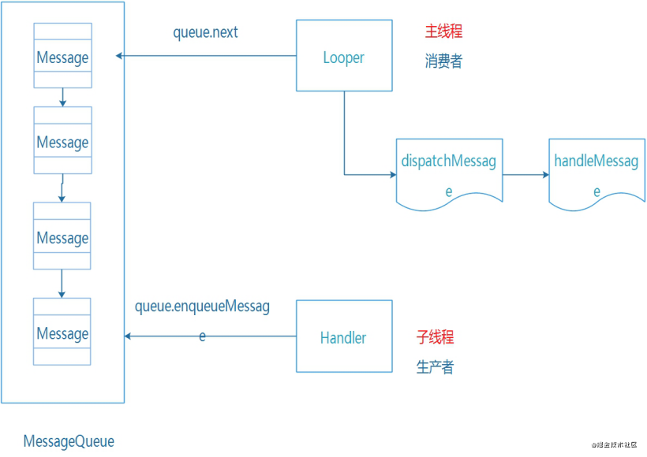
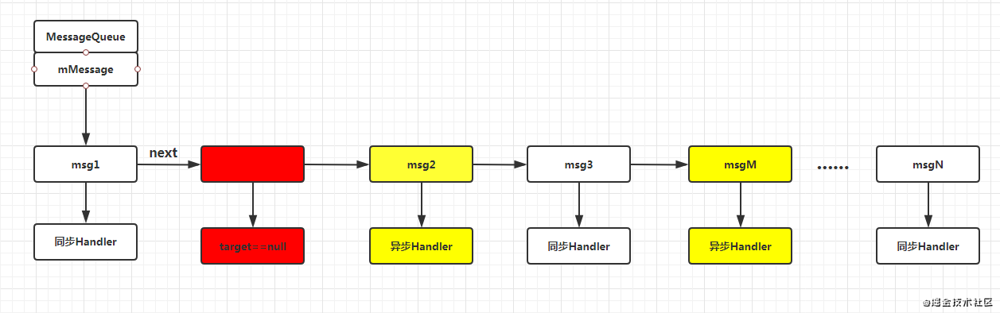

# 跨进程的核心原理  
  

**原理：** 子线程，handler，主线程，构成了线程模型中的经典问题：生产者-消费者模型。  
**生产者-消费者模型：** 生产者和消费者在同一时间段内共用同一个存储空间，生产者往存储空间内添加数据，消费者从存储空间内取出数据。  

**好处：**  保证数据生产消费的顺序（通过 MessageQueue先进先出），不管是生产者（子线程）还是消费者（主线程）都只是依赖缓冲区（handler），生产者和消费者之间不会互相持有，使它们直接没有任何耦合。  

# 源码分析  
## handler机制的相关类  
**Handler：** 发送和接收消息  
**Looper：** 用于轮询消息队列，一个线程只能有一个 Looper  
**Message：** 消息实体  
**MessageQueue：** 消息队列，用于存储和管理消息  

## 创建Looper  

> 创建 **Looper** 的方法是调用 **Looper.prepare()** 方法  

在 ActivityThread 的 man 方法中为我们调用了 prepare() 方法  

```Java

  public static void main(String[] args) {
        Trace.traceBegin(Trace.TRACE_TAG_ACTIVITY_MANAGER, "ActivityThreadMain");

      	//其他代码省略
        
        // 创建主线程的 Looper
        Looper.prepareMainLooper();
        
        ActivityThread thread = new ActivityThread();
        thread.attach(false, startSeq);

        if (sMainThreadHandler == null) {
            sMainThreadHandler = thread.getHandler();
        }

        if (false) {
            Looper.myLooper().setMessageLogging(new
                    LogPrinter(Log.DEBUG, "ActivityThread"));
        }

        // End of event ActivityThreadMain.
        Trace.traceEnd(Trace.TRACE_TAG_ACTIVITY_MANAGER);
        // 开始轮询操作
        Looper.loop();

        throw new RuntimeException("Main thread loop unexpectedly exited");
    }

```

**Looper.prepareMainLooper() 的代码 ：**   

```Java

public static void prepareMainLooper() {
        prepare(false);
        synchronized (Looper.class) {
            if (sMainLooper != null) {
                throw new IllegalStateException("The main Looper has already been prepared.");
            }
            sMainLooper = myLooper();
        }
    }

```

**prepare()** 有两个重载的方法，主要看 **prepare(boolean quitAllowed)** `quitAllowed` 的作用是在创建 MessageQueue 时。标识消息队列是否可以销毁， **主线程队列不可以销毁。**  

```Java

    public static void prepare() {
        prepare(true);
    }

    private static void prepare(boolean quitAllowed) {
        if (sThreadLocal.get() != null) { 
        	// 不为空标识已经创建过 Looper， 每个线程只能创建一个 Looper
            throw new RuntimeException("Only one Looper may be created per thread");
        }
        // 创建 Looper 并设置给 sThreadLocal
        sThreadLocal.set(new Looper(quitAllowed));
    }

```
### 创建 MessageQueue 并将 Looper 与当前线程绑定  

```Java
	private Looper(boolean quitAllowed) {
        mQueue = new MessageQueue(quitAllowed);
        mThread = Thread.currentThread();
    }
```

**MessageQueue 的构造方法：**  

```Java
    MessageQueue(boolean quitAllowed) {
    	// quitAllowed 决定队列是否可以被销毁
        // 主线程不可以被销毁
        mQuitAllowed = quitAllowed;
        mPtr = nativeInit();
    }
    
    // 退出方法
    void quit(boolean safe) {
        if (!mQuitAllowed) {
            throw new IllegalStateException("Main thread not allowed to quit.");
        }
        synchronized (this) {
            if (mQuitting) {
                return;
            }
            mQuitting = true;
            if (safe) {
                removeAllFutureMessagesLocked();
            } else {
                removeAllMessagesLocked();
            }
            // We can assume mPtr != 0 because mQuitting was previously false.
            nativeWake(mPtr);
        }
    }
```

## Looper.loop()  

在 `man` 方法的 `Looper.prepareMainLooper()`后， `Looper.loop()` 开始轮询  

```Java

    public static void loop() {
        final Looper me = myLooper(); // 内部调用 sThreadLocal.get(); 获得当前线程的 looper对象
        if (me == null) {
            throw new RuntimeException("No Looper; Looper.prepare() wasn't called on this thread.");
        }
        final MessageQueue queue = me.mQueue;

        // Make sure the identity of this thread is that of the local process,
        // and keep track of what that identity token actually is.
        Binder.clearCallingIdentity();
        final long ident = Binder.clearCallingIdentity();

       ...... 
       
        for (;;) {
        	// 一个死循环，不断的从 消息队列里获取 message
            Message msg = queue.next(); // might block
            if (msg == null) {
            	// msg 为null 时 looper 会直接退出
                // No message indicates that the message queue is quitting.
                return;
            }

            // This must be in a local variable, in case a UI event sets the logger
            final Printer logging = me.mLogging;
            if (logging != null) {
                logging.println(">>>>> Dispatching to " + msg.target + " " +
                        msg.callback + ": " + msg.what);
            }
            
          	......
            
            try {
            	// target 是当前绑定的 Handler 将消息分发出去 
                // dispatchMessage() 会调用 mCallback.handleMessage(msg)；主线程收到消息
                msg.target.dispatchMessage(msg);  
                if (observer != null) {
                    observer.messageDispatched(token, msg);
                }
                dispatchEnd = needEndTime ? SystemClock.uptimeMillis() : 0;
            } catch (Exception exception) {
                if (observer != null) {
                    observer.dispatchingThrewException(token, msg, exception);
                }
                throw exception;
            } finally {
           		......
            }
          ......
            msg.recycleUnchecked();
        }
    }


```

## 创建Handler 

常见的 `Handler` 创建：  
```Java
Handler handler = new Handler(){
	@Override
    public void handleMessage(Message msg){
    	super.handleMessage(msg);
    }
};
```
在内部调用 `this(null, false);`  

```Java
    public Handler(@Nullable Callback callback, boolean async) {
        
        ......
        
        mLooper = Looper.myLooper(); // 获取当前线程的 Looper
        if (mLooper == null) {
            throw new RuntimeException(
                "Can't create handler inside thread " + Thread.currentThread()
                        + " that has not called Looper.prepare()");
        }
        mQueue = mLooper.mQueue;  // 获取消息队列 MessageQueue
        mCallback = callback;	// 初始化回调接口
        mAsynchronous = async;
    }

```

**Looper.myLooper()**  

```Java
	
    //Looper 中定义的 ThreadLocal，主要解决多线程并发的问题
    // sThreadLocal.get() will return null unless you've called prepare().
    static final ThreadLocal<Looper> sThreadLocal = new ThreadLocal<Looper>();

    public static @Nullable Looper myLooper() {
        return sThreadLocal.get();
    }
```
`sThreadLocal.get() will return null unless you've called prepare()` 这句话告诉我们，get()可能为 null，除非先调用 prepare() 创建 Looper。

## 创建Message  

可以直接 `new Message()`, 但是有更好的方式 `Message.obtain()`, 因为后者可以检查是否有可以复用的 Message，用复用避免过多的创建，销毁 Message对象 以达到优化内存和性能的目的。  

```Java

    public static Message obtain(Handler h) {
        Message m = obtain();	// 调用重载的 obtain方法
        m.target = h;		// 并绑定创建 Message对象 的 Handler
        return m;
    }
    public static Message obtain() {
        synchronized (sPoolSync) {   // sPoolSync 是一个 object对象 用锁来同步保证线程安全
        	// sPool 是handler dispatchMessage 后，通过 recycleUnchecked 回收用以复用的 message
            if (sPool != null) {	
                Message m = sPool;
                sPool = m.next;
                m.next = null;
                m.flags = 0; // clear in-use flag
                sPoolSize--;
                return m;
            }
        }
        return new Message();
    }

```

## Message 和 Handler 的绑定  

创建 Message 的时候可以同 `Message obtain(Handler h)` 这个构造方法绑定。 在 `handler` 的 `enqueueMessage()` 也绑定了，所以发送 Message 的方法都会调用此方法入队，所以在创建 Message 的时候是可以不绑定的。  
```Java
    private boolean enqueueMessage(@NonNull MessageQueue queue, @NonNull Message msg,
            long uptimeMillis) {
        msg.target = this;	// 绑定
        msg.workSourceUid = ThreadLocalWorkSource.getUid();

        if (mAsynchronous) {
            msg.setAsynchronous(true);
        }
        return queue.enqueueMessage(msg, uptimeMillis);
    }
```

## Handler发送消息  

Handler 发送消息的重载方法很多，但主要有两种。  
`sendMessage(Message msg)`  sendMessage(...) 方法通过一系列重载方法的调用， `sendMessage -> sendMessageDelayed -> sendMessageAtTime -> enqueueMessage -> queue.enqueueMessage` 最终是调用 `MessageQueue.enqueueMessage` 方法，将消息保存在了消息队列中，而最终由 Looper 取出，交给 Handler 的 dispatchMessage 进行处理。  

可以看到在 `dispatchMessage` 方法中，message 的 callback 是一个 Runnable 对象，如果 callback 不为空，则直接调用 callback 的 run 方法，否则判断 handler 的 mCallback 是否为空，mCallback 在 handler 的构造函数中初始化，在主线程中直接通过无参的构造方法 new 出来的为 null，所以会直接执行后面的 handlerMessage 方法。  

```Java

    public void dispatchMessage(@NonNull Message msg) {
    	// callback 在 message 的构造函数中初始化 或者 使用 handler.post(Runnable) 方法的时候才不为空
        if (msg.callback != null) {
            handleCallback(msg);
        } else {
            if (mCallback != null) {
            // mCallback 是一个 callback 对象通过无参的构造函数创建出来的 handler， 该属性为null，此段不执行
                if (mCallback.handleMessage(msg)) {
                    return;
                }
            }
            handleMessage(msg);	// handleMessage 最终直接 handlerMessage 方法
        }
    }

    private static void handleCallback(Message message) {
        message.callback.run();
    }
    
```

## Handler 消息处理  
在 handlerMessage(Message msg) 方法中，我们可以拿到 message 对象，根据不同的需求进行处理，整个 handler 流程就结束了。  

## 总结  
handler.sendMessage 发送消息到消息队列 MessageQueue，然后 Looper 调用 loop() 函数带动 MessageQueue ，从而轮询 MessageQueue里面的每个 Message，当 Message 达到了可以执行的时间的时候开始执行，执行后调用 message 绑定的 handler 来处理消息，通过 dispatchMessage 调用 handlerMessage 发送到主线程接收。  


## 难点问题  
### 线程同步问题  
Handler 是用于线程间通信的，但是它产生的根本并不只是用于UI处理，更多的是 **Handler 是整个APP通信的框架** ，整个APP都是用它来进行线程间的协调。  
**Handler 是如何保证线程安全的呢？**  
Handler机制里最主要的类是 MessageQueue，这个类是所有消息的存储仓库。  

消息的管理有两点：  
1. 消息入库 (enqueueMessage)  
2. 消息出库 (next)  

**enqueueMessage源码如下:**  
```Java
    boolean enqueueMessage(Message msg, long when) {
        if (msg.target == null) {
            throw new IllegalArgumentException("Message must have a target.");
        }
        if (msg.isInUse()) {
            throw new IllegalStateException(msg + " This message is already in use.");
        }
        // 锁开始的地方
        synchronized (this) {
            if (mQuitting) {
                IllegalStateException e = new IllegalStateException(
                        msg.target + " sending message to a Handler on a dead thread");
                Log.w(TAG, e.getMessage(), e);
                msg.recycle();
                return false;
            }

            msg.markInUse();
            msg.when = when;
            Message p = mMessages;
            boolean needWake;
            if (p == null || when == 0 || when < p.when) {
                // New head, wake up the event queue if blocked.
                msg.next = p;
                mMessages = msg;
                needWake = mBlocked;
            } else {
                // Inserted within the middle of the queue.  Usually we don't have to wake
                // up the event queue unless there is a barrier at the head of the queue
                // and the message is the earliest asynchronous message in the queue.
                needWake = mBlocked && p.target == null && msg.isAsynchronous();
                Message prev;
                for (;;) {
                    prev = p;
                    p = p.next;
                    if (p == null || when < p.when) {
                        break;
                    }
                    if (needWake && p.isAsynchronous()) {
                        needWake = false;
                    }
                }
                msg.next = p; // invariant: p == prev.next
                prev.next = msg;
            }

            // We can assume mPtr != 0 because mQuitting is false.
            if (needWake) {
                nativeWake(mPtr);
            }
        }
        return true;
    }

```
`synchronized(this)` 是一个内置锁，说明对所有调用 MessageQueue对象的线程来说，他们都是互斥的，而在 Handler 里面，一个线程对应唯一一个 Looper，而Looper 中又只有唯一的一个MessageQueue。所以，主线程就只有一个MessageQueue对象，也就是说，所有的子线程向主线程发送消息的时候，主线程一次都只会处理一个消息，其他的都需要等待，那么这时候消息队列就不会出现混乱。  

**next() 函数**  
```Java

    Message next() {
        ......
        for (;;) {
            ......

            nativePollOnce(ptr, nextPollTimeoutMillis);

            synchronized (this) {
             	......
                if (msg != null && msg.target == null) {
                    // Stalled by a barrier.  Find the next asynchronous message in the queue.
           	    ......
                }
                if (msg != null) {
                  ......
                } else {
                    // No more messages.
                    nextPollTimeoutMillis = -1;
                }
              ......
            }	// synchronized 结束

            // Run the idle handlers.
            // We only ever reach this code block during the first iteration.
            for (int i = 0; i < pendingIdleHandlerCount; i++) {
                final IdleHandler idler = mPendingIdleHandlers[i];
                mPendingIdleHandlers[i] = null; // release the reference to the handler

                boolean keep = false;
                try {
                    keep = idler.queueIdle();
                } catch (Throwable t) {
                    Log.wtf(TAG, "IdleHandler threw exception", t);
                }

                if (!keep) {
                    synchronized (this) {
                        mIdleHandlers.remove(idler);
                    }
                }
            }

            // Reset the idle handler count to 0 so we do not run them again.
            pendingIdleHandlerCount = 0;

            // While calling an idle handler, a new message could have been delivered
            // so go back and look again for a pending message without waiting.
            nextPollTimeoutMillis = 0;
        }
    }

```
next 函数，每次都从头部取数据，那加锁的意义在哪里？  
next函数是必须加锁的，因为 synchronized (this) 的作用范围是所有 this正在访问的代码块。它可以保证 next 和 enqueueMessage 函数实现互斥，这样才能真正保证多线程的时候 messagequeuq 的有序进行。  


### 消息机制之同步屏障

线程的消息都是放到一个 MessageQueue 里面，取消息的时候是互斥取消息，而且**只能从头部取消息，而添加消息是按照消息执行的先后顺序进行的排序** ， 那么问题来了，同一个时间范围内的消息，如果它是需要立刻执行的，正常情况，我们需要等队列轮询到自己的时候才能执行，那岂不是黄花菜都凉了。所以，我们需要给紧急执行的消息一个绿色通道，这个绿色通道就是同步屏障的概念。  

**同步屏障是什么？**  
顾名思义，**同步屏障就是阻碍同步消息，只让异步消息通过。** 开启同步屏障的方法如下：  
```Java
MessageQueue.postSyncBarrier();
```

**postSyncBarrier方法源码 ：**  

```Java
    /**
     * @hide
     */
    @TestApi
    public int postSyncBarrier() {
        return postSyncBarrier(SystemClock.uptimeMillis());
    }

    private int postSyncBarrier(long when) {
        // Enqueue a new sync barrier token.
        // We don't need to wake the queue because the purpose of a barrier is to stall it.
        synchronized (this) {
            final int token = mNextBarrierToken++;
            // 从消息池中获取 message
            final Message msg = Message.obtain();
            msg.markInUse();
            
            // 初始化 message对象的时候，并未给 message.target 赋值， target == null
            msg.when = when;
            msg.arg1 = token;

            Message prev = null;
            Message p = mMessages;
            if (when != 0) {
                while (p != null && p.when <= when) {
                // 如果开启同步屏障的时间(假设为T)T不为0， 且当前的同步消息里有时间小于T的，则 prev 也不为null 
                    prev = p;
                    p = p.next;
                }
            }
            
            // 根据 prev 是否为null，将 msg 根据时间顺序插入到消息队列中去
            // 如果为null 则插入队列第一个  否则按时间顺序插入
            if (prev != null) { // invariant: p == prev.next
                msg.next = p;
                prev.next = msg;
            } else {
                msg.next = p;
                mMessages = msg;
            }
            return token;
        }
    }

```

可以看到，Message 对象初始化的时候并没有给 target 赋值，因此，`target == null` 的来源就找到了。 这样，一条 `target == null` 的消息就进入了消息队列，

**开启同步屏障之后，异步消息是如何被处理的呢？**  
```Java
    Message next() {
       ......
        int pendingIdleHandlerCount = -1; // -1 only during first iteration
        // 如果 nextPollTimeoutMillis = -1 一直阻塞不会超时
        // 如果 nextPollTimeoutMillis = 0 不会阻塞立即返回
        // 如果 nextPollTimeoutMillis > 0 最长阻塞 nextPollTimeoutMillis 毫秒（超时）
        // 如果期间有程序唤醒会立即返回
        int nextPollTimeoutMillis = 0;
        for (;;) {
            if (nextPollTimeoutMillis != 0) {
                Binder.flushPendingCommands();
            }

            nativePollOnce(ptr, nextPollTimeoutMillis);

            synchronized (this) {
                // Try to retrieve the next message.  Return if found.
                // 获取系统开机到现在的时间
                final long now = SystemClock.uptimeMillis();
                Message prevMsg = null;
                Message msg = mMessages; // 当前链表的头结点
                
                //如果 target == null，那它就是屏障，需要遍历消息队列，直到找到异步消息并返回
                if (msg != null && msg.target == null) {
                    // Stalled by a barrier.  Find the next asynchronous message in the queue.
                    do {
                        prevMsg = msg;
                        msg = msg.next;
                    } while (msg != null && !msg.isAsynchronous());
                }
                if (msg != null) {
                	// 如果有消息需要处理，先判断时间有没有到，如果没到就设置一下阻塞时间
                    // 常见的使用如 postDelay等
                    if (now < msg.when) {
                    	// 计算出离执行时间还有多久，赋值给 nextPollTimeoutMillis
                        // 表示 nativePollOnce 方法要等待 nextPollTimeoutMillis 时长后返回
                        // Next message is not ready.  Set a timeout to wake up when it is ready.
                        nextPollTimeoutMillis = (int) Math.min(msg.when - now, Integer.MAX_VALUE);
                    } else {
                    	//获取到消息了
                        // Got a message.
                        mBlocked = false;
                        
                        // 链表操作 获取msg并且从队列中删除该节点 ，同时返回该msg
                        if (prevMsg != null) {
                            prevMsg.next = msg.next;
                        } else {
                            mMessages = msg.next;
                        }
                        msg.next = null;
                        if (DEBUG) Log.v(TAG, "Returning message: " + msg);
                        msg.markInUse();
                        // 返回拿到的消息
                        return msg;
                    }
                } else {
                	// 没有消息就继续等待nextPollTimeoutMillis 
                    // No more messages.
                    nextPollTimeoutMillis = -1;
                }

              ......
        }
    }

```

从上面可以看出，当消息队列开启同步屏障(即 `msg.target == null`)的时候，消息机制在处理消息的时候，优先处理异步消息。这样，同步屏障就起到了过滤和优先级的作用。  

  

如上图所示，在消息队列中有同步消息和异步消息，以及同步屏障(红色部分)。有了同步屏障的存在，**msg2** 和 **msgM** 两个异步消息可以被优先执行，而后面的 msg3等 同步消息则不会被处理。**那同步消息怎么被处理呢？** 那就需要先移除屏障，即调用 `removeSyncBarrier()`  

**同步屏障的应用场景**  
Android 系统中的 UI更新的相关消息即为异步消息，需要优先处理。  
比如：在View更新时，draw，requestLayout，invalidate等很多地方都调用了 **ViewRootImpl.scheduleTraversals()** 方法  

```Java
    void scheduleTraversals() {
        if (!mTraversalScheduled) {
            mTraversalScheduled = true;
            // 发送同步屏障
            mTraversalBarrier = mHandler.getLooper().getQueue().postSyncBarrier();
            // 发送异步消息
            mChoreographer.postCallback(
                    Choreographer.CALLBACK_TRAVERSAL, mTraversalRunnable, null);
            if (!mUnbufferedInputDispatch) {
                scheduleConsumeBatchedInput();
            }
            notifyRendererOfFramePending();
            pokeDrawLockIfNeeded();
        }
    }
```
**Choreographer.postCallback** 函数最终走向了 **postCallbackDelayedInternal**
```Java
    private void postCallbackDelayedInternal(int callbackType,
            Object action, Object token, long delayMillis) {
        if (DEBUG_FRAMES) {
            Log.d(TAG, "PostCallback: type=" + callbackType
                    + ", action=" + action + ", token=" + token
                    + ", delayMillis=" + delayMillis);
        }

        synchronized (mLock) {
            final long now = SystemClock.uptimeMillis();
            final long dueTime = now + delayMillis;
            mCallbackQueues[callbackType].addCallbackLocked(dueTime, action, token);

            if (dueTime <= now) {
                scheduleFrameLocked(now);
            } else {
                Message msg = mHandler.obtainMessage(MSG_DO_SCHEDULE_CALLBACK, action);
                msg.arg1 = callbackType;
                msg.setAsynchronous(true);	// 异步消息
                mHandler.sendMessageAtTime(msg, dueTime);
            }
        }
    }
```

这里就开启了**同步屏障** ，并发送异步消息，由于 UI 相关的消息都是优先级最高的，这样系统就会优先处理这些异步消息。  

要移除同步屏障的时候需要调用 **ViewRootImpl.unscheduleTraversals()**  

```Java
    void unscheduleTraversals() {
        if (mTraversalScheduled) {
            mTraversalScheduled = false;
            mHandler.getLooper().getQueue().removeSyncBarrier(mTraversalBarrier);
            mChoreographer.removeCallbacks(
                    Choreographer.CALLBACK_TRAVERSAL, mTraversalRunnable, null);
        }
    }
```

总结：同步屏障可以方便的处理那些优先级较高的消息。当我没调用 `mHandler.getLooper().getQueue().postSyncBarrier()`，	并设置消息的 `setAsynchronous()`为true时，如若开启了同步屏障，会优先处理其中的异步消息，阻碍同步消息。  