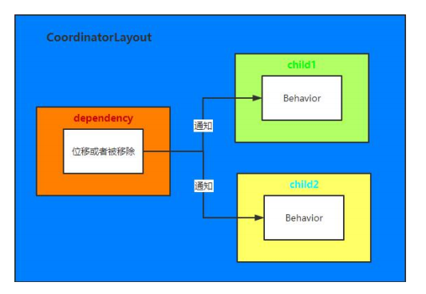
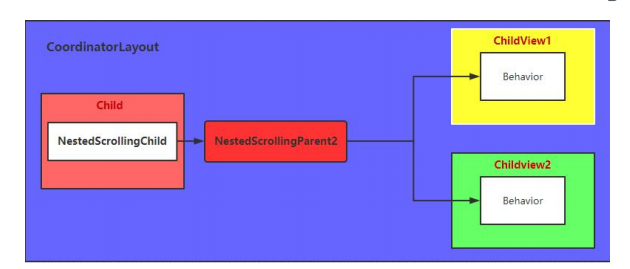
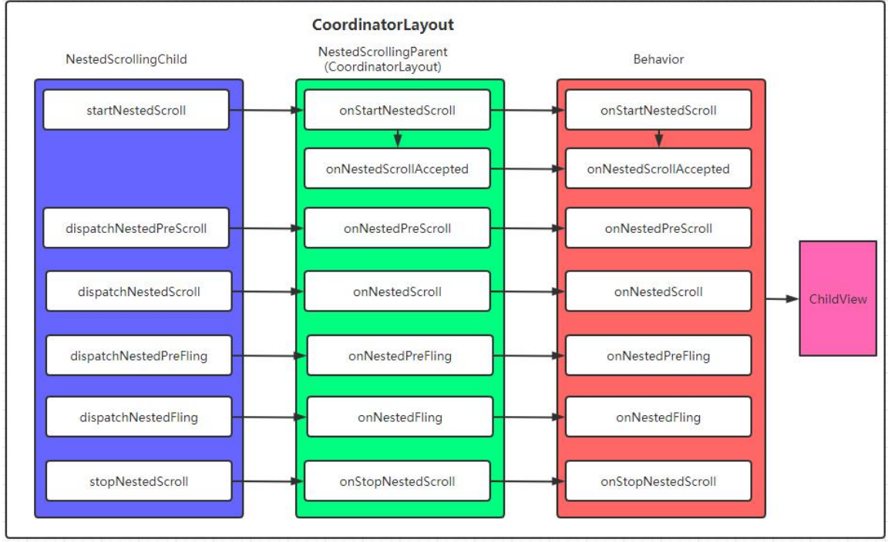
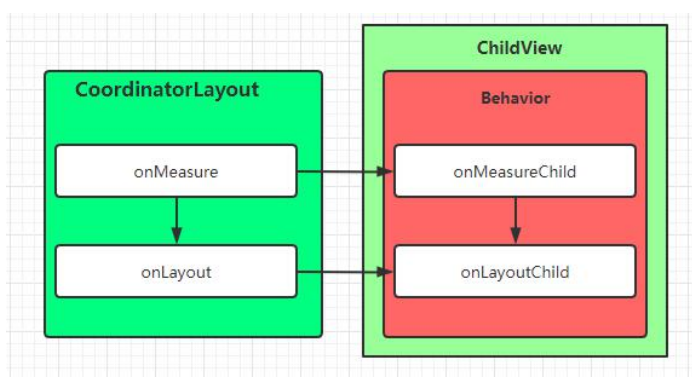
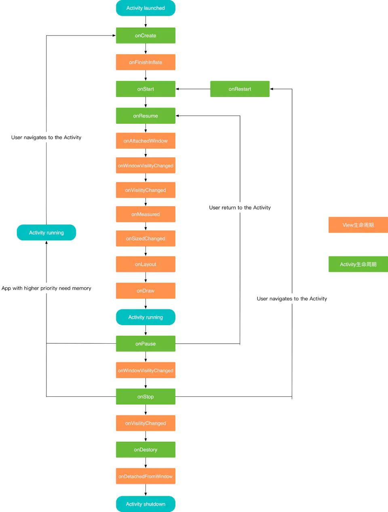
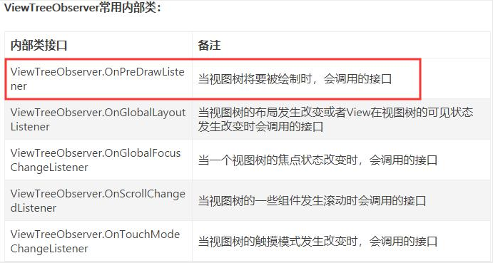
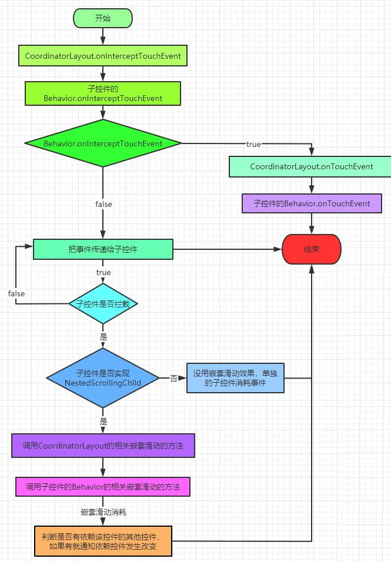

##  CoordinatorLayout 依赖交互原理

 

当 CoordinatorLayout 中子控件 depandency 的位置，大小发生改变的时候，那么 CoordinatorLayout 内部会通知所有依赖 depandency 的控件，并调用对应声明的 Behavior，告知其依赖的 depandency 发生改变。  

那么如何判断依赖 ( **layoutDependsOn** )， 接到通知后如何处理（**onDependentViewChanged/onDependentViewRemoved**）, 这些都交给 ***Behavior*** 来处理。  

## CoordinatorLayout 嵌套滑动原理  

CoordinatorLayout 实现了 NestedScrollingParent2 接口。那么当事件（scroll或fling)产生后，内部实现了NestedScrollingChild接口的子控件会将事件分发给CoordinatorLayout，CoordinatorLayout又会将事件传递给所有的Behavior。然后在Behavior中实现子控件的嵌套滑动。    

1.  产生事件(scroll或fling)的控件必须是CoordinatorLayout的直接子View
2.  响应 Behavior 的控件必须是 CoordinatorLayout 的直接 子View

## CoordinatorLayout 下子控件的测量与布局

CoordainatorLayout主要负责的是子控件之间的交互，内部控件的测量与布局，都非常简单。在特殊的情况下，如子控件需要处理宽高和布局的时候，那么交由Behavior内部的onMeasureChild与onLayoutChild方法来进行处理。  

同理对于事件的拦截与处理，如果子控件需要拦截并消耗事件，那么交由给*Behavior*内部的*onInterceptTouchEvent*与*onTouchEvent*方法进行处理

## View 的生命周期

## Android ViewTreeObserver 介绍  

ViewTreeObserver 注册一个观察者来监听视图树，当视图树的布局、视图树的焦点、视图树将要绘制、视图树滚动等发生改变时，ViewTreeObserver都会收到通知，ViewTreeObserver不能被实例化，可以调用View.getViewTreeObserver()来获得

***dispatchOnPreDraw( ) :*** 通知观察者绘制即将开始，如果其中的某个观察者返回为 true，那么绘制将会取消，并且重新安排绘制，如果想在 View Layout 或者 View Hierarchy 还未依附到 Window 时，或者在View 处于 GONE 状态时强制绘制，可以手动调用这个方法。  

## CoordinatorLayout  事件传递机制  

